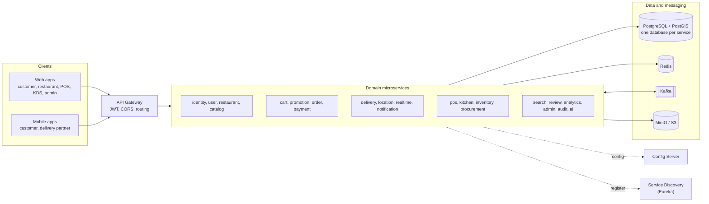

# Food Delivery Platform

[](https://github.com/vipultikhe234/Food_Delivery_System/actions/workflows/ci-backend.yml)
[](https://github.com/vipultikhe234/Food_Delivery_System/actions/workflows/ci-web.yml)
[](https://github.com/vipultikhe234/Food_Delivery_System/actions/workflows/ci-requirements.yml)
[](https://github.com/vipultikhe234/Food_Delivery_System/actions/workflows/ci-security.yml)
[](https://github.com/vipultikhe234/Food_Delivery_System/actions/workflows/ci-commits.yml)


A requirement-driven food delivery platform with a built-in restaurant operating system: customer ordering, restaurant POS and kitchen display, inventory and purchasing, delivery, payments, analytics and AI assistants.

> **Status:** under active development, built phase by phase. Each phase starts only after the previous one is approved. Phases 1 to 3 and the system design are approved; Phase 4 (infrastructure) is in progress. Nothing here is production-ready yet. Current state and evidence: [docs/README.md](docs/README.md).

## Contents

- [Features (planned)](#features-planned)
- [Architecture](#architecture)
- [Tech stack](#tech-stack)
- [Repository layout](#repository-layout)
- [Getting started](#getting-started)
- [Common commands](#common-commands)
- [Configuration and secrets](#configuration-and-secrets)
- [Documentation](#documentation)
- [Branches and commits](#branches-and-commits)

## Features (planned)

| Area | What it covers |
|---|---|
| Customer ordering | Restaurant discovery, menus, cart, coupons, checkout, live order tracking, reviews |
| Restaurant operating system | POS billing, dine-in and QR ordering, kitchen order tickets and kitchen display, multi-outlet menus |
| Inventory and purchasing | Recipes, ingredient stock, suppliers, purchase orders |
| Delivery | Partner onboarding, automatic assignment, live location |
| Payments | Online payments with verified webhooks, refunds, wallet, reconciliation |
| Admin and analytics | Approvals, complaints, audit log, business dashboards |
| AI | Food assistant, recommendations, DevAgent and TestAgent for the development workflow |

The full list (207 functional and 25 non-functional requirements) lives in [`docs/requirements/requirements.json`](docs/requirements/requirements.json).

## Architecture



Services own their data and talk asynchronously through Kafka (transactional outbox), with synchronous calls only where a response is needed. Details: [system architecture](docs/04-system-architecture.md), [microservices](docs/05-microservices.md), [event-driven architecture](docs/08-event-driven-architecture.md).

## Tech stack

| Layer | Technology |
|---|---|
| Backend | Java 21, Spring Boot 4.1, Spring Cloud 2025.1 (Gateway, Config, Eureka, LoadBalancer), Spring Security 7 |
| Data | PostgreSQL 17 with PostGIS, Redis 8, Apache Kafka 4 (KRaft), MinIO (S3-compatible) |
| Web | React, pnpm workspace, Turborepo |
| Mobile | React + Capacitor |
| Observability | Structured JSON logs, OpenTelemetry, Prometheus, Grafana, Loki, Tempo |
| Delivery | Docker, Docker Compose, GitHub Actions; Kubernetes and Terraform planned |

## Repository layout

| Path | Contents | Phase |
|---|---|---|
| `docs/` | Requirements, architecture, ADRs, UI design | 1–2 |
| `docs/requirements/requirements.json` | Source of truth for requirements, statuses and history ([ADR-012](docs/17-adr/README.md)) | 1 |
| `backend/` | Java 21 / Spring Boot microservices (Maven multi-module) | 3+ |
| `backend/platform/` | Shared libraries: web, security, events, persistence, observability, event contracts | 3–4 |
| `backend/services/` | config-server, service-discovery, api-gateway; domain services from Phase 5 | 4+ |
| `web/` | React web apps (customer, restaurant, POS, KDS, delivery, admin) | 14 |
| `mobile/` | React + Capacitor apps (customer, delivery partner) | 15 |
| `ai-agents/` | DevAgent and TestAgent | 18–19 |
| `tools/requirements-validator/` | CI validator for `requirements.json` | 3 |
| `infrastructure/` | Docker Compose, config repository, Kubernetes, Terraform | 4, 23–24 |
| `tests/` | Cross-service E2E, performance and security suites | 14+ |
| `.ai/` | Context files for AI agents | — |

## Getting started

### Prerequisites

| Tool | Version | Notes |
|---|---|---|
| JDK | 21 (Temurin) | Set `JAVA_HOME`. The Maven wrapper downloads Maven 3.9.16 with a pinned checksum. |
| Node.js | 24 or newer | |
| pnpm | 12.8.1 | Via corepack: `corepack pnpm ...` (version pinned in `package.json`) |
| Docker Desktop | Current, with WSL 2 on Windows | Compose v2. The `infra` and `platform` profiles need about 4 GB of memory for Docker. |

### Run locally

```bash
git clone https://github.com/vipultikhe234/Food_Delivery_System.git
cd Food_Delivery_System
cp .env.example .env    # then replace every change-me value
docker compose --env-file .env -f infrastructure/docker/docker-compose.yml --profile infra --profile platform up -d --build
```

This starts PostgreSQL (one database per service), Redis, Kafka with Kafka UI, MinIO, Mailpit, config-server, service-discovery and the API gateway on `http://localhost:8080`.

| Profile | Adds |
|---|---|
| `infra` | PostgreSQL, Redis, Kafka, Kafka UI, MinIO, Mailpit |
| `platform` | config-server, service-discovery, api-gateway |
| `observability` | OpenTelemetry Collector, Prometheus, Grafana, Loki, Tempo, Alloy |
| `media` | ClamAV (virus scanning for uploads) |

Ports and troubleshooting: [infrastructure/README.md](infrastructure/README.md).

## Common commands

```bash
# Backend: build, tests, format check, coverage report
cd backend && ./mvnw verify          # Windows: .\mvnw.cmd verify
cd backend && ./mvnw spotless:apply  # fix formatting

# Workspace
corepack pnpm install
corepack pnpm validate:requirements
corepack pnpm --filter @fdp/requirements-validator test

# Git hooks (once per clone): secret scan, requirement validation, Conventional Commits
git config core.hooksPath .githooks
```

## Configuration and secrets

Copy `.env.example` to `.env` for local development. `.env` is gitignored and no credentials are committed. Non-secret configuration lives in [`infrastructure/config-repo/`](infrastructure/config-repo/) and is served by config-server. Shared and production secrets come from a secret manager ([docs/09-security.md](docs/09-security.md)).

## Documentation

| Topic | Document |
|---|---|
| Documentation index and phase status | [docs/README.md](docs/README.md) |
| Requirements | [docs/requirements/requirements.md](docs/requirements/requirements.md) |
| System architecture | [docs/04-system-architecture.md](docs/04-system-architecture.md) |
| API design and error format | [docs/07-api-design.md](docs/07-api-design.md) |
| Database design | [docs/06-database-design.md](docs/06-database-design.md) |
| Security | [docs/09-security.md](docs/09-security.md) |
| Deployment | [docs/13-deployment.md](docs/13-deployment.md) |
| Architecture decisions | [docs/17-adr/README.md](docs/17-adr/README.md) |

## Branches and commits

`main` and `develop` are long-lived. Work happens on `feature/*`, `bugfix/*`, `release/*` and `hotfix/*` branches. Commit messages follow [Conventional Commits](https://www.conventionalcommits.org/) and are checked by the `commit-msg` hook and CI.
