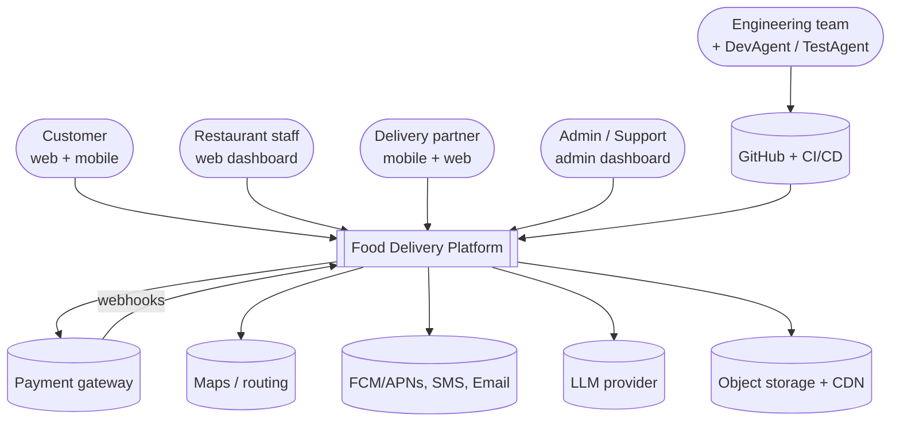
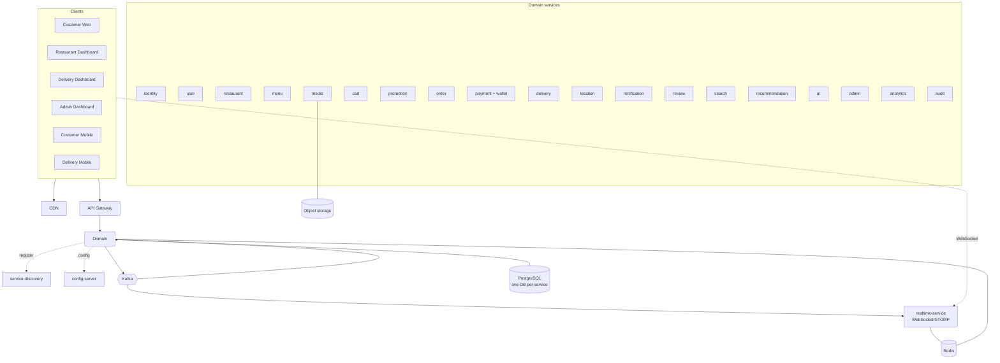
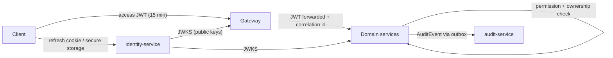
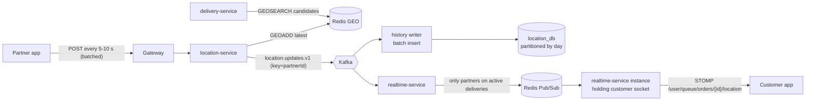
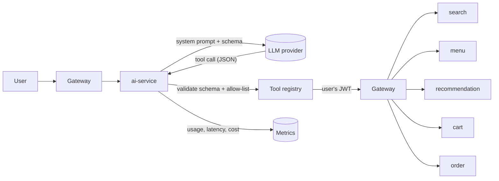

# 04 — System Architecture

| Field | Value |
|---|---|
| Version | 1.0.0 |
| Status | **APPROVED** 2026-10-01 by project owner (instruction: continue) |
| Author | ArchitectAgent |
| Date | 2026-10-01 |
| Inputs | [`requirements.json`](requirements/requirements.json), [`requirements.md`](requirements/requirements.md), master prompt, reference notes |
| Detailed in | [05 Microservices](05-microservices.md), [06 Database](06-database-design.md), [07 API](07-api-design.md), [08 Events](08-event-driven-architecture.md), [09 Security](09-security.md), [ADRs](17-adr/README.md) |

---

## 1. Architectural drivers

The quality attributes that shape the design, in priority order:

| # | Driver | Why it matters here | Main tactics |
|---|---|---|---|
| 1 | **Correctness of money and orders** | Duplicate orders, double charges and lost refunds destroy trust | State machine, idempotency keys, transactional outbox, saga with compensation, webhook verification |
| 2 | **Security** | PII, payments, multi-tenant restaurants, AI tools | RS256 JWT + JWKS, permission and ownership checks, gateway hardening, audit trail, no card data |
| 3 | **Read scalability** | Peak is about 5–10K TPS, mostly reads (10:1) | Redis cache-aside, search read model, CDN, stateless services |
| 4 | **Write-heavy location stream** | About 100K updates/s at design scale, roughly 1000× order writes | Dedicated location service, Redis GEO, Kafka, batched history writes |
| 5 | **Real-time UX** | Live orders, tracking < 2 s | Dedicated WebSocket service, Redis Pub/Sub fan-out |
| 6 | **Evolvability** | Swap search engine, payment gateway, maps or LLM later | Ports and adapters per external dependency |
| 7 | **Operability** | Must *prove* production readiness | Correlation IDs from day one, metrics, tracing, health probes |
| 8 | **Developer experience** | About 20 JVM services on one laptop is heavy | Compose profiles, shared libraries, generated API clients |

---

## 2. System context



---

## 3. Service decomposition

### 3.1 Changes to the brief's service list

The brief lists 23 services and also says *"do not create unnecessary microservices"*. I applied one test to each: **does it have its own data, its own consistency boundary, or a meaningfully different scaling or change profile?**

| Brief's service | Proposal | Reason |
|---|---|---|
| Product Service | **Merge into Menu Service** | Products exist only inside a menu. They share the same consistency boundary (price, variants, add-ons, availability) and the same users. A separate service would add network hops to every menu read for no benefit. |
| Wallet Service | **Module inside Payment Service** (own tables) | Wallet debits, refunds-to-wallet and payments must be atomic together. Separating them would need a saga for every wallet payment. It can be extracted later; the module boundary is kept clean. |
| Coupon Service | **Rename to Promotion Service** | Same scope, with room for offers and (if approved) loyalty/referral without a new service. |
| Location Service | **Keep, separate from Delivery** | Very different load profile (about 100K writes/s against low-volume assignment logic). It scales independently. |
| Admin Service | **Keep, with a real bounded context:** complaints/support tickets plus aggregated back-office views | Admin *actions* stay in the owning services (approve restaurant lives in restaurant-service). This avoids a "god service" that writes into other services' data. |
| — (not in brief) | **Add `realtime-service`** (OQ-16) | WebSocket connections are long-lived and stateful and scale on connection count, not CPU per request. Embedding them in order or notification services would couple unrelated scaling. |
| — (not in brief) | **Add `requirement-service` in Phase 18** (OQ-6) | Backs DevAgent tools and the admin "Requirements / Releases" screens. Until then, Git-versioned JSON is the source of truth. |

### 3.2 Proposed services

**Infrastructure services (3)**

| Service | Responsibility | Technology |
|---|---|---|
| `api-gateway` | Routing, JWT validation, rate limiting, CORS, security headers, correlation ID, API versioning | Spring Cloud Gateway, Redis |
| `service-discovery` | Registration, discovery, health | Spring Cloud Netflix Eureka |
| `config-server` | Central configuration per profile (secrets come from env/secret manager) | Spring Cloud Config (Git-backed) |

**Domain services (18, plus `requirement-service` in Phase 18)**

| Service | Bounded context and owned data | Database | Main events published | Phase |
|---|---|---|---|---|
| `identity-service` | Credentials, roles, permissions, refresh tokens, OTP | identity_db + Redis | UserRegistered, RoleChanged | 5 |
| `user-service` | Profiles, addresses, preferences, devices, favourites | user_db (PostGIS) | UserPreferencesUpdated | 5 |
| `audit-service` | Append-only audit trail (consumes AuditEvent) | audit_db | — | 5 |
| `restaurant-service` | Restaurants, branches, hours, documents, staff, settings | restaurant_db (PostGIS) | RestaurantApproved, BranchUpdated, BranchAvailabilityChanged | 6 |
| `menu-service` | Categories, products, variants, add-ons, availability | menu_db + Redis | MenuUpdated, MenuItemAvailabilityChanged | 6 |
| `media-service` | Upload URLs, metadata, variants, private documents | media_db + object storage | MediaUploaded | 6 |
| `cart-service` | Carts, pricing, signed quotes | cart_db + Redis | — | 7 |
| `promotion-service` | Coupons, offers, redemptions, abuse flags | promotion_db + Redis | OfferUpdated | 7 |
| `order-service` | Orders, state machine, **saga orchestrator** | order_db | OrderCreated, OrderConfirmed, OrderCancelled, … | 8 |
| `payment-service` | Payments, transactions, refunds, reconciliation, **wallet module** | payment_db | PaymentCompleted, PaymentFailed, RefundCompleted | 9 |
| `delivery-service` | Partners, availability, assignment engine, workflow, earnings | delivery_db + Redis | DeliveryAssigned, OrderPickedUp, OrderDelivered | 10 |
| `location-service` | Location ingestion, Redis GEO, history, distance, ETA | location_db (partitioned) + Redis GEO | PartnerLocationUpdated (high volume) | 10 |
| `notification-service` | Templates, channel routing, providers, inbox | notification_db | NotificationSent | 11 |
| `review-service` | Reviews, ratings, aggregates, moderation | review_db | ReviewCreated, RatingAggregated | 12 |
| `search-service` | Denormalised discovery and search read model | search_db (PostGIS, FTS, pg_trgm) + Redis | — | 13 |
| `analytics-service` | Event-fed facts and KPIs | analytics_db (partitioned) | — | 13 |
| `admin-service` | Complaints, support tickets, back-office aggregation | admin_db | ComplaintResolved | 14 |
| `realtime-service` | WebSocket/STOMP connections, fan-out | Redis Pub/Sub (no DB) | — | 16 |
| `recommendation-service` | Behaviour read model, rule-based recommendations | recommendation_db | — | 17 |
| `ai-service` | LLM orchestration, tool registry, guardrails, usage | ai_db | — | 17 |

That makes 21 deployables in total (3 infrastructure + 18 domain), plus `requirement-service` in Phase 18.

### 3.3 Container view



---

## 4. Communication patterns

| Use | Pattern | Examples |
|---|---|---|
| Query needed to answer the current request | **Sync REST** via discovery (RestClient/OpenFeign), with timeout and circuit breaker | cart → menu (prices), cart → promotion (validate coupon), order → cart (verify quote) |
| State change that other contexts react to | **Async Kafka event** via transactional outbox | OrderCreated → payment, notification, analytics |
| Multi-step business transaction | **Orchestrated saga** in order-service | create → pay → accept → assign → deliver, with compensations |
| Side effects (notifications, search index, analytics, audit) | **Choreography** (consumers subscribe) | MenuUpdated → search-service |
| Server → client push | **WebSocket/STOMP** via realtime-service | order status, partner location, new restaurant order |
| Client → payment gateway → platform | **Webhook** (signature verified) | payment and refund confirmation |

**Why orchestration for orders?** The order lifecycle is the core business process. It already has an explicit state machine (MP §11). Making order-service the orchestrator keeps the whole flow, its timeouts and its compensations in one readable place. Choreography for the core flow would scatter that logic across services.

### 4.1 Order saga (happy path and key compensations)

```mermaid
sequenceDiagram
    autonumber
    participant C as Customer app
    participant GW as Gateway
    participant CART as cart
    participant ORD as order (orchestrator)
    participant PAY as payment
    participant PG as Payment gateway
    participant PRO as promotion
    participant RES as Restaurant staff
    participant DEL as delivery
    participant K as Kafka

    C->>GW: POST /cart/quote
    GW->>CART: price + validate
    CART-->>C: signed quote (10 min)
    C->>GW: POST /orders (Idempotency-Key, quote)
    GW->>ORD: create
    ORD->>PRO: reserve coupon
    ORD->>ORD: CREATED → PAYMENT_PENDING (+ outbox OrderCreated)
    ORD-->>C: orderId
    C->>GW: POST /payments
    GW->>PAY: create payment (amount from order)
    PAY->>PG: create gateway order
    C->>PG: pay (UPI/card on gateway UI)
    PG->>PAY: webhook (signed)
    PAY->>K: PaymentCompleted
    K->>ORD: PaymentCompleted
    ORD->>PRO: commit coupon
    ORD->>ORD: CONFIRMED (+ OrderConfirmed)
    K->>RES: new order (via realtime)
    RES->>ORD: accept (prep time)
    ORD->>K: RestaurantAccepted
    K->>DEL: start assignment (timed to prep)
    DEL->>K: DeliveryAssigned
    Note over ORD: Failure paths: PaymentFailed → release coupon → PAYMENT_FAILED<br/>Rejected / accept timeout → refund + release → RESTAURANT_REJECTED<br/>No partner → escalate, notify; Cancel → REFUND_PENDING → REFUNDED
```

---

## 5. Event design (summary)

- **Topics:** one per aggregate stream, versioned: `order.events.v1`, `payment.events.v1`, `delivery.events.v1`, `restaurant.events.v1`, `menu.events.v1`, `review.events.v1`, `user.events.v1`, `audit.events.v1`, and `location.updates.v1` (high volume, short retention).
- **Key:** aggregateId (orderId, partnerId, …), which guarantees ordering per aggregate.
- **Envelope:** `eventId, eventType, eventVersion, occurredAt, producer, aggregateType, aggregateId, correlationId, causationId, payload`.
- **Reliability:** transactional outbox, at-least-once delivery, a `processed_events` table per consumer for idempotency, retry topics with backoff, and `<topic>.dlt` with alerting.
- **Schema evolution:** backward-compatible changes only within v1 (add optional fields). A breaking change creates a v2 topic, with both versions published during migration.
- **Schema format:** JSON Schema files in a shared `event-contracts` module, validated in contract tests. Avro with a schema registry is an option later if throughput or governance requires it (ADR).

The full event catalogue is produced in Phase 2 (`08-event-driven-architecture.md`).

---

## 6. Data architecture

- **Database per service** on PostgreSQL. Locally, one PostgreSQL container hosts one *logical* database per service with separate credentials. In production, instances are grouped by criticality and load (for example order and payment on dedicated instances).
- **PostGIS** in user, restaurant, search and location databases for geospatial queries (`ST_DWithin` for radius and serviceability).
- **Flyway** migrations following expand/contract, which enables zero-downtime deployment.
- **Base entity:** `id UUID, created_at, updated_at, created_by, updated_by, version` with JPA `@Version` optimistic locking.
- **Money:** `DECIMAL(12,2)` plus a currency code, `BigDecimal` in Java, `HALF_UP` rounding.
- **Large or volatile data:**
  - Location history is partitioned by day with 90-day retention.
  - Audit logs are partitioned by month and append-only.
  - Analytics facts are partitioned by day.
- **Read models:** search, recommendation and analytics build their own stores from events. Nothing queries another service's database.

### 6.1 Caching (Redis) — only where it solves a problem

| Data | Pattern | TTL / invalidation | Why |
|---|---|---|---|
| Branch menu | Cache-aside | 10 min + evict after commit on change | Highest-volume read |
| Branch open status | Write-through | Evict on hours/toggle change | Checked on every discovery/checkout |
| Popular search queries | Cache-aside | 5–10 min | REF p.4 |
| Active offers | Cache-aside | Evict on OfferUpdated | Read on every cart price |
| OTP, login-failure counters, rate-limit buckets | Primary store | Short TTL | Ephemeral by nature |
| Partner latest location | Redis GEO (primary for "now") | Overwritten every 5–10 s | 100K writes/s; DB keeps history only |
| Partner availability | Primary for "now" | On state change | Assignment engine hot path |
| Distributed locks | `SET NX PX` / Redisson | Short lease | Single assignment per order |
| WebSocket fan-out | Pub/Sub | — | Cross-instance delivery |

**Not cached:** order state, payment state, wallet balance. These must always be read from the source of truth.

---

## 7. Security architecture



- **Tokens:** identity-service signs RS256 access tokens containing user ID, roles, permissions and scopes (restaurant/branch IDs). Every service validates them locally via JWKS, which keeps identity-service off the hot path. Refresh tokens are opaque, stored hashed, rotated on use, and reuse of an old one revokes the whole token family.
- **Web storage:** the access token is kept in memory. The refresh token is in an `HttpOnly; Secure; SameSite=Strict` cookie, and the refresh endpoint is CSRF-protected.
- **Mobile storage:** Keychain/Keystore via secure storage.
- **Authorisation in three layers:**
  1. The gateway does coarse route checks (authenticated or public).
  2. Services check **permissions** with `@PreAuthorize`.
  3. Services check **ownership/scope** in the application layer, which is the IDOR defence.
- **Service-to-service:** user calls propagate the user's JWT. System calls (schedulers, consumers) use client-credentials tokens from identity-service. NetworkPolicies, and later mTLS via a service mesh if needed, restrict traffic in Kubernetes.
- **Secrets:** environment variables locally. External Secrets Operator backed by a cloud secret manager in staging and production. CI uses OIDC federation, with no long-lived cloud keys.
- **Payments:** gateway-hosted checkout keeps the platform out of PCI card-data scope. Webhooks are HMAC-verified and deduplicated.
- **AI:** the LLM never sees database credentials. Tools call public APIs with the *user's* token, and state-changing tools require user confirmation.

---

## 8. Real-time and location pipeline



- The ingestion path does no synchronous database writes: it does validation, a Redis write and a Kafka publish.
- realtime-service filters to partners with active deliveries. It learns these from DeliveryAssigned and OrderDelivered events. This keeps fan-out proportional to active orders, not to all online partners.
- Customer apps fall back to polling `GET /orders/{id}/tracking` if WebSocket is unavailable.

---

## 9. Delivery assignment engine (summary)

1. **Trigger:** on `RestaurantAccepted`, schedule assignment so that the partner's ETA to the restaurant is roughly the remaining prep time. Trigger immediately on `READY_FOR_PICKUP` if not yet assigned.
2. **Candidates:** `GEOSEARCH` within 2 km, expanding to 5 km (REF p.9).
3. **Hard filters:** ONLINE, verified, not stale, below capacity, not already offered this order.
4. **Score:**

\[
\text{score} = w_d \cdot S_{\text{distance}} + w_e \cdot S_{\text{ETA}} + w_r \cdot S_{\text{rating}} + w_w \cdot S_{\text{workload}} + w_a \cdot S_{\text{acceptance}}
\]

Each \(S\) is normalised to \([0,1]\), where higher is better. The default weights are 0.4 / 0.2 / 0.2 / 0.1 / 0.1 (REF p.9) and are configurable per city. "Availability" (MP §17) is applied as a hard filter rather than a score.

5. **Offer:** to the top candidate with a 30-second timeout. On reject or timeout, offer the next candidate. After N rounds, widen the radius. If all fail, emit `AssignmentFailed` and alert ops.
6. **Concurrency:** a per-order Redis lock plus an optimistic version on `delivery_assignments` guarantee exactly one assignee.
7. **Explainability:** candidate scores are persisted in `assignment_decisions`.

The full algorithm document is produced in Phase 2/10.

---

## 10. AI architecture



- **Food assistant (ai-service, Java).** LLM-provider abstraction via Spring AI (provider per OQ-04). Structured output is validated against JSON Schema. The tool allow-list starts with `searchFood`, `getMenu`, `getRecommendations`, `addToCart` (requires confirmation) and `getOrderStatus`. There are no payment or order-placement tools in v1.
- **Guardrails:** isolated system prompt, output validation, a red-team suite in CI, PII minimisation, per-user rate limits, a cost budget, and fallback to keyword search.
- **DevAgent / TestAgent (`ai-agents/`).** These are dev-time agents (TypeScript per OQ-18). They work only through Git branches and PRs, the CI test runner and requirement-service APIs. Branch protection makes it technically impossible to merge or deploy without human approval.

---

## 11. Frontend and mobile architecture

```text
web/
  packages/
    ui/            design tokens (Tailwind preset + CSS vars) + React components
    api-client/    generated from OpenAPI (types + TanStack Query hooks)
    auth/          token handling, guards, permission hooks
    realtime/      STOMP client with reconnect + polling fallback
    domain/        shared hooks/models (cart, order status, money formatting)
  apps/
    customer-web/  restaurant-dashboard/  delivery-dashboard/  admin-dashboard/
mobile/
  customer-mobile/   delivery-mobile/     (Capacitor; consume web/packages/*)
```

- **Workspace:** pnpm workspace + Turborepo for builds and caching.
- **Stack:** React + TypeScript + Vite, React Router, TanStack Query (server state), Zustand (client state), React Hook Form + Zod, Tailwind CSS, Axios-based generated client.
- **Mobile:** shares packages but has its own navigation and screens (bottom tabs, sheets, gestures, offline states). Ionic React is proposed for native-feeling navigation (OQ-17). Capacitor plugins cover Geolocation, Push, Camera, secure storage, App/deep links and biometrics. The partner app uses a background-geolocation plugin with an Android foreground service and iOS background mode.

---

## 12. Deployment architecture

| Environment | Runtime | Data services | Purpose |
|---|---|---|---|
| Local | Docker Compose (profiles: `infra`, `core`, `commerce`, `fulfilment`, `all`, `observability`) | Containers: PostgreSQL (PostGIS), Redis, Kafka (KRaft), MinIO, Mailpit | Development |
| development | Kubernetes namespace | Managed or shared | Integration of merged work |
| staging | Kubernetes (production-like) | Managed services | E2E, performance, DAST, UAT |
| production | Kubernetes, multi-AZ | Managed PostgreSQL (HA + PITR), managed Redis, managed Kafka, S3 + CDN | Live |

- **Kubernetes per service:** Deployment, Service, ConfigMap, ExternalSecret, Ingress (gateway and realtime only), HPA, readiness/liveness probes, requests/limits, PDB, NetworkPolicy. Templated with Helm (a single shared chart with per-service values).
- **Images:** multi-stage Maven build, then a minimal JRE base (e.g. Eclipse Temurin JRE or distroless Java), non-root user, `HEALTHCHECK`, and JVM container-aware memory flags.
- **CI/CD:** GitHub Actions with path-filtered jobs per service/app. Images are pushed to a registry. Deployment uses GitHub Environments: dev is automatic, staging is automatic with smoke and E2E tests, and production needs manual approval with automatic rollback.
- **Observability stack:** Prometheus + Grafana, Loki (logs) and Tempo (traces) via OpenTelemetry, plus Alertmanager.
- **Cloud:** AWS recommended (OQ-02). Terraform modules per environment.

---

## 13. Repository structure (monorepo)

The workspace root is the monorepo root. It matches MP §59, adjusted for the service changes above:

```text
/
├─ backend/
│  ├─ pom.xml                        (parent: dependency management, plugins)
│  ├─ platform/                      (shared libs, not services)
│  │  ├─ common-web/                 error model, validation, correlation filter
│  │  ├─ common-security/            JWT resource server, permission/ownership helpers
│  │  ├─ common-events/              envelope, outbox, idempotent consumer
│  │  ├─ common-persistence/         base entity, auditing, Flyway conventions
│  │  ├─ common-observability/       logging/MDC, metrics, tracing setup
│  │  └─ event-contracts/            JSON Schemas for all events
│  ├─ api-gateway/  service-discovery/  config-server/
│  ├─ identity-service/  user-service/  audit-service/
│  ├─ restaurant-service/  menu-service/  media-service/
│  ├─ cart-service/  promotion-service/  order-service/  payment-service/
│  ├─ delivery-service/  location-service/  notification-service/
│  ├─ review-service/  search-service/  analytics-service/  admin-service/
│  ├─ realtime-service/  recommendation-service/  ai-service/
│  └─ requirement-service/          (Phase 18)
├─ web/        packages/*, apps/*
├─ mobile/     customer-mobile/, delivery-mobile/
├─ ai-agents/  dev-agent/, test-agent/, requirement-agent/
├─ infrastructure/  docker/, kubernetes/ (helm), terraform/
├─ tests/      e2e/web, e2e/mobile, performance/, security/
├─ docs/       01–16 design docs, requirements/, architecture/, api/, database/, ui/, 17-adr/, releases/, reference/
├─ .ai/        agent context files
└─ .github/workflows/
```

**Internal service layout** (applied pragmatically): `api` (controllers, DTOs), `application` (use cases, transactions), `domain` (entities, state machines, domain rules), `infrastructure` (JPA, Kafka, Redis, external adapters). Ports and adapters are used only where an external dependency must be swappable.

---

## 14. Technology choices and rationale (become ADRs)

| ADR | Decision | Main reason | Alternatives considered |
|---|---|---|---|
| ADR-001 | Microservices with the 21-service decomposition above | Independent scaling (location, realtime, search) and clear ownership | Modular monolith (simpler, but the brief requires microservices) |
| ADR-002 | Kafka for domain events | Ordering per key, replay for read models, consumer groups, high throughput for location | RabbitMQ (no replay), Redis Streams (weaker durability/ops) |
| ADR-003 | PostgreSQL + PostGIS, database per service | ACID for money/orders, geospatial, FTS for initial search | MongoDB (weaker transactions for this domain) |
| ADR-004 | Redis for cache, GEO, rate limits, locks, Pub/Sub | One proven component covering several hot-path needs | Hazelcast, Memcached (no GEO/PubSub) |
| ADR-005 | Transactional outbox | Atomic state + event without XA | Dual write (loses events), CDC/Debezium (more infra; possible later) |
| ADR-006 | React + Capacitor + Ionic React (mobile only) | Shared TypeScript code and skills across web and mobile | React Native (better native feel, less sharing with web), Flutter |
| ADR-007 | Orchestrated saga in order-service | Core flow readable in one place, with explicit timeouts and compensations | Pure choreography |
| ADR-008 | RS256 JWT + JWKS, opaque rotating refresh tokens | Local validation without an identity hot path; theft detection | Opaque tokens + introspection (extra hop per request) |
| ADR-009 | Search on PostgreSQL behind a SearchIndex port | Fewer moving parts initially; OpenSearch can be swapped in later | OpenSearch from day one |
| ADR-010 | Dedicated realtime-service with Redis Pub/Sub | Isolates long-lived connections; simple horizontal fan-out | STOMP broker relay (RabbitMQ), embedding in notification-service |
| ADR-011 | Eureka + Config Server in all environments for v1 | One model everywhere; satisfies MP §7–8 | Kubernetes-native discovery/ConfigMaps (revisit later) |
| ADR-012 | Git-versioned requirements as source of truth until Phase 18 | Reviewable via PRs and immutable history for free | Requirement DB from day one |
| ADR-013 | Java 21 LTS (25 if compatible), Maven multi-module, latest stable Spring Boot / Spring Cloud train pinned in Phase 3 | LTS support; Maven BOMs suit multi-service builds | Gradle |
| ADR-014 | k6 as primary performance tool | Scriptable in JS, CI-friendly, good reports | JMeter, Gatling (optional) |
| ADR-015 | Ports and adapters for external providers (Razorpay, Haversine, SMS, e-mail, push, LLM, S3) | Deterministic tests, no lock-in, offline development | Direct SDK calls |
| ADR-016 | AWS (`ap-south-1`), cost-minimised, on-demand staging | Managed equivalents of every component; portfolio budget | GCP, Azure, single VM |
| ADR-017 | TypeScript for DevAgent and TestAgent | Same toolchain as Playwright/WebdriverIO and the web stack | Java + Spring AI, Python |

The full records are in [`17-adr/`](17-adr/README.md).

---

## 15. Risks and mitigations

| Risk | Impact | Mitigation |
|---|---|---|
| Scope is very large (110 requirements, about 21 services, 6 apps, 2 agents) | Delivery delay, shallow quality | Strict phase gates; P0 first; vertical slices; no phase starts until the previous exit criteria have evidence |
| About 21 JVM services exceed laptop memory | Poor developer experience | Compose profiles, JVM tuning (`-XX:MaxRAMPercentage`), run only the slice under work |
| Distributed consistency bugs (saga and outbox) | Wrong orders or money | Shared, well-tested `common-events` library; failure-injection tests are mandatory for order/payment |
| Design-scale targets (REF p.1) cannot be verified on a modest budget | Unproven NFR claims | OQ-01: agree a verifiable load level and document the extrapolation; never claim unverified targets |
| Background-location store policies (Play/App Store) | Partner app rejection | Location only while ONLINE, prominent disclosure, foreground service; review policies before Phase 15 |
| Third-party sandbox limits (payment, SMS, LLM) | Blocked tests | Mock adapters plus WireMock; provider contract tests |
| AI hallucination or prompt injection | Wrong or unsafe actions | Tool-only access, schema validation, confirmation for writes, red-team suite |
| Phase order puts CI and observability late | Untested code accumulates | Proposed deviation OQ-19 (baseline CI and logging early) |

---

## 16. Decision log

### 16.1 Decided (2026-10-01)

| Decision | Outcome |
|---|---|
| D2: Service changes | **Approved.** Product merged into Menu, Wallet as a Payment module, Coupon renamed Promotion, dedicated `realtime-service`, `requirement-service` in Phase 18 (OQ-16) |
| D3: Phase-order deviation | **Approved.** Baseline CI in Phase 3, structured logging/correlation in Phase 4 (OQ-19) |
| Project context / verified scale | **Portfolio/learning.** Design for REF p.1 scale; demonstrate a modest agreed load on a small budget and document the extrapolation (OQ-01) |
| Payment gateway | **Razorpay test mode** behind a `PaymentGateway` port, plus a mock adapter (OQ-03) |
| Loyalty and referral | **Backlog (P2)** (OQ-07) |

### 16.2 Decided by default (2026-10-01)
The project owner instructed "continue". This approved the requirement baseline (D1, including the PROPOSED items) and this architecture (D7). It also accepted the recommendations for:

- D4: AWS, provider-agnostic Spring AI, Haversine first, minimal cloud cost.
- D5: Java 21 + Maven, Eureka everywhere in v1, Ionic React, TypeScript agents.
- D6: business rules as listed in `requirements.json` (OQ-08..13, OQ-20).

Any of these can be revisited through the requirement change process.

## 17. Next steps

1. Phase 2 (this phase): ADRs in `docs/17-adr/` and design documents `05`–`16` plus the UI/UX design.
2. Phase 3: monorepo skeleton, parent POM, web/mobile workspaces, baseline CI, `.ai/` context files completed. Still no business logic.
3. Phase 4: infrastructure services plus the Compose environment.
