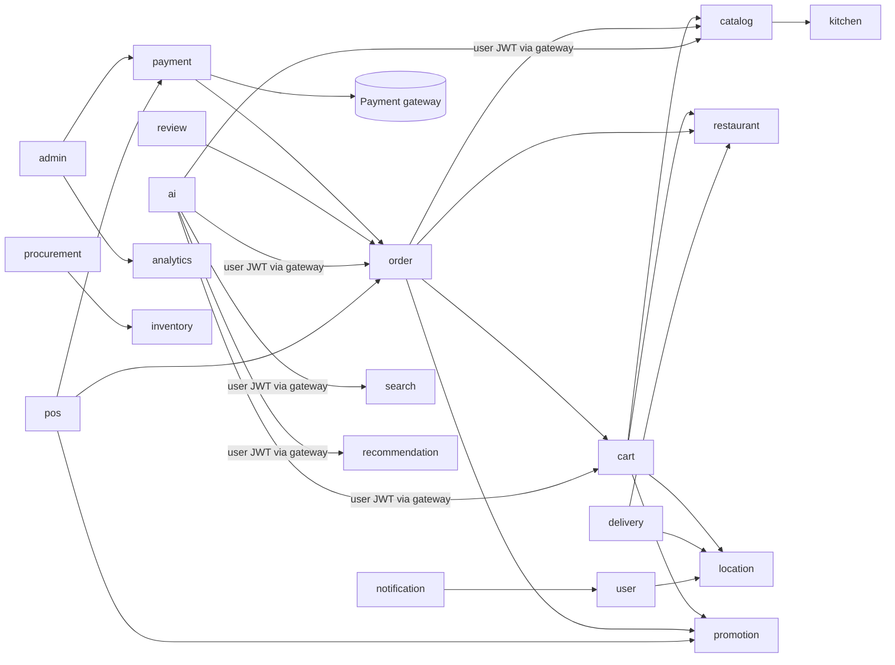

# 05 — Microservices

| Field | Value |
|---|---|
| Version | 1.1.0 |
| Status | **Approved** 2026-10-01 (v1.1.0: Restaurant OS design) |
| Depends on | [04 System Architecture](04-system-architecture.md), [ADR-001](17-adr/ADR-001-microservices.md), [ADR-018](17-adr/ADR-018-restaurant-os-services.md) |

This document defines each deployable: its responsibility, owned data, API surface, synchronous dependencies, events, scaling profile and the requirements it implements. Data models are in [06](06-database-design.md), endpoint conventions in [07](07-api-design.md), and the event catalogue in [08](08-event-driven-architecture.md).

v1.1.0 adds pos-service, kitchen-service, inventory-service and procurement-service, and renames menu-service to **catalog-service** (25 deployables in total, [ADR-018](17-adr/ADR-018-restaurant-os-services.md)). Their detailed designs are in [architecture/restaurant-os/](architecture/restaurant-os/README.md); §3.22–3.25 below summarise them, and the extensions of existing services are listed in [restaurant-os README §1](architecture/restaurant-os/README.md#1-service-boundaries-ros-oq-01-adr-018).

---

## 1. Conventions shared by all services

| Concern | Convention |
|---|---|
| Package root | `com.fooddelivery.<service>` (e.g. `com.fooddelivery.order`) |
| Layers | `api` (controllers, DTOs, mappers) → `application` (use cases, transactions, ports) → `domain` (entities, value objects, state machines, domain rules) → `infrastructure` (JPA, Kafka, Redis, HTTP clients, external adapters) |
| Dependency rule | `domain` depends on nothing framework-specific except JPA annotations. Controllers never touch repositories directly. |
| Shared libraries | `common-web`, `common-security`, `common-events`, `common-persistence`, `common-observability`, `event-contracts` (in `backend/platform/`). Libraries hold *cross-cutting* code only, never domain logic. |
| Config | `spring.application.name` = service name. Config is fetched from config-server. Secrets come from environment variables only. |
| Health | `/actuator/health/liveness`, `/actuator/health/readiness`, `/actuator/prometheus` (internal port only) |
| API base path | `/api/v1/...` via the gateway. Services are not exposed directly. |
| Internal APIs | `/internal/v1/...`: not routed by the gateway, reachable only inside the cluster (NetworkPolicy), and require a service token |
| Sync clients | Spring `RestClient` (or OpenFeign) with Resilience4j: timeout, retry (idempotent GET only), circuit breaker, bulkhead |

### 1.1 Port plan (local development)

| Port | Service | Port | Service |
|---|---|---|---|
| 8080 | api-gateway | 8091 | location-service |
| 8761 | service-discovery | 8092 | notification-service |
| 8888 | config-server | 8093 | review-service |
| 8081 | identity-service | 8094 | search-service |
| 8082 | user-service | 8095 | analytics-service |
| 8083 | restaurant-service | 8096 | admin-service |
| 8084 | catalog-service (was menu-service) | 8097 | realtime-service |
| 8085 | media-service | 8098 | recommendation-service |
| 8086 | cart-service | 8099 | ai-service |
| 8087 | promotion-service | 8100 | audit-service |
| 8088 | order-service | 8101 | requirement-service (Phase 18) |
| 8089 | payment-service | 8090 | delivery-service |
| 8102 | pos-service | 8103 | kitchen-service |
| 8104 | inventory-service | 8105 | procurement-service |

Management/actuator ports are the service port + 1000 (e.g. 9088 for order-service). In Kubernetes every service listens on 8080 and 9090. The table above applies to local development only.

### 1.2 Gateway routing

| Path prefix | Target | Auth |
|---|---|---|
| `/api/v1/auth/**`, `/.well-known/jwks.json` | identity-service | Public (rate-limited) |
| `/api/v1/users/**`, `/api/v1/me/**` | user-service | Authenticated |
| `/api/v1/restaurants/**` (GET) | restaurant-service | Public |
| `/api/v1/restaurants/**` (write), `/api/v1/partner/restaurants/**` | restaurant-service | Authenticated |
| `/api/v1/branches/*/menu/**` (GET), `/api/v1/products/**` (GET) | catalog-service | Public |
| `/api/v1/partner/menu/**`, `/api/v1/partner/catalog/**`, `/api/v1/partner/menus/**` | catalog-service | Authenticated, brand or outlet scope |
| `/api/v1/partner/orders/**` | order-service | Authenticated staff |
| `/api/v1/pos/**` | pos-service | Authenticated staff or paired device + PIN |
| `/api/v1/qr/**` | pos-service | Public with a signed QR token; rate-limited per token and IP |
| `/api/v1/kitchen/**` | kitchen-service | Authenticated staff or paired kitchen device |
| `/api/v1/inventory/**`, `/api/v1/recipes/**` | inventory-service | Authenticated, brand or outlet scope |
| `/api/v1/procurement/**` | procurement-service | Authenticated, brand or outlet scope |
| `/api/v1/partner/devices/**`, `/api/v1/partner/locations/**` | restaurant-service | `DEVICE_MANAGE`, `BRANCH_MANAGE` |
| `/api/v1/auth/device/**` | identity-service | Pairing (public, rate-limited); PIN login (device token) |
| `/api/v1/media/**` | media-service | Authenticated |
| `/api/v1/search/**`, `/api/v1/discovery/**` | search-service | Public |
| `/api/v1/cart/**` | cart-service | Authenticated |
| `/api/v1/coupons/**`, `/api/v1/offers/**` | promotion-service | Mixed |
| `/api/v1/orders/**` | order-service | Authenticated |
| `/api/v1/payments/**`, `/api/v1/refunds/**`, `/api/v1/wallet/**` | payment-service | Authenticated |
| `/api/v1/webhooks/payments/**` | payment-service | Public + signature |
| `/api/v1/delivery/**` | delivery-service | Authenticated |
| `/api/v1/locations/**`, `/api/v1/serviceability/**` | location-service | Authenticated / Public |
| `/api/v1/notifications/**` | notification-service | Authenticated |
| `/api/v1/reviews/**` | review-service | Mixed |
| `/api/v1/recommendations/**` | recommendation-service | Mixed |
| `/api/v1/assistant/**` | ai-service | Authenticated |
| `/api/v1/admin/**` | admin-service (aggregation and complaints) or owning service (`/api/v1/admin/restaurants/**` → restaurant-service, etc.) | Admin permissions |
| `/api/v1/analytics/**` | analytics-service | Permission |
| `/api/v1/audit/**` | audit-service | `AUDIT_VIEW` |
| `/ws/**` | realtime-service | JWT at CONNECT |

Admin actions are routed to the **owning** service (e.g. approve restaurant → restaurant-service). admin-service only owns complaints and read aggregation.

---

## 2. Infrastructure services

### 2.1 api-gateway — REQ-PLAT-001, REQ-SEC-001, REQ-OBS-001
- **Responsibility:**
  - routing (lb:// via Eureka) and API versioning
  - JWT validation (JWKS cached) and session deny-list check (`revoked_sessions`)
  - CORS, security headers, request size limits
  - correlation ID creation and propagation (`X-Correlation-Id` + W3C `traceparent`)
  - rate limiting (Redis token bucket)
  - normalising errors to the standard error format
- **Not responsible for:** business authorisation (services do it).
- **Scaling:** stateless, HPA on CPU/RPS, minimum 2 replicas in production.

### 2.2 service-discovery — REQ-PLAT-002
- Eureka server, 2 peers in production. Self-preservation tuned for Kubernetes pod churn.

### 2.3 config-server — REQ-PLAT-003
- Git-backed (`infrastructure/config-repo` or a separate repo), profiles `local|dev|staging|prod`.
- Values are **non-secret** only. Secret placeholders are resolved from the environment.
- Encrypted properties are not used: secrets do not go into config at all.

---

## 3. Domain services

Each card lists: **Owns**, **API (main)**, **Calls (sync)**, **Publishes**, **Consumes**, **Redis**, **Scaling**, **Requirements**.

### 3.1 identity-service (Phase 5)
- **Owns:** users (credentials), roles, permissions, role assignments (with restaurant/branch scope), refresh token families, password reset tokens, JWK key set.
- **API:**
  - `POST /auth/register`, `/auth/login`, `/auth/otp/send`, `/auth/otp/verify`
  - `POST /auth/refresh`, `/auth/logout`, `/auth/logout-all`
  - `POST /auth/password/forgot`, `/auth/password/reset`
  - `GET /auth/sessions`
  - `GET /.well-known/jwks.json`
  - admin: `/admin/roles`, `/admin/permissions`, `/admin/users/{id}/roles`
  - internal: `POST /internal/v1/tokens/service` (client credentials)
- **Calls:** none synchronously. SMS and e-mail go through notification events. Before Phase 11 an `SmsPort` fake is used (phase-order note).
- **Publishes:** `UserRegistered`, `UserRoleChanged`, `UserBlocked`, `UserUnblocked`, `SessionRevoked`, plus audit events.
- **Consumes:** `RestaurantApproved` (grant the owner role scope), `StaffInvited/StaffRemoved` (scope changes), `PartnerVerified`.
- **Redis (state):** OTP hashes (TTL 5 min), OTP and login attempt counters, `revoked_sessions:{sid}`.
- **Scaling:** CPU-bound at login (password hashing with Argon2id/bcrypt). HPA on CPU.
- **Requirements:** REQ-AUTH-001..005, REQ-SEC-001 (auth limits).

### 3.2 user-service (Phase 5)
- **Owns:** profiles, addresses (geography point), food preferences, devices (push tokens), favourites.
- **API:**
  - `GET/PUT /me/profile`, `/me/preferences`
  - `/me/addresses` CRUD and `POST /me/addresses/{id}/default`
  - `/me/devices` register/unregister
  - `/me/favorites` add/remove/list
- **Calls:** location-service `GET /internal/v1/serviceability` (optional address validation hint).
- **Publishes:** `UserProfileUpdated`, `UserPreferencesUpdated`, `AddressChanged`, `DeviceRegistered`.
- **Consumes:** `UserRegistered` (creates the profile shell), `UserBlocked`.
- **Redis (cache):** preferences (read by recommendation and ai-service).
- **Requirements:** REQ-USER-001..004.

### 3.3 audit-service (Phase 5)
- **Owns:** `audit_logs`: append-only, hash-chained, monthly partitions.
- **API:** `GET /audit/logs` (filter by actor, entity, action, date; requires `AUDIT_VIEW`).
- **Consumes:** `audit.events.v1` from all services.
- **Publishes:** nothing.
- **Notes:** no update or delete endpoints. The database role used by the service has no UPDATE or DELETE on `audit_logs`.
- **Requirements:** REQ-AUDIT-001.

### 3.4 restaurant-service (Phase 6)
- **Owns:** restaurants, branches (location, delivery radius, prep-time default), hours and overrides, documents (FSSAI, GST, PAN, bank — references to private media), settings (auto-accept, packaging charge), status history, staff and invitations.
- **API:**
  - Public: `GET /restaurants/{id}`, `GET /restaurants/{id}/branches`
  - Partner:
    - `POST /partner/restaurants` (onboard)
    - `PUT /partner/restaurants/{id}`
    - `/partner/restaurants/{id}/branches` CRUD
    - `/branches/{id}/hours`
    - `POST /branches/{id}/availability` (open/close/busy toggle)
    - `/branches/{id}/staff`
  - Admin: `/admin/restaurants?status=PENDING`, `POST /admin/restaurants/{id}/approve|reject|suspend`
  - Internal: `GET /internal/v1/branches/{id}/status` (open, accepting orders, prep time)
- **Calls:** media-service (validate document media IDs).
- **Publishes:** `RestaurantSubmitted`, `RestaurantApproved`, `RestaurantRejected`, `RestaurantSuspended`, `BranchCreated`, `BranchUpdated`, `BranchAvailabilityChanged`, `StaffInvited`, `StaffRemoved`.
- **Consumes:** `RatingAggregated` (denormalised rating for display).
- **Redis (cache):** branch open status (write-through).
- **Requirements:** REQ-RESTAURANT-001..004.

### 3.5 catalog-service (Phase 6; was menu-service)
v1.1.0 renames the service and widens it to the brand catalogue: master products, combos, tax classes, price layers, menus per channel, schedules and published menu versions ([CATALOG_ARCHITECTURE.md](architecture/restaurant-os/CATALOG_ARCHITECTURE.md)). The internal price check moves to `POST /internal/v1/pricing/price-check` with a `channel` parameter, and events move to `catalog.events.v1`. The v1.0.0 scope below stays valid.
- **Owns:** categories, products (veg/non-veg/egg, tags, prep time), variants, add-on groups and add-ons (min/max selection), product images (media IDs), availability/stock.
- **API:**
  - Public: `GET /branches/{id}/menu` (cached full menu), `GET /products/{id}`
  - Partner: `/partner/menu/branches/{id}/categories|products|variants|addon-groups` CRUD, `PATCH /partner/menu/products/{id}/availability`
  - Internal: `POST /internal/v1/menu/price-check` (batch: product, variant and add-on IDs → current prices and availability), `POST /internal/v1/menu/stock/reserve|release` (only for products with tracked stock)
- **Calls:** none in the request path.
- **Publishes:** `MenuUpdated` (coarse, per branch), `ProductUpdated`, `MenuItemAvailabilityChanged`.
- **Consumes:** `BranchCreated` (initialise the menu), `RestaurantSuspended` (hide the menu), `RatingAggregated` (product ratings).
- **Redis (cache):** `menu:branch:{id}:v{version}`, TTL 10 min, evicted after commit.
- **Scaling:** read-heavy. Most traffic is served from Redis.
- **Requirements:** REQ-MENU-001..004.

### 3.6 media-service (Phase 6)
- **Owns:** media asset metadata (owner, purpose, visibility, status, variants, checksum).
- **API:** `POST /media/upload-url` (returns a pre-signed PUT URL with limits), `POST /media/{id}/complete`, `GET /media/{id}` (public CDN URL, or a short-lived signed URL for private assets).
- **Flow:** the client uploads directly to object storage. On completion the service validates type, size and magic bytes, scans for malware (ClamAV), generates variants (thumbnail, medium) and marks the asset READY.
- **Publishes:** `MediaUploaded`, `MediaRejected`.
- **Requirements:** REQ-MEDIA-001.

### 3.7 cart-service (Phase 7)
- **Owns:** carts (one active cart per user, single branch), items with variant and add-on selections, price quotes.
- **API:**
  - `GET /cart`, `POST /cart/items`, `PATCH /cart/items/{id}`, `DELETE /cart/items/{id}`, `DELETE /cart`
  - `POST /cart/coupon`, `DELETE /cart/coupon`
  - `POST /cart/quote` (validates everything and returns a signed quote, valid 10 min)
- **Calls:**
  - menu-service `price-check`
  - restaurant-service `branch status`
  - location-service `serviceability` and `distance` (delivery fee)
  - promotion-service `validate`
- **Pricing:** item subtotal + add-ons + packaging + delivery fee (distance slab) + platform fee + GST − discount. Computed server-side only, with `BigDecimal` and HALF_UP.
- **Quote:** `{quoteId, userId, branchId, lines, amounts, couponCode, addressId, expiresAt}`, persisted and signed with HMAC-SHA256 (key from the secret manager). order-service verifies the signature and expiry.
- **Expiry (OQ-10):** cart contents kept 24 h for logged-in users. Prices and availability are re-validated if the cart has been idle for more than 30 min.
- **Publishes:** none (cart events would be noise). Abandoned-cart analytics are a backlog item.
- **Consumes:** `MenuItemAvailabilityChanged`, `BranchAvailabilityChanged` (flag affected carts for re-validation).
- **Requirements:** REQ-CART-001..003.

### 3.8 promotion-service (Phase 7)
- **Owns:** offers/coupons (versioned), applicability (restaurant, branch, user segment, first order), redemptions, abuse flags.
- **API:**
  - Customer: `GET /offers?branchId=`, `GET /coupons/available`
  - Admin/partner: `/admin/coupons` CRUD, `/partner/offers` CRUD
  - Internal:
    - `POST /internal/v1/coupons/validate` (cart context → discount)
    - `POST /internal/v1/coupons/reserve` (order ID, idempotent)
    - `POST /internal/v1/coupons/commit`
    - `POST /internal/v1/coupons/release`
- **Concurrency:** usage limits are enforced with an atomic conditional update:
  ```sql
  UPDATE offers
     SET redeemed_count = redeemed_count + 1
   WHERE id = ? AND redeemed_count < max_redemptions;
  ```
  Per-user limits are enforced by a unique constraint.
- **Publishes:** `OfferUpdated`, `CouponRedeemed`, `PromotionAbuseFlagged`.
- **Consumes:** `OrderCancelled`, `OrderPaymentFailed` (release, as a safety net besides orchestrator commands).
- **Redis (cache):** active offers per branch.
- **Requirements:** REQ-PROMO-001..003 (004 is backlog).

### 3.9 order-service (Phase 8) — saga orchestrator
- **Owns:** orders (state, totals, partner assignment fields), items (price snapshot), address snapshot, pricing breakdown, status history, saga state, idempotency keys.
- **API:**
  - Customer:
    - `POST /orders` (Idempotency-Key, quoteId)
    - `GET /orders`, `GET /orders/{id}`
    - `POST /orders/{id}/cancel`
    - `GET /orders/{id}/tracking` (status + partner location fallback)
    - `POST /orders/{id}/reorder` (builds a cart)
  - Restaurant: `GET /partner/orders?branchId=&status=`, `POST /partner/orders/{id}/accept` (prepTimeMinutes), `/reject` (reason), `/preparing`, `/ready`
  - Admin: `GET /admin/orders` (search), `POST /admin/orders/{id}/cancel`, `POST /admin/orders/{id}/refund` (delegates to payment)
  - Internal: `GET /internal/v1/orders/{id}/summary` (for payment amount, review eligibility, AI tool)
- **Calls:** cart-service (quote fetch and verify), promotion-service (reserve, commit, release), menu-service (stock reserve for tracked-stock items), restaurant-service (branch accepting orders).
- **Publishes:** `order.events.v1` (see 08 §3); commands to `payment.commands.v1` and `delivery.commands.v1`.
- **Consumes:** `payment.events.v1` (PaymentCompleted/Failed, RefundCompleted/Failed, CodCollected), `delivery.events.v1` (DeliveryAssigned, DeliveryUnassigned, DeliveryPickedUp, DeliveryOutForDelivery, DeliveryCompleted, DeliveryFailed, DeliveryAssignmentFailed).
- **Timeouts (saga_state, ShedLock job every 15 s):**

  | Wait | Timeout | Action |
  |---|---|---|
  | Payment | 15 min | PAYMENT_FAILED (closed) |
  | Restaurant accept | 5 min (OQ-11) | Reject + refund |
  | Ready | prep time + 20 min | Alert |
  | Assignment | 10 min after ready | Escalate |

- **State machine:** [order-state-machine.md](architecture/order-state-machine.md).
- **Requirements:** REQ-ORDER-001..006.

### 3.10 payment-service (Phase 9) — includes wallet module
- **Owns:** payments, payment transactions (gateway attempts), webhook events (raw + dedupe), refunds, reconciliation reports, wallets and wallet transactions (double-entry style ledger).
- **API:**
  - `POST /payments` (Idempotency-Key, orderId, method) → gateway order details for hosted checkout
  - `GET /payments/{id}`
  - `POST /webhooks/payments/razorpay` (public, HMAC verified)
  - `GET /wallet`, `GET /wallet/transactions`
  - Admin: `GET /admin/payments`, `GET /admin/refunds`, `POST /admin/refunds` (partial refund with reason), `GET /admin/reconciliation`
- **Amount source:** the amount always comes from order-service (`internal summary`), never from the client.
- **Calls:** order-service internal summary, `PaymentGateway` port (Razorpay or mock).
- **Publishes:** `PaymentInitiated`, `PaymentCompleted`, `PaymentFailed`, `RefundCreated`, `RefundCompleted`, `RefundFailed`, `CodCollected`, `WalletCredited`, `WalletDebited`.
- **Consumes:** `payment.commands.v1` (RefundRequested, CapturePayment if needed), `OrderCancelled` (safety net), `DeliveryCompleted` with COD (mark COD collected).
- **Jobs:** reconciliation every 10 min for payments PENDING for more than 15 min (query the gateway). Daily settlement report.
- **Wallet (OQ-13):** credit only from refunds and cashback, with no top-up. Debit only for order payment. `CHECK (balance >= 0)`, with each debit in the same transaction as its ledger row.
- **Requirements:** REQ-PAYMENT-001..005, REQ-WALLET-001 (002 is backlog).

### 3.11 delivery-service (Phase 10)
- **Owns:** partners (vehicle, verification, rating), partner documents, availability state and history, assignments, offers, assignment decisions (scores), delivery status history, earnings.
- **API:**
  - Partner:
    - `POST /delivery/partners` (onboard), `GET/PUT /delivery/partners/me`
    - `POST /delivery/partners/me/status` (ONLINE/OFFLINE/BREAK)
    - `GET /delivery/offers/current`, `POST /delivery/offers/{id}/accept|reject`
    - `GET /delivery/assignments/current`
    - `POST /delivery/assignments/{id}/arrived-at-restaurant|picked-up|out-for-delivery|arrived|delivered|failed` (delivered requires OTP or proof photo)
    - `GET /delivery/earnings`
  - Admin: `/admin/partners?status=`, `POST /admin/partners/{id}/verify|reject|suspend`, `POST /admin/assignments/{orderId}/reassign`
- **Calls:** location-service (GEO candidates, ETA), restaurant-service (branch location, prep).
- **Publishes:** `PartnerVerified`, `PartnerStatusChanged`, `DeliveryOfferCreated`, `DeliveryAssigned`, `DeliveryUnassigned`, `DeliveryAssignmentFailed`, `DeliveryPickedUp`, `DeliveryOutForDelivery`, `DeliveryCompleted`, `DeliveryFailed`.
- **Consumes:** `delivery.commands.v1` (AssignDeliveryRequested, CancelDeliveryRequested), `OrderReady` (immediate assignment if not yet assigned), `RatingAggregated` (partner rating).
- **Redis (state):** partner availability hash, per-order assignment lock, offer timers (sorted set by deadline).
- **Algorithm:** [delivery-assignment-algorithm.md](architecture/delivery-assignment-algorithm.md).
- **Requirements:** REQ-DELIVERY-001..005.

### 3.12 location-service (Phase 7 serviceability, Phase 10 ingestion)
- **Owns:** location history (partitioned daily), ETA predictions (for later accuracy analysis).
- **API:**
  - `POST /locations/batch` (partner only; up to 10 points)
  - `GET /serviceability?lat=&lng=&branchId=`
  - Internal:
    - `GET /internal/v1/distance?from=&to=`
    - `POST /internal/v1/eta`
    - `GET /internal/v1/partners/nearby?lat=&lng=&radiusKm=&limit=`
    - `GET /internal/v1/partners/{id}/location`
- **Ingestion path:** validate (accuracy, speed sanity, timestamp skew) → `GEOADD partners:geo` + `HSET partner:loc:{id}` → publish `location.updates.v1` (no outbox). Kafka consumer `history-writer` batch-inserts every 1–2 s.
- **Routing:** `RoutingProvider` port (Haversine × road factor 1.3 initially, per ADR-015).
- **Scaling:** highest write volume. Stateless, HPA on RPS. Kafka topic with 24+ partitions at production scale.
- **Requirements:** REQ-LOCATION-001..003.

### 3.13 notification-service (Phase 11)
- **Owns:** templates (versioned, per channel and locale), notifications (inbox), deliveries per channel (status, attempts, dedupe key), preferences.
- **API:**
  - `GET /notifications` (inbox), `POST /notifications/{id}/read`, `POST /notifications/read-all`
  - `GET/PUT /notifications/preferences`
  - Admin: `/admin/notification-templates` CRUD
- **Consumes:** order, payment, delivery, restaurant, review, identity (OTP, password reset) and complaint events.
- **Mapping:** event type → template → channels, respecting preferences. Transactional messages (OTP, payment receipt) ignore marketing opt-outs.
- **Publishes:** `NotificationCreated` (realtime-service pushes it to the in-app inbox).
- **Calls:** user-service internal devices lookup (push tokens). Providers via ports (ADR-015).
- **Reliability:** dedupe key = `eventId + channel + recipient`. Retries with backoff. A provider circuit breaker falls back to the next channel for critical messages.
- **Requirements:** REQ-NOTIF-001..003.

### 3.14 review-service (Phase 12)
- **Owns:** reviews (restaurant, product, delivery rating per order), images, replies, moderation status, rating aggregates.
- **API:**
  - `POST /reviews` (orderId, only after delivery, within 14 days, once per order and target)
  - `GET /reviews?restaurantId=`
  - Partner: `POST /reviews/{id}/reply`
  - Admin: `POST /admin/reviews/{id}/hide|restore`
- **Calls:** order-service internal summary (eligibility).
- **Publishes:** `ReviewCreated`, `ReviewModerated`, `RatingAggregated` (restaurant, product, partner).
- **Requirements:** REQ-REVIEW-001..002.

### 3.15 search-service (Phase 13)
- **Owns:** `restaurant_search_docs`, `dish_search_docs` (denormalised read model).
- **API:** `GET /discovery/restaurants?lat=&lng=&sort=&filters` (nearby, open now, rating), `GET /search?q=&lat=&lng=&type=restaurant|dish&filters`, `GET /search/suggest?q=`.
- **Consumes:** restaurant, menu, review (aggregates) and promotion (offer badges) events.
- **Ops:** `POST /admin/search/reindex` (`SEARCH_REINDEX`) rebuilds from source services' internal export endpoints.
- **Redis (cache):** popular queries per geohash-5 cell (TTL 5–10 min).
- **Requirements:** REQ-SEARCH-001..003.

### 3.16 analytics-service (Phase 13)
- **Owns:** fact tables (orders, payments, deliveries) partitioned by day, and daily aggregates.
- **API:** `GET /analytics/platform/*` (`ANALYTICS_VIEW_PLATFORM`), `GET /analytics/restaurants/{id}/*` (`ANALYTICS_VIEW_RESTAURANT` + scope), CSV export.
- **Consumes:** order, payment, delivery and review events.
- **Requirements:** REQ-ANALYTICS-001.

### 3.17 admin-service (Phase 14)
- **Owns:** complaints/support tickets, complaint messages, SLA timers.
- **API:**
  - Customer: `POST /complaints` (orderId optional), `GET /complaints`, `POST /complaints/{id}/messages`
  - Admin: `/admin/complaints` (assign, resolve with resolution type; a refund resolution calls payment-service), `GET /admin/dashboard` (aggregates from analytics plus health)
- **Publishes:** `ComplaintCreated`, `ComplaintResolved`.
- **Requirements:** REQ-ADMIN-003, plus aggregation for REQ-ADMIN-001/002/004. Those admin actions are executed by the owning services.

### 3.18 realtime-service (Phase 16)
- **Owns:** no database. Connection registry in memory. Active-delivery map in Redis.
- **Endpoints:**
  - `/ws` (STOMP over WebSocket, SockJS fallback disabled by default)
  - user destinations:
    - `/user/queue/orders`
    - `/user/queue/orders/{id}/location`
    - `/user/queue/notifications`
    - `/user/queue/delivery-offers`
  - restaurant topic: `/topic/branches/{id}/orders` (scope-checked)
- **Consumes:** order, payment, delivery and notification events, plus `location.updates.v1` (filtered by the active-delivery map).
- **Fan-out:** Redis Pub/Sub channel `rt:user:{userId}` and `rt:branch:{branchId}`.
- **Scaling:** on connection count (custom metric). Graceful drain on shutdown (clients reconnect with backoff).
- **Requirements:** REQ-RT-001..003.

### 3.19 recommendation-service (Phase 17)
- **Owns:** user order features (frequency, cuisines, time-of-day), item popularity by area and time.
- **API:** `GET /recommendations/home`, `GET /recommendations/reorder`, `GET /recommendations/similar?productId=`.
- **Strategy:** a `RecommendationStrategy` interface. The rule-based implementation is v1, ML/LLM is backlog (REQ-REC-002).
- **Consumes:** `OrderDelivered`, `RatingAggregated`, `UserPreferencesUpdated`, `MenuItemAvailabilityChanged`.
- **Requirements:** REQ-REC-001.

### 3.20 ai-service (Phase 17)
- **Owns:** assistant sessions and messages (30-day retention), tool invocations, usage ledger (tokens, cost, latency).
- **API:** `POST /assistant/sessions`, `POST /assistant/sessions/{id}/messages` (streaming via SSE optional), `POST /assistant/sessions/{id}/confirm/{toolCallId}`.
- **Calls:** gateway public APIs with the **user's JWT** (search, menu, recommendations, cart, order status). It never accesses a database directly.
- **Requirements:** REQ-AI-001..003. Details in [15](15-ai-architecture.md).

### 3.21 requirement-service (Phase 18)
- **Owns:** requirements, versions, status history, traceability links, test evidence, releases (imported from `requirements.json`).
- **API:** `/requirements`, `/requirements/{id}/versions`, `/requirements/{id}/status` (transition with evidence), `/traceability`, `/releases`.
- **Requirements:** REQ-RMS-001..006 (tooling), REQ-DEVAGENT-001, REQ-ADMIN-004.

### 3.22 pos-service (Phase 13A)
- **Owns:** areas, tables, table sessions, transfers and merges, held orders, QR codes and QR sessions, bills, splits, invoices (gap-free numbering), credit notes, in-store settlement.
- **API:** `/pos/**` (staff or paired device + PIN), `/qr/**` (signed QR token).
- **Calls:** order-service (in-store order create, authoritative lines), payment-service (in-store payments, dynamic UPI QR), promotion-service (bill coupons).
- **Publishes:** `pos.events.v1`. **Consumes:** order, payment and kitchen events.
- **Design:** [POS_ARCHITECTURE.md](architecture/restaurant-os/POS_ARCHITECTURE.md).

### 3.23 kitchen-service (Phase 13B)
- **Owns:** stations, displays and printers, KOTs and KOT items, KOT event history, KOT numbering, KDS state, order kitchen roll-up.
- **API:** `/kitchen/**` (staff or paired kitchen device).
- **Publishes:** `kitchen.events.v1` (including `OrderKitchenStatusChanged`). **Consumes:** `KitchenRoundSubmitted`, `OrderLineVoided`, `OrderCancelled`.
- **Design:** [KITCHEN_ARCHITECTURE.md](architecture/restaurant-os/KITCHEN_ARCHITECTURE.md).

### 3.24 inventory-service (Phase 13C)
- **Owns:** stock items, units, locations, balances, batches, the movement ledger, consumption, counts, waste, transfers, central-kitchen requests, production, alerts, costing, recipes and recipe costs.
- **API:** `/inventory/**`, `/recipes/**`. Internal: `POST /internal/v1/stock/returns`.
- **Publishes:** `inventory.events.v1`. **Consumes:** `OrderCompleted`, `KOTCancelled`, `KOTUpdated`, `PurchaseReceived`, location events.
- **Design:** [INVENTORY_ARCHITECTURE.md](architecture/restaurant-os/INVENTORY_ARCHITECTURE.md), [ADR-020](17-adr/ADR-020-inventory-ledger-costing.md).

### 3.25 procurement-service (Phase 13D)
- **Owns:** suppliers, supplier items, purchase suggestions, purchase orders, goods receipts, purchase invoices, returns and debit notes, supplier payment records.
- **API:** `/procurement/**`.
- **Calls:** inventory-service (post purchase returns).
- **Publishes:** `procurement.events.v1`. **Consumes:** stock alert events, `StockReceiptPosted`.
- **Design:** [INVENTORY_ARCHITECTURE.md](architecture/restaurant-os/INVENTORY_ARCHITECTURE.md).

---

## 4. Synchronous dependency graph



Rules:
1. **No cycles.** payment → order is a read of the summary. order → payment happens only through commands and events, never synchronously.
2. A synchronous call is allowed only when the caller cannot answer the current request without it.
3. Every synchronous client has a timeout (default 2 s connect + read, 500 ms for the menu price check), a circuit breaker and a defined fallback. The fallback is often a clear 503 error rather than stale data for money-related reads.

---

## 5. Scaling profiles

| Profile | Services | HPA signal | Notes |
|---|---|---|---|
| Read-heavy, cacheable | menu, search, restaurant (public), recommendation | CPU / RPS | Redis absorbs most reads |
| Write-heavy, ephemeral | location | RPS | No synchronous DB writes in the ingest path |
| Connection-bound | realtime | Active connections | Graceful drain |
| Transactional core | order, payment, cart, promotion | CPU | Dedicated DB instances for order and payment in production |
| Event consumers | notification, analytics, audit, search (indexer) | Kafka consumer lag (KEDA optional) | Partition count caps parallelism |
| CPU spikes | identity (password hashing), media (image variants) | CPU | Variant generation done asynchronously |
| External-latency-bound | ai | Concurrent requests | Strict per-user and global budgets |
