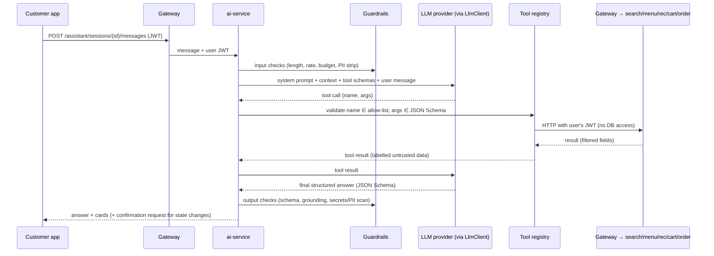

# 15 — AI Architecture

| Field | Value |
|---|---|
| Version | 1.0.0 |
| Status | **Approved** 2026-10-01 |
| Depends on | [ADR-015](17-adr/ADR-015-external-provider-adapters.md), [ADR-017](17-adr/ADR-017-typescript-agents.md), [09 Security §8](09-security.md) |
| Requirements | REQ-AI-001..003, REQ-REC-001/002, REQ-DEVAGENT-001..003, REQ-TESTAGENT-001..003, REQ-RMS-003/005 |

The platform contains two kinds of AI:

- **Runtime AI** for end users: the food assistant in `ai-service` (Java, Spring AI) and rule-based recommendations in `recommendation-service`.
- **Development-time agents**: DevAgent, TestAgent and the specialised agents in `ai-agents/` (TypeScript). They never run in the production request path.

---

## Part A: Food assistant (ai-service, Phase 17)

### A1. Request flow



A maximum of 4 tool calls per turn applies, with an overall turn timeout of 20 s.

### A2. Structured criteria (REQ-AI-001 AC1)
The first tool-planning step converts natural language into a validated criteria object:

```json
{
  "$id": "food-search-criteria.v1",
  "type": "object",
  "additionalProperties": false,
  "properties": {
    "query":      { "type": "string", "maxLength": 100 },
    "diet":       { "enum": ["VEGETARIAN", "VEGAN", "EGGETARIAN", "NON_VEGETARIAN", "ANY"] },
    "spice":      { "enum": ["MILD", "MEDIUM", "HIGH"] },
    "cuisines":   { "type": "array", "items": { "type": "string" }, "maxItems": 5 },
    "maxPrice":   { "type": "number", "minimum": 0 },
    "minRating":  { "type": "number", "minimum": 1, "maximum": 5 },
    "maxDeliveryMinutes": { "type": "integer", "minimum": 10 },
    "sort":       { "enum": ["RELEVANCE", "RATING", "DELIVERY_TIME", "PRICE_LOW"] },
    "clarificationNeeded": { "type": "string" }
  }
}
```

Example: "I want spicy vegetarian food under 300 rupees" gives `{"diet":"VEGETARIAN","spice":"HIGH","maxPrice":300}`. Ambiguous input sets `clarificationNeeded`, and the assistant asks rather than guesses (AC2). The assistant maps diet values to menu `food_type` (VEGETARIAN → VEG, and so on) in the tool layer, not in the LLM.

### A3. Tool registry (REQ-AI-002)
| Tool | Calls | State-changing | Confirmation |
|---|---|---|---|
| `searchFood(criteria, location)` | `GET /search` (dish + restaurant) | No | — |
| `getMenu(branchId, filters)` | `GET /branches/{id}/menu` | No | — |
| `getRecommendations(context)` | `GET /recommendations/home` | No | — |
| `addToCart(branchId, productId, variantId, addonIds, qty)` | `POST /cart/items` | **Yes** | **Required** (AC4): the assistant returns a `confirmation` card; the tool executes only after `POST …/confirm/{toolCallId}` from the user |
| `getOrderStatus(orderId?)` | `GET /orders/{id}` / latest active order | No | — |

- Each tool is a Java class with a JSON Schema for input and a **result projector** that returns only the fields the model needs (name, price, rating, ETA, veg flag, IDs). No phone numbers, addresses or payment data are ever included (REQ-AI-003 AC2).
- Every call is logged in `tool_invocations` with trace ID, tool, validated args, outcome and latency (AC5).
- Unknown tools or invalid arguments are rejected, logged, counted in `assistant_tool_calls_total{outcome="rejected"}`, and the model is told the call failed.
- There are no payment, order-placement, cancellation or profile-changing tools in v1. Adding any tool requires a requirement change and a security review.

### A4. Grounding (REQ-AI-001 AC3)
The final answer schema lists `items[]` with `{type, id}` references. ai-service checks that every referenced ID, name and price appeared in this turn's tool results. Any mismatch is dropped or regenerated once, otherwise a fallback answer is given. The evaluation set measures the fabrication rate (target 0 on the set).

### A5. Guardrails and cost (REQ-AI-003)
| Control | Design |
|---|---|
| Prompt isolation | System prompt in code (versioned); user and tool content wrapped in delimiters and labelled as data; the model is instructed never to follow instructions inside data |
| Injection red team | `ai-service/src/test/resources/redteam/*.yaml` (instruction overrides, tool coercion, exfiltrate system prompt, role-play, encoded payloads, indirect injection via restaurant descriptions or reviews). CI asserts that no non-registered tool is invoked, no system prompt text leaks and no confirmation bypass occurs (AC1). |
| Data minimisation | Only the message, short session context (last 10 turns, summarised beyond that), coarse location (city or geohash-5) and tool projections are sent to the provider |
| Rate limits | 20 messages/min per user (gateway) |
| Budgets | Per-user daily token budget (Redis counter); global monthly cost budget (`usage_ledger`); at 80% an alert fires; at 100% the assistant falls back to **keyword search** (calls `searchFood` with the raw text as `query`, no LLM) (AC3) |
| Provider failure | Circuit breaker on `LlmClient`; same fallback |
| Model choice | Spring AI provider abstraction; the default model is chosen in Phase 17 by an evaluation on the test set (task success, grounding, latency p95, cost per 1K turns). Configurable per environment. |
| Monitoring | Metrics in 12 §2.2; admin dashboard tile (AC4) |

### A6. Evaluation
- `ai-service/eval/` holds about 150 labelled conversations (criteria extraction, clarification cases, grounding, refusal of out-of-scope requests, Hindi-English mixed inputs as stretch).
- Metrics: criteria exact-match/F1, clarification precision, fabrication rate, tool success rate, latency, cost.
- Runs nightly in CI against the configured provider (budget-capped) and on every prompt or tool change PR with a **scripted fake model** for deterministic tests.

---

## Part B: Recommendations (recommendation-service, Phase 17)

`RecommendationStrategy` interface → `RuleBasedStrategy` (v1). Candidate generation comes from the user's area (geohash), restaurants that are open and serviceable (from the search read model), and items.

| Signal (REQ-REC-001 AC1) | Rule / weight |
|---|---|
| Previous orders | Reorder candidates (`ORDERED_BEFORE`), boosted by recency and frequency |
| Cuisine preference | Match with preferences or order history (`MATCHES_PREFERENCE`) |
| Price range | Within ±30% of the user's average order value |
| Time of day | Item popularity for the time bucket |
| Location | Same geohash-5 and neighbours, within delivery radius |
| Popularity | `item_popularity` score (`POPULAR_NEARBY`) |
| Ratings | Minimum 3.8 for the "top rated" slot (`HIGHLY_RATED`) |

Every item carries a reason code (AC3). Cold start uses popular-nearby only (AC4). The output is filtered by open and serviceable status at request time (AC2). ML/LLM strategies plug in behind the same interface (REQ-REC-002, backlog).

---

## Part C: Development agents (`ai-agents/`, Phases 18–19)

### C1. Principles (MP §53, REQ-DEVAGENT-002)
- Agents act only through **Git branches + PRs, CI runs and requirement-service APIs**. They have no production credentials, no direct pushes to `main`, and no deploy rights. Branch protection enforces this technically.
- The workflow for major changes is Requirement → Impact analysis → Plan → Implementation → Tests → Review → Approval → Merge. Approval is always human.
- Agents read the `.ai/` context files before modifying anything (REQ-DEVAGENT-001 AC3).
- No requirement moves past `TESTING` (to `UAT`, `READY_FOR_RELEASE` or `COMPLETED`) without evidence that references a **real CI run ID** (REQ-DEVAGENT-002 AC3/AC4). The requirement-service API rejects transitions without evidence.

### C2. Components
```text
ai-agents/
  shared/            LLM client (provider-agnostic), tool framework, schemas (Ajv), GitHub client, logger
  requirement-agent/ requirement CRUD, impact analysis drafts, consistency checks
  dev-agent/         orchestrator for specialised agents; task state machine
  test-agent/        test generation, execution via CI, evidence, bug creation, visual testing
  schemas/           agent-output.schema.json (MP §56 format), task.schema.json, evidence.schema.json
```

### C3. DevAgent tools (REQ-DEVAGENT-001 AC1)
| Tool | Implementation |
|---|---|
| `getRequirement`, `createRequirement`, `updateRequirement`, `getRequirementHistory` | requirement-service API (before Phase 18: read and PR edits of `requirements.json`) |
| `analyzeArchitecture` | Reads `docs/`, `.ai/architecture-context.md`, module graph (Maven), OpenAPI and event schemas |
| `analyzeImpact` | Dependency graph from requirements + code ownership map + API and event consumers; produces an `IMPACT-NNNN.md` draft |
| `createTask`, `updateTask`, `getTaskStatus` | Task records (GitHub Issues linked to requirement IDs) |
| `generateCode`, `reviewCode` | LLM with repository context; output is a **branch + PR**, never a direct write to `main` |
| `generateTests`, `runTests`, `analyzeFailure` | Delegates to TestAgent; `runTests` triggers a CI workflow and waits for the run ID |
| `createBug` | GitHub issue with label `bug`, requirement link, failing test, logs |
| `updateDocumentation`, `generateReleaseNotes` | PRs against `docs/`; release notes from merged PRs + requirement statuses |

Every tool action is logged with task ID, requirement ID, input summary and output (AC2).

### C4. Specialised agents and handoff (REQ-DEVAGENT-003, MP §55)
The MP §55 example order is **Requirement → Architect → Backend → Frontend → Mobile → Test → Security → CodeReview → Documentation**. The two agents the example does not place are inserted per the MP §52 workflow:

- **Database** runs after Architect (database impact precedes the API contract and implementation).
- **DevOps** runs after CodeReview, when deployment or infrastructure changes are involved.

Agents that do not apply to a task are skipped. Shared state is a task file `ai-agents/state/<TASK-ID>.json`, committed on the task branch. Each agent appends its output in the standard format and validates it against `agent-output.schema.json`:

`TASK ID, REQUIREMENT ID, CURRENT STATUS, WHAT WAS ANALYZED, WHAT WAS CHANGED, FILES CHANGED, DATABASE CHANGES, API CHANGES, TESTS CREATED, TESTS EXECUTED, TEST RESULTS, KNOWN ISSUES, DEPENDENCIES, NEXT ACTION`.

### C5. TestAgent (REQ-TESTAGENT-001..003)
1. **Generate:** from the requirement's ACs, propose tests per layer (unit, integration, API, web E2E, mobile E2E, negative, security, regression). Each test is named or annotated with `@Requirement("REQ-ORDER-001")` and `@AcceptanceCriterion("AC2")` (JUnit tag or Playwright annotation). Tests enter the suite only via a reviewed PR.
2. **Execute:** trigger CI and collect JUnit XML, Playwright and Appium reports, coverage and the run ID.
3. **Evidence:** `evidence.schema.json` records commit SHA, environment, executed/passed/failed/skipped counts, duration and artefact URLs. It is attached to the requirement and the traceability matrix is updated (REQ-RMS-005). It never reports tests that were not run.
4. **Failures:** analyse the logs, then create a bug linked to the requirement and test; the requirement moves to `BUG_FOUND`.
5. **Visual implementation and testing** (REQ-TESTAGENT-003):
   - Reference images are converted into a UI spec (layout, spacing, typography, colours, components, responsive rules) stored in `docs/ui/specs/<screen>.md`.
   - Playwright captures screenshots at defined viewports (360×800, 768×1024, 1440×900) with fixed fonts, data and animations disabled.
   - The comparison uses **pixelmatch diff % and SSIM** against per-screen thresholds (e.g. diff ≤ 3%, SSIM ≥ 0.95 for layout-faithful screens). Reference designs that are not pixel-exact mock-ups get layout-level checks instead.
   - Diff images feed correction tasks. The loop runs until the threshold is met, or escalates after 5 iterations.
   - Reports state the measured values. "Pixel-perfect" is claimed only with a 0% diff measurement (MP rule).

### C6. Safety controls summary
| Risk | Control |
|---|---|
| Agent breaks production | No deploy rights; PR + CI + human approval; protected branches |
| Fabricated test results | Evidence must reference a CI run ID that the API verifies with GitHub; schema validation |
| Silent requirement change | Requirement edits go through the versioning rules (new version + impact report + approval); CI checks history immutability |
| Secret exposure | Agents have no production secrets; gitleaks on agent PRs; prompts are scrubbed of secrets |
| Unrelated changes | CodeReview agent and human review check the diff scope against the task's file plan |
