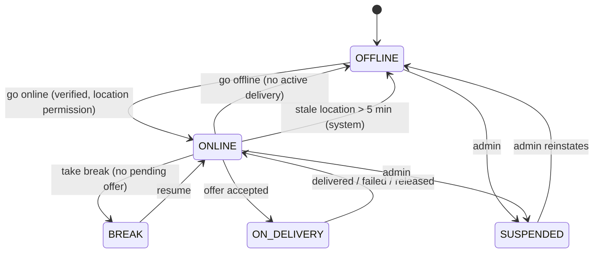

# Delivery Assignment Algorithm

| Field | Value |
|---|---|
| Version | 1.0.0 |
| Status | **Approved** 2026-10-01 |
| Owner | delivery-service (candidates via location-service) |
| Requirements | REQ-DELIVERY-002, REQ-DELIVERY-003, REQ-LOCATION-001, REQ-LOCATION-003 |
| Source | REF p.9 (radius 2→5 km, 30 s offer, weights 40/20/20/10/10), MP §17 |

---

## 1. Trigger and timing

| Trigger | When assignment starts |
|---|---|
| `AssignDeliveryRequested` (sent at `RestaurantAcceptedOrder`) | At `notBefore = estimated_ready_at − (typical pickup ETA + buffer)`. Defaults: typical pickup ETA 8 min (configurable per city, later learned from history), buffer 2 min. If `notBefore` is already in the past, start immediately. |
| `OrderReady` with no partner assigned | Immediately; the request jumps the queue (priority 1) |
| `DeliveryUnassigned` (partner released) | Immediately, excluding the released partner |
| Admin manual reassignment | Immediately, with an optional forced partner (still subject to the hard filters except radius) |

Scheduled requests are held in a Redis sorted set `assign:schedule` (score = `notBefore` epoch ms). A ShedLock-guarded poller runs every second and dispatches due requests to a worker pool.

## 2. Candidate search

1. Restaurant branch location `B` (cached from `BranchUpdated`).
2. Radius rounds `R = [2.0, 3.5, 5.0]` km (configurable per city; the maximum comes from REF p.9).
3. `GEOSEARCH partners:geo FROMLONLAT B.lng B.lat BYRADIUS R km ASC COUNT 50 WITHDIST` (through the location-service internal API).

## 3. Hard filters (all must pass)

| Filter | Source |
|---|---|
| Status `ONLINE` (not `BREAK`, `OFFLINE`, `SUSPENDED`) | Redis `partner:avail:{id}` |
| Verified (`verification_status = VERIFIED`) | Cached partner profile |
| Location fresh: last update ≤ 60 s old | `partner:loc:{id}.ts` |
| Active deliveries < capacity (default 1; 2 allowed for batching in a later release, not v1) | Availability hash |
| Not previously offered **this** order (REQ-DELIVERY-003 AC4) | `assignment_offers` + Redis set `assign:offered:{orderId}` |
| No pending offer for another order | Availability hash `pendingOfferId` |
| Vehicle allowed for distance (e.g. bicycle max 3 km to the customer) | Vehicle rules config |

"Availability" in MP §17 is implemented as these hard filters, not as a score weight.

## 4. Score

\[
\text{score} = 0.4\,S_d + 0.2\,S_e + 0.2\,S_r + 0.1\,S_w + 0.1\,S_a
\]

Weights are configured per city in `delivery.assignment.weights.*` and must sum to 1 (validated at startup). Every component is normalised to \([0,1]\), where higher is better.

| Component | Formula | Notes |
|---|---|---|
| Distance \(S_d\) | \(1 - \min(d / R_{max}, 1)\) | \(d\) = partner→restaurant distance (km, from `WITHDIST`), \(R_{max}\) = 5 km |
| ETA fit \(S_e\) | Let \(\Delta = \text{eta}_{pickup} - \text{remainingPrep}\) (minutes). If \(\Delta \ge 0\) (partner late): \(1 - \min(\Delta / 15, 1)\). If \(\Delta < 0\) (partner early, waiting): \(1 - \min(|\Delta| / 30, 1)\). | Late arrival is penalised twice as hard as early arrival. `remainingPrep` is 0 once the food is ready. |
| Rating \(S_r\) | \((r - 1) / 4\) | \(r\) = partner rating 1–5. New partners with fewer than 10 rated deliveries use 4.0. |
| Workload \(S_w\) | \(1 - \text{active} / \text{capacity}\) | With capacity 1 in v1 this is 1 for all eligible partners. It becomes meaningful when batching is enabled. |
| Acceptance \(S_a\) | Accepted ÷ offered over the last 30 days | Fewer than 20 offers: 0.8 |

**Tie-break:** lower distance, then longer idle time (fairness).

## 5. Offer protocol

1. Take the top `N = 3` candidates (configurable) and send offers **in parallel**: `assignment_offers` rows with status OFFERED and `expires_at = now + 30 s`. Each candidate gets `pendingOfferId` set, and the offer is pushed via realtime-service plus a high-priority push notification.
2. **First to accept wins.** Accept is an atomic compare-and-set inside a per-order lock (§6). The other offers are withdrawn (status WITHDRAWN) and those partners are notified.
3. Reject or timeout marks the offer REJECTED or EXPIRED and feeds the acceptance-rate statistics. Withdrawn offers are excluded from the acceptance rate.
4. When every offer in the round has failed, the next round starts: the next N candidates in the same radius, then the next radius.
5. **Stop condition:** all radii exhausted, or 6 rounds, or 10 minutes since the order became ready. Then publish `DeliveryAssignmentFailed`, alert ops (admin queue + alert), and allow manual reassignment. The order stays `READY_FOR_PICKUP`, and the customer is notified of the delay.

Parallel offers (N = 3) reduce time-to-assign compared with sequential 30-second offers. They are allowed by REF p.9 ("offer to next partner") and MP §17. Set N = 1 to get strictly sequential behaviour.

## 6. Concurrency and exactly-one assignment (REQ-DELIVERY-003 AC5)

- **Order lock:** `SET assign:lock:{orderId} <workerId> NX PX 10000`, renewed while processing. Only one worker runs rounds for an order at a time.
- **Accept:**
  ```sql
  UPDATE delivery_assignments
     SET partner_id = ?, status = 'ASSIGNED', version = version + 1
   WHERE order_id = ? AND status = 'SEARCHING' AND version = ?;
  ```
  Zero rows updated means the offer was lost, and the partner gets "offer no longer available".
- **Partner-side exclusivity:** availability is updated with a Lua script that checks `pendingOfferId == offerId` and `active < capacity`, so a partner cannot accept two orders at once.
- The `DeliveryAssigned` event is written to the outbox in the same transaction as the accept.

## 7. Explainability (REQ-DELIVERY-003 AC7)

Every round persists an `assignment_decisions` row:

- order ID, round, radius, candidate count, filtered-out counts per filter
- the top 10 candidates with each component score and the total
- the offers sent and the outcome

Admin can view this per order. The data also supports later weight tuning.

## 8. Partner availability state machine (REQ-DELIVERY-002)



`ON_DELIVERY` counts as "capacity reached" while capacity is 1.

## 9. Metrics

| Metric | Use |
|---|---|
| `assignment_time_seconds` (histogram, from the first eligible moment to accepted) | SLO: p90 < 120 s at verified load (target, to be confirmed in Phase 21) |
| `assignment_rounds_total`, `assignment_failed_total` | Alert when the failure rate exceeds 5% over 15 min per city |
| `offer_outcome_total{outcome}` | Acceptance trends |
| `partner_wait_at_restaurant_seconds` | ETA-fit quality (tunes the pickup ETA and buffer) |

## 10. Test obligations

- Unit: normalisation formulas (boundaries 0 and 1), weights validation, tie-break, filter logic.
- Integration (Testcontainers Redis + PostgreSQL): radius expansion, never re-offer the same partner, expiry after 30 s (clock injected), first-accept-wins with 3 concurrent accepts, stop condition and `DeliveryAssignmentFailed`.
- Simulation: synthetic city grid with N partners. Report assignment time and partner wait distribution for weight tuning (Phase 10 evidence).
