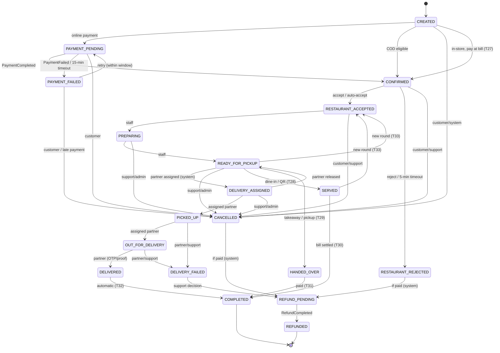

# Order State Machine

| Field | Value |
|---|---|
| Version | 2.0.0 |
| Status | **Approved** 2026-10-01 (v1: [IMPACT-0001](../requirements/impact/IMPACT-0001.md), REQ-ORDER-002 v2; v2: [IMPACT-0002](../requirements/impact/IMPACT-0002.md), REQ-ORDER-002 v3, Restaurant OS design) |
| Owner | order-service |
| Requirements | REQ-ORDER-002 v3, REQ-ORDER-003 v2, REQ-ORDER-004, REQ-ORDER-005, REQ-ORDER-007, REQ-ORDER-008, REQ-ORDER-009, REQ-PAYMENT-004, REQ-PAYMENT-005, REQ-DELIVERY-003/004, REQ-RT-003 v2 |

v2.0.0 adds lifecycles per order type (DELIVERY, DINE_IN, QR_ORDER, TAKEAWAY, PICKUP), the states `SERVED`, `HANDED_OVER` and `COMPLETED`, transitions T27–T34 and extensions of T8, T9, T11 and T13. Order source and type rules, rounds, voids, per-type diagrams and the immutability guard are in [ORDER_ARCHITECTURE.md](restaurant-os/ORDER_ARCHITECTURE.md); this document stays the single transition table.

The state machine lives in the order-service `domain` layer as an enum plus an explicit transition table. Every transition:

- is checked against the table (otherwise `409 INVALID_ORDER_TRANSITION`)
- is authorised by actor type and ownership or scope
- increments the optimistic `version` (concurrent transitions: exactly one wins, and the others receive `409 CONCURRENT_MODIFICATION` and retry against the new state)
- appends to `order_status_history` (from, to, actor type, actor ID, reason, correlation ID)
- writes the matching event to the outbox in the same transaction

---

## 1. States

| State | Meaning | Terminal? |
|---|---|---|
| `CREATED` | Order persisted from a valid quote; coupon reserved | No |
| `PAYMENT_PENDING` | Waiting for online payment confirmation (webhook) | No |
| `PAYMENT_FAILED` | Payment failed, or the payment window (15 min) expired | Yes once the window has expired. Before that, the customer may retry. |
| `CONFIRMED` | Paid (or COD accepted); waiting for the restaurant | No |
| `RESTAURANT_ACCEPTED` | Restaurant accepted with a prep time | No |
| `RESTAURANT_REJECTED` | Restaurant rejected, or the acceptance timeout (5 min) passed | Yes if unpaid (COD); otherwise continues to refund |
| `PREPARING` | Kitchen is preparing | No |
| `READY_FOR_PICKUP` | Food ready; no partner assigned yet | No |
| `DELIVERY_ASSIGNED` | Food ready **and** a partner is assigned | No |
| `PICKED_UP` | Partner has the food | No |
| `OUT_FOR_DELIVERY` | Partner travelling to the customer | No |
| `DELIVERED` | Delivered (OTP or proof confirmed) | No (v2): T32 moves it to `COMPLETED` in the same transaction |
| `DELIVERY_FAILED` | Delivery could not be completed | Yes unless support initiates a refund |
| `CANCELLED` | Cancelled by customer, support or system | Yes if unpaid; otherwise continues to refund |
| `REFUND_PENDING` | Refund requested from payment-service | No |
| `REFUNDED` | Refund confirmed by gateway webhook or wallet credit | Yes |
| `SERVED` (v2) | All fired lines of a dine-in or QR order are at the table | No |
| `HANDED_OVER` (v2) | A takeaway or pickup order was handed to the customer | No |
| `COMPLETED` (v2) | Fulfilled and paid (served and settled, handed over and paid, or delivered). The order is locked (REQ-ORDER-009) and `OrderCompleted` triggers inventory consumption | Yes |

In store, `READY_FOR_PICKUP` means "food ready at the pass" and is labelled **Ready**.

### Partner assignment is a separate attribute (IMPACT-0001)
Assignment may happen **during preparation** (REQ-DELIVERY-003 AC1). The status stays linear: the order records `delivery_partner_id` and `partner_assigned_at` as soon as `DeliveryAssigned` arrives, but does not change status until the food is ready. When the restaurant marks the order ready:

- if a partner is already assigned: `PREPARING → READY_FOR_PICKUP → DELIVERY_ASSIGNED` in **one transaction**, producing two history rows and two events
- otherwise it stays `READY_FOR_PICKUP` and an immediate assignment request is sent

The customer sees the partner (REQ-RT-003 v2) from `DeliveryAssigned`, not from the `DELIVERY_ASSIGNED` status.

---

## 2. Diagram

In-store cancellations (T34) use the existing CONFIRMED, RESTAURANT_ACCEPTED, PREPARING and READY_FOR_PICKUP → CANCELLED arrows with the staff actor. Per-type diagrams are in [ORDER_ARCHITECTURE §4.2](restaurant-os/ORDER_ARCHITECTURE.md#42-diagrams-per-order-type).

---

## 3. Transition table

Actor types: `CUSTOMER` (order owner), `RESTAURANT` (staff with scope on the order's branch), `PARTNER` (the assigned partner), `SUPPORT` (SUPPORT_AGENT or ADMIN with `ORDER_CANCEL_ANY`/`ORDER_MANAGE`), `SYSTEM` (saga, consumers, timeout jobs).

| # | From | To | Trigger | Actor | Guards | Side effects (same transaction unless noted) | Event |
|---|---|---|---|---|---|---|---|
| T1 | CREATED | PAYMENT_PENDING | Order created with an online method | SYSTEM | Quote valid, coupon reserved | Saga deadline `PAYMENT` = now + 15 min | `OrderCreated` (emitted on creation; carries `paymentMethod`) |
| T2 | CREATED | CONFIRMED | Order created with COD | SYSTEM | COD eligible (REQ-PAYMENT-004 AC1) | Command `RegisterCodPayment` | `OrderConfirmed` |
| T3 | CREATED | CANCELLED | Cancel before payment initiated | CUSTOMER, SYSTEM | — | Release coupon | `OrderCancelled` |
| T4 | PAYMENT_PENDING | CONFIRMED | `PaymentCompleted` | SYSTEM | Amount and currency equal order total | Commit coupon; deadline `RESTAURANT_ACCEPT` = now + 5 min (or immediate auto-accept) | `OrderConfirmed` |
| T5 | PAYMENT_PENDING | PAYMENT_FAILED | `PaymentFailed`, or payment deadline passed | SYSTEM | — | On timeout: release coupon, `closed = true`. On gateway failure: keep the coupon reserved until the deadline. | `OrderPaymentFailed` |
| T6 | PAYMENT_FAILED | PAYMENT_PENDING | Customer retries payment | CUSTOMER | `closed = false` and now < payment deadline | — | `OrderPaymentRetried` |
| T7 | PAYMENT_PENDING | CANCELLED | Customer cancels | CUSTOMER | — | Release coupon; command `CancelPayment` (best effort) | `OrderCancelled` |
| T8 | CONFIRMED | RESTAURANT_ACCEPTED | Accept (prep time 5–120 min) or auto-accept | RESTAURANT, SYSTEM | Branch scope | Set `prep_time_minutes`, `estimated_ready_at`; schedule assignment (command `AssignDeliveryRequested` with `notBefore`) | `RestaurantAcceptedOrder` |
| T9 | CONFIRMED | RESTAURANT_REJECTED | Reject (reason required) or accept deadline passed | RESTAURANT, SYSTEM | Reason present | Release coupon; restore tracked stock | `RestaurantRejectedOrder` |
| T10 | CONFIRMED | CANCELLED | Cancel | CUSTOMER, SUPPORT | SUPPORT needs a reason | Release coupon; restore stock | `OrderCancelled` |
| T11 | RESTAURANT_ACCEPTED | PREPARING | Start preparing | RESTAURANT | Branch scope | — | `OrderPreparing` |
| T12 | RESTAURANT_ACCEPTED | CANCELLED | Cancel | CUSTOMER, SUPPORT | SUPPORT needs a reason | Release coupon; `CancelDeliveryRequested` if a partner is assigned or assignment is scheduled | `OrderCancelled` |
| T13 | PREPARING | READY_FOR_PICKUP | Mark ready | RESTAURANT | Branch scope | `ready_at` = now. If a partner is assigned, T15 runs in the same transaction. Otherwise `AssignDeliveryRequested(immediate)` and deadline `ASSIGNMENT` = now + 10 min. | `OrderReady` |
| T14 | PREPARING | CANCELLED | Cancel | SUPPORT | Reason required; audited | `CancelDeliveryRequested` | `OrderCancelled` |
| T15 | READY_FOR_PICKUP | DELIVERY_ASSIGNED | Partner assigned (`DeliveryAssigned`, or already recorded) | SYSTEM | `delivery_partner_id` set | — | `OrderDeliveryAssigned` |
| T16 | READY_FOR_PICKUP | CANCELLED | Cancel | SUPPORT | Reason required | `CancelDeliveryRequested` | `OrderCancelled` |
| T17 | DELIVERY_ASSIGNED | PICKED_UP | `DeliveryPickedUp` | PARTNER (via delivery-service) | Event partner = order partner | — | `OrderPickedUp` |
| T18 | DELIVERY_ASSIGNED | READY_FOR_PICKUP | `DeliveryUnassigned` | SYSTEM | Event partner = order partner | Clear partner fields; assignment restarts in delivery-service | `OrderPartnerReleased` |
| T19 | DELIVERY_ASSIGNED | CANCELLED | Cancel | SUPPORT | Reason required | `CancelDeliveryRequested` | `OrderCancelled` |
| T20 | PICKED_UP | OUT_FOR_DELIVERY | `DeliveryOutForDelivery` | PARTNER | Same partner | — | `OrderOutForDelivery` |
| T21 | PICKED_UP, OUT_FOR_DELIVERY | DELIVERY_FAILED | `DeliveryFailed` (reason category) or support action | PARTNER, SUPPORT | Reason required | Notify support | `OrderDeliveryFailed` |
| T22 | OUT_FOR_DELIVERY | DELIVERED | `DeliveryCompleted` | PARTNER | OTP or proof verified by delivery-service; COD: cash collected confirmed | `delivered_at` = now | `OrderDelivered` |
| T23 | RESTAURANT_REJECTED, CANCELLED | REFUND_PENDING | Automatic, if a captured payment exists | SYSTEM | `paid_amount > 0` | Command `RefundRequested(full, to original method)` | `OrderRefundPending` |
| T24 | DELIVERY_FAILED | REFUND_PENDING | Support decides to refund | SUPPORT (`ORDER_REFUND`) | Reason required; audited | Command `RefundRequested(amount, destination)` | `OrderRefundPending` |
| T25 | REFUND_PENDING | REFUNDED | `RefundCompleted` covering the requested amount | SYSTEM | — | — | `OrderRefunded` |
| T26 | PAYMENT_FAILED | CANCELLED | Customer abandons, or a late payment arrives (reason `LATE_PAYMENT`) | CUSTOMER, SYSTEM | — | Release the coupon if still reserved | `OrderCancelled` |
| T27 | CREATED | CONFIRMED | In-store order created with `paymentMethod = BILL` (DINE_IN, QR_ORDER, TAKEAWAY, pay-at-counter PICKUP) | SYSTEM | Source/type valid; DINE_IN/QR_ORDER: table session OPEN | — | `OrderConfirmed` |
| T28 | READY_FOR_PICKUP | SERVED | Captain marks served, kitchen roll-up SERVED, or settlement of a ready order (DINE_IN, QR_ORDER) | RESTAURANT, SYSTEM | No fired line still in the kitchen | `served_at` = now | `OrderServed` |
| T29 | READY_FOR_PICKUP | HANDED_OVER | Staff hands over (TAKEAWAY, PICKUP) | RESTAURANT | Pickup code if the outlet requires it | `handed_over_at` = now; T31 in the same transaction if already paid | `OrderHandedOver` |
| T30 | SERVED | COMPLETED | `BillSettled` listing the order | SYSTEM | `settled_at` set | Lock the order | `OrderCompleted` |
| T31 | HANDED_OVER | COMPLETED | Bill settled, or online payment equals the total | SYSTEM | Paid in full | Lock the order | `OrderCompleted` |
| T32 | DELIVERED | COMPLETED | Automatic after T22 | SYSTEM | — | Same transaction as T22; lock the order | `OrderCompleted` |
| T33 | READY_FOR_PICKUP, SERVED | RESTAURANT_ACCEPTED | New round fired (DINE_IN staff orders) | RESTAURANT (`POS_ORDER`) | Session OPEN; bill not finalised | Fire round n | `KitchenRoundSubmitted` |
| T34 | CONFIRMED, RESTAURANT_ACCEPTED, PREPARING, READY_FOR_PICKUP | CANCELLED | Staff cancels an in-store order | RESTAURANT | Reason required; `POS_ORDER` before any KOT, `POS_VOID` after; not on a finalised bill | Lock the order; kitchen cancels KOTs (waste via `KOTCancelled`); pos drops the lines from the open bill | `OrderCancelled` |

**Extended in v2:** T8 also covers POS/captain "send to kitchen" (same transaction as T27), staff acceptance of QR orders and QR auto-accept; it fires round 1 and emits `KitchenRoundSubmitted`, and schedules delivery assignment only for DELIVERY orders. T9 also covers rejection of QR orders and the QR acceptance window. T11 and T13 can also be triggered by SYSTEM from `OrderKitchenStatusChanged`. T23 applies only to ONLINE/WALLET orders; bill-paid orders are refunded with a credit note in pos-service.

### Non-status changes (no transition)
| Change | Allowed in | Effect |
|---|---|---|
| Partner assigned | RESTAURANT_ACCEPTED, PREPARING | Sets `delivery_partner_id`, `partner_assigned_at`; publishes `OrderPartnerAssigned` |
| Partner released | RESTAURANT_ACCEPTED, PREPARING | Clears partner fields; publishes `OrderPartnerReleased` |
| Prep time extended | RESTAURANT_ACCEPTED, PREPARING (once, up to +30 min) | Updates `estimated_ready_at`; reschedules assignment; customer notified |
| Partial refund after completion | COMPLETED (v2; was DELIVERED) | Status stays `COMPLETED`. Online: the refund is tracked in payment-service and on the order's `refunded_amount`. Bill-paid: credit note in pos-service. |
| Round fired, lines added, line voided, settlement recorded (v2) | See [ORDER_ARCHITECTURE §4.3](restaurant-os/ORDER_ARCHITECTURE.md#43-new-and-extended-transitions) | `KitchenRoundSubmitted`, `OrderLinesAdded`, `OrderLineVoided` |

---

## 4. Edge cases

| Case | Handling |
|---|---|
| `PaymentCompleted` arrives after `CANCELLED` or a closed `PAYMENT_FAILED` | Order-service records the payment, then CANCELLED → REFUND_PENDING (T23). For PAYMENT_FAILED it first applies T26 (reason `LATE_PAYMENT`), then T23. Covered by a dedicated failure test. |
| Duplicate events | `processed_events` dedupe. A transition to the current state is ignored as a no-op (logged at debug). |
| Out-of-order events (e.g. `DeliveryPickedUp` before `OrderReady` is processed) | Delivery-service only allows pickup after it has consumed `OrderReady`, so this ordering cannot occur from the source. Any invalid transition from an event goes to the retry topic, then the DLT with an alert. It is never forced. |
| `RefundFailed` | Order stays `REFUND_PENDING`; support is alerted (admin queue). A manual retry from the admin UI re-issues the command with a new idempotency key. |
| Restaurant closes after `CONFIRMED` | Treated as reject (T9) with reason `BRANCH_CLOSED`. |
| Customer unreachable at delivery | Partner reports `DELIVERY_FAILED` with reason `CUSTOMER_UNREACHABLE` after the in-app call and wait flow. Whether a refund follows is a support decision (T24). |
| Order-service crash mid-saga | State, outbox and saga deadlines are in the database. On restart, the relay publishes pending events and the deadline job resumes. Consumers are idempotent. |

### Refund policy after a failed delivery
**OQ-21 (decided 2026-10-01):** in v1, refunds after `DELIVERY_FAILED` happen only by support decision (T24). Automatic rules by failure reason may be revisited after UAT data, through a requirement change.

---

## 5. Customer-facing status mapping

| Internal state(s) | Customer label | Restaurant label | Partner label |
|---|---|---|---|
| CREATED, PAYMENT_PENDING | Awaiting payment | — (not visible) | — |
| PAYMENT_FAILED | Payment failed | — | — |
| CONFIRMED | Waiting for restaurant | **New order** | — |
| RESTAURANT_ACCEPTED, PREPARING | Preparing your food (+ partner name once assigned) | Accepted / Preparing | Offer / Head to restaurant |
| READY_FOR_PICKUP | Food is ready | Ready | — |
| DELIVERY_ASSIGNED | Partner arriving at restaurant | Partner arriving | Pick up order |
| PICKED_UP, OUT_FOR_DELIVERY | On the way (live map) | Picked up | Deliver to customer |
| DELIVERED, COMPLETED (delivery) | Delivered | Delivered | Completed |
| CONFIRMED (QR, not accepted) | Waiting for confirmation | **New QR order** | — |
| SERVED | Served | Served | — |
| HANDED_OVER | Collected | Handed over | — |
| COMPLETED (in store) | Completed | Completed | — |
| RESTAURANT_REJECTED, CANCELLED, DELIVERY_FAILED | Cancelled / Failed (reason) | Cancelled | Cancelled |
| REFUND_PENDING, REFUNDED | Refund in progress / Refunded | — | — |

---

## 6. Test obligations

1. A unit test for every allowed transition (T1–T34) and every disallowed (state, action, order type) triple. The disallowed triples are generated from the table.
2. Concurrency test: parallel accept and cancel on one order. Exactly one succeeds, and the history is consistent.
3. Saga failure tests (REQ-ORDER-005 AC4): payment failure, payment timeout, restaurant rejection, accept timeout, no partner available, late payment after cancel, refund failure, crash mid-saga (Testcontainers, kill the consumer).
4. Contract tests for each emitted event against its JSON Schema.
