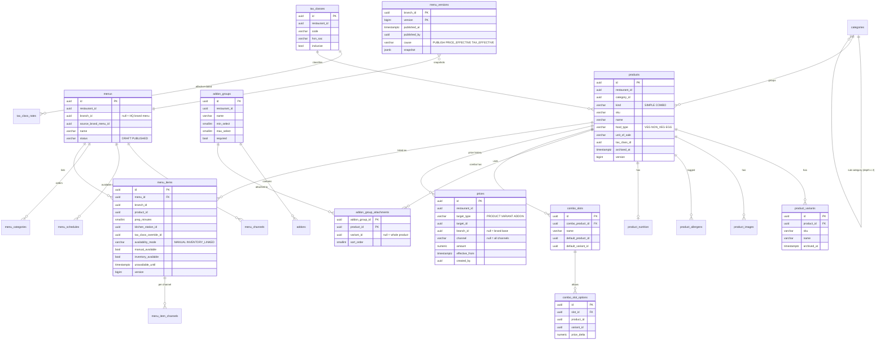
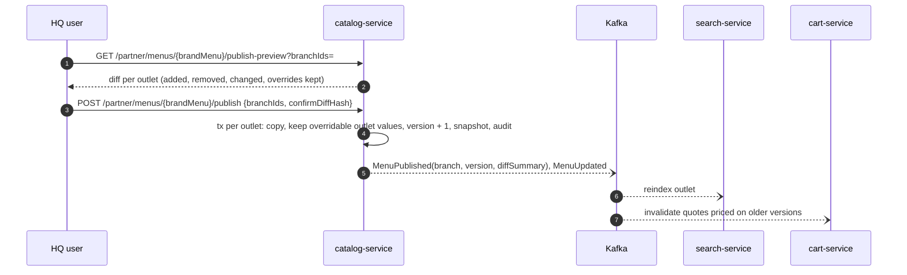

# Catalogue and menu architecture (catalog-service)

| Field | Value |
|---|---|
| Version | 0.1.0 |
| Status | **Approved** 2026-10-01 by the project owner (design decisions D-01..D-23 as proposed) |
| Owner | catalog-service (today's menu-service, renamed before any code exists; port 8084; database `catalog_db`) |
| Requirements | REQ-PRODUCT-001..009, REQ-MENU-001..004 (v2 where bumped), REQ-MENU-005..010, REQ-CART-002 v2, REQ-SEARCH-003 |
| Replaces | The `menu_db` sketch in [06 §2.4](../../06-database-design.md) (never implemented) |
| Phase | 6 |

## 1. Responsibilities
- **Master catalogue** (brand level, HQ): categories, products, variants, add-on groups, combos, tax classes, nutrition, allergens, images (media IDs), base prices.
- **Menus** (outlet level): menus per outlet and channel, menu items (outlet listing of a master product: price layer, availability, tax override, preparation time, station), schedules, HQ brand menus published to outlets with override rules, published menu versions.
- **Pricing**: the `price-check` used by cart-service (online quotes) and order-service (in-store orders), through the shared pricing library (ADR-021).
- **Availability**: manual toggle, schedule, and inventory-linked status from inventory-service.

It doesn't own stations (kitchen-service), recipes or stock (inventory-service).

## 2. Data model (catalog_db)



Notes:
- All tenant tables carry `restaurant_id` (ADR-019). SKU unique per brand: `uq_products_sku (restaurant_id, sku) WHERE archived_at IS NULL`, same for variants (REQ-PRODUCT-001 AC4).
- `ck_addon_groups_select`: `0 <= min_select <= max_select` and `required ⇔ min_select >= 1` (REQ-PRODUCT-003 AC1).
- `prices` and `tax_class_rates` are append-only (trigger): history is never overwritten (REQ-PRODUCT-007 AC2, REQ-PRODUCT-005 AC2).
- Products are never hard-deleted: `DELETE` is revoked from `catalog_app`, so REQ-PRODUCT-001 AC5 holds by construction. Archiving sets `archived_at` and hides the product's menu items (REQ-MENU-005 AC2). Orders, bills and recipe versions keep referring to archived products and variants (REQ-PRODUCT-002 AC3).
- Also: `product_images (product_id, media_id, sort_order)` with images in object storage (REQ-PRODUCT-001 AC1), `product_nutrition`, `allergens` (brand-configurable list), `product_allergens`, `menu_categories (menu_id, category_id, sort_order)`, `menu_schedules (menu_id, name, days_mask, start_time, end_time)`, `menu_item_channels (menu_item_id, channel, enabled)`, `brand_menu_publications (brand_menu_id, branch_id, version, diff jsonb, published_by)`, `override_policies (brand_menu_id, field, overridable, price_band_percent)`, `price_rules` (P2, REQ-PRODUCT-008), `station_refs` (cache of kitchen stations), plus the common technical tables.

## 3. Products, variants and add-ons
- A product has zero or more variants. If it has variants, a line must select exactly one (REQ-PRODUCT-002 AC2). Variant price: `prices` row with `target_type = VARIANT` (absolute) layered like products.
- Add-on groups attach to a product or to specific variants (REQ-PRODUCT-003 AC3). Validation (AC4) rejects: selections outside [min, max]; add-ons from groups not attached to the item or the chosen variant; archived add-ons. Errors name the group: `422 ADDON_SELECTION_INVALID` with `errors[].field = "lines[0].addons.<groupId>"`.
- Categories nest at most two levels (`depth` check, REQ-PRODUCT-001 AC2).

## 4. Combos
- A combo is a product with `kind = COMBO` and slots (REQ-PRODUCT-004 AC1). Each slot has a default item and optional replacement options with price deltas; variant and add-on selection per slot item follows that item's rules (AC3).
- **Combo price** = the combo's own layered price + Σ selected option deltas + Σ slot item add-on prices. **Discount shown** = Σ standalone effective prices of the resolved slot items − combo price (AC2).
- **Order lines** (AC4): the combo is a parent line; each resolved slot item is a child line, so routing and consumption work per item.
- **Revenue apportionment** (AC5): the combo price (before add-ons) is split across slot items in proportion to their standalone effective prices for the same outlet and channel. Option deltas go to their own slot item. The rounding residue goes to the slot item with the largest share. Child lines carry the apportioned `unit_price`, and product sales reports use it.

## 5. Channels and menus
Channels (REQ-MENU-006): `DINE_IN`, `TAKEAWAY`, `DELIVERY`, `QR`, `WEBSITE`, `MOBILE`, `AGGREGATOR`.

- An outlet has one or more menus, each enabled for one or more channels (`menu_channels`). A menu item is enabled or disabled per channel and may have a channel price.
- **Default menu (D-21):** when an outlet is created, catalog-service creates a default menu enabled for `DELIVERY`, `WEBSITE` and `MOBILE`. So outlets that don't differentiate channels need no extra setup.
- **Channel per request:** every price check and menu read passes the channel; responses contain only items enabled for it (AC3). The public menu API (`GET /api/v1/branches/{id}/menu`) takes `?channel=` and defaults to `DELIVERY`, so REQ-MENU-001..004 clients keep working (regression test). Channel derivation for orders is in [ORDER §2](ORDER_ARCHITECTURE.md#2-source-type-and-channel-req-order-007).
- **Schedules (REQ-MENU-007):** a menu can have schedules (`days_mask`, `start_time`, `end_time`, outlet time zone). A window with `end_time < start_time` crosses midnight and belongs to the day it starts. An item is orderable if any active schedule of any enabled menu containing it covers "now" (AC3). Outside all windows, the item isn't orderable on any channel, and the menu response shows the next available time (AC2).
- **HQ publishing (REQ-MENU-008):** HQ brand menus (`branch_id IS NULL`) are published to selected outlets. Publishing computes a diff (added, removed, changed items) that must be confirmed (AC3), copies the menu into the outlet as `source_brand_menu_id`, and keeps outlet values only for fields that `override_policies` mark overridable (AC2). Prices overridden at the outlet must stay within `price_band_percent` of the brand price. Every publish is audited.
- Menu item changes don't touch the master product, and product changes don't overwrite outlet overrides (REQ-MENU-005 AC4).

## 6. Prices and taxes (REQ-PRODUCT-005, REQ-PRODUCT-007)
- **Resolution** at time `t` for (target, outlet, channel): the latest `prices` row with `effective_from ≤ t` for (outlet, channel); else (outlet, any channel); else the brand base (no outlet, no channel) (AC1). Add-on prices use the same layering (REQ-PRODUCT-003 AC5).
- **Tax:** the menu item's `tax_class_override_id` if set (REQ-PRODUCT-005 AC3), else the product's tax class; the rate is the latest `tax_class_rates` row with `effective_from ≤ t`. Rates are data, never code (AC2).
- **Dynamic pricing** (P2, REQ-PRODUCT-008): `price_rules` (product or category, channel, days, window, percentage). Overlaps on the same product and channel are rejected on save. AI recommendations are proposals only (REQ-AI-005).
- **Price-check** (`POST /internal/v1/pricing/price-check`, REQ-CART-002 v2):
```json
{
  "branchId": "0192…b1",
  "channel": "DINE_IN",
  "lines": [
    { "menuItemId": "0192…m1", "variantId": "0192…v2", "addonIds": ["0192…a1"], "quantity": 2 },
    { "menuItemId": "0192…m9", "comboSelections": [ { "slotId": "0192…s1", "productId": "0192…p4" } ], "quantity": 1 }
  ]
}
```
  The response holds `menuVersion` and, per line: `available` (with reason `UNAVAILABLE`/`NOT_ON_CHANNEL`/`OUTSIDE_SCHEDULE`), `unitPrice`, add-on prices, combo child lines with apportioned prices, the tax class (`code`, `rate`, `inclusive`, `hsnSac`), `stationId` and `prepMinutes`. Lines by `productId` (the existing cart contract) resolve to the outlet's menu item for the channel. Prices are calculated server-side only (AC3), and orders store them as snapshots (AC4).

## 7. Availability
An item is orderable on a channel when all of these hold:

| Condition | Source |
|---|---|
| Product not archived; menu item exists and is enabled for the channel | Catalogue data |
| `manual_available = true` and `unavailable_until` is not in the future | Manual toggle (REQ-MENU-005 AC3, audited) |
| A schedule of an enabled menu covers now (or the menu has no schedules) | REQ-MENU-007 |
| `availability_mode = MANUAL`, or `inventory_available = true` | REQ-MENU-009 |

- `inventory_available` is set from `ProductStockAvailabilityChanged` ([INVENTORY §8.2](INVENTORY_ARCHITECTURE.md#82-product-stock-availability-req-menu-009-d-11)) for `INVENTORY_LINKED` items only. A manual "unavailable" always wins (REQ-MENU-009 AC4).
- Every change of the effective availability publishes `MenuItemAvailabilityChanged` (with `cause`) and evicts the outlet's menu cache. Availability is operational state, so it doesn't create a menu version.

## 8. Published menu versions (REQ-MENU-010)
- Edits to menus, menu items, outlet and channel prices are drafts until published (AC1). Publishing increments `menu_versions(branch_id, version)` and stores a snapshot of the outlet's published structure and prices (JSON snapshot, allowed by 06 §1.1).
- Effective-dated brand base price and tax rate changes don't need a manual publish. When one takes effect, a scheduled job creates a new version for each affected outlet with `cause = PRICE_EFFECTIVE` or `TAX_EFFECTIVE`, so any order's `menu_version` identifies exactly the prices it was charged.
- Orders store the menu version they were priced against (AC2). The cache key is `menu:{branchId}:{channel}:v{version}` (AC3, extends REQ-MENU-004); `menu_versions` is the source of the current version per outlet.
- `MenuPublished` carries the diff summary; `MenuUpdated` keeps its approved meaning with the added fields.

## 9. API contracts (catalog-service)

| Method and path | Permission | Purpose |
|---|---|---|
| `GET /api/v1/branches/{branchId}/menu?channel=` | Public | Published menu for a channel (default DELIVERY), with availability, allergens, ETag |
| `GET /api/v1/products/{id}` | Public | Product detail (unchanged) |
| `GET/POST/PATCH /api/v1/partner/catalog/categories`, `/products`, `/products/{id}/variants`, `/addon-groups`, `/combos`, `/tax-classes` | CATALOG_MANAGE (brand) | Master catalogue |
| `POST /api/v1/partner/catalog/products/{id}/archive` | CATALOG_MANAGE | Archive |
| `POST /api/v1/partner/catalog/prices` | CATALOG_MANAGE (base) / MENU_UPDATE (outlet, within band) | New price row with `effective_from` |
| `GET/POST/PATCH /api/v1/partner/menus`, `/menus/{id}/items`, `/menus/{id}/schedules`, `/menus/{id}/channels` | MENU_UPDATE (outlet) / MENU_PUBLISH (brand menus) | Menus and items (drafts) |
| `GET /api/v1/partner/menus/{id}/publish-preview`, `POST /api/v1/partner/menus/{id}/publish` | MENU_UPDATE / MENU_PUBLISH | Diff and publish |
| `POST /api/v1/partner/menu-items/{id}/availability` | MENU_AVAILABILITY_UPDATE | One-action toggle `{available, until?}` |
| `PUT /api/v1/partner/menu-items/{id}/availability-mode` | MENU_UPDATE | `MANUAL` / `INVENTORY_LINKED` |
| `GET /api/v1/partner/menus/versions/{branchId}/{version}` | MENU_UPDATE | Read a published snapshot |
| `POST /internal/v1/pricing/price-check` | Service tokens (cart, order, pos) | §6 |

**New error codes:** `ADDON_SELECTION_INVALID` (existing), `VARIANT_REQUIRED` (422), `SKU_ALREADY_EXISTS` (409), `CATEGORY_DEPTH_EXCEEDED` (422), `PRICE_OUTSIDE_BAND` (422), `OVERRIDE_NOT_ALLOWED` (403), `ITEM_NOT_ON_CHANNEL` (422), `PRICE_RULE_OVERLAP` (422).

## 10. Sequence: HQ publish with an outlet override


## 11. Test obligations
- Unit: price layering and effective dates; add-on min/max and attachment rules; combo price, discount and apportionment residue; inclusive and exclusive tax; schedule windows across midnight and time zones; channel filtering; override permissions and price bands.
- Integration: outbox events for product, price, menu and availability changes; `ProductStockAvailabilityChanged` flips INVENTORY_LINKED items and leaves MANUAL items alone; manual unavailable wins; effective-dated price changes create a new menu version.
- Regression: the REQ-MENU-001..004 customer menu API on the DELIVERY channel.
- Security: cross-brand read and write denied (404); outlet managers can't change non-overridable fields.
- API: contract tests for catalogue endpoints and `price-check`.
