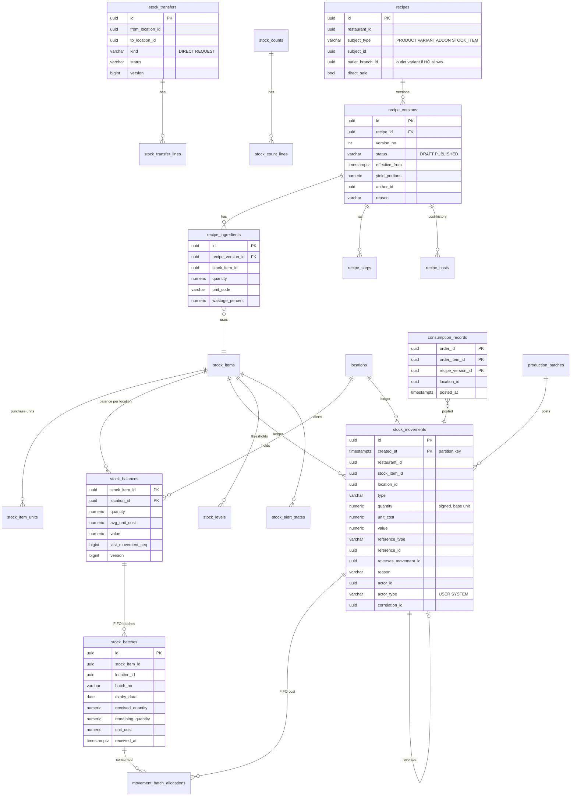
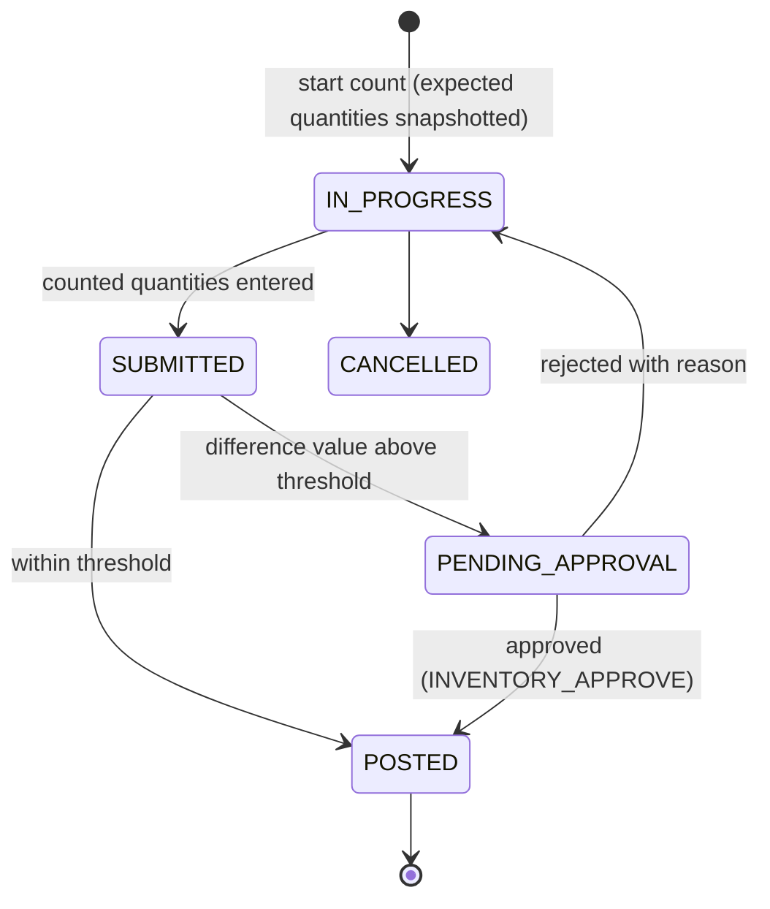
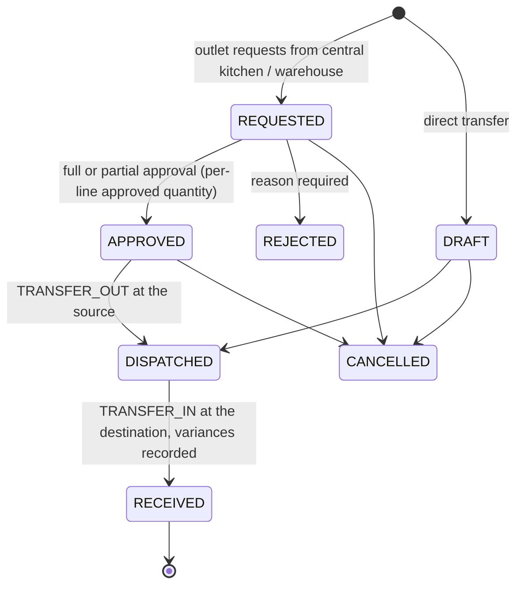
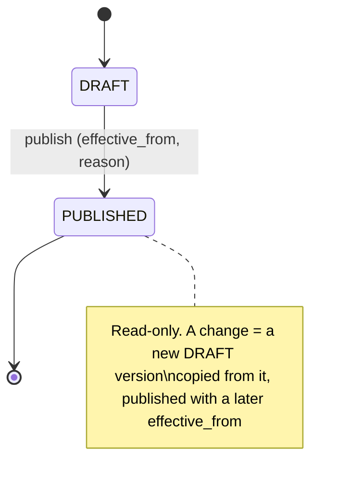
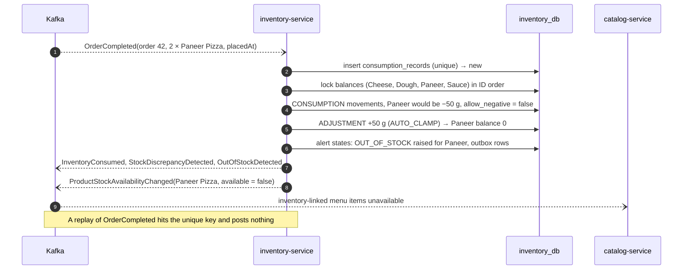
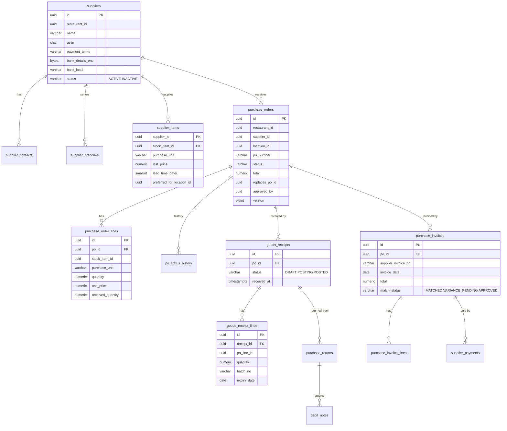
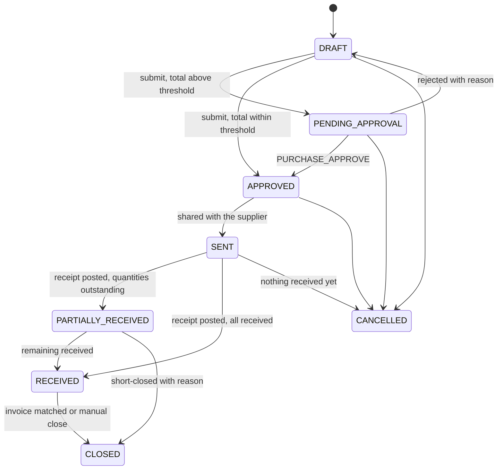
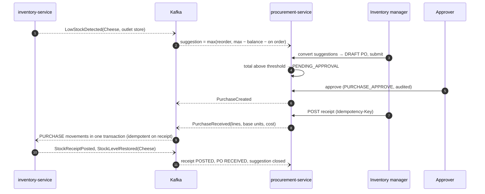

# Inventory and procurement architecture

| Field | Value |
|---|---|
| Version | 0.1.0 |
| Status | **Proposed** 2026-10-01, awaiting approval |
| Owners | inventory-service (new, port 8104, `inventory_db`); procurement-service (new, port 8105, `procurement_db`) |
| Requirements | REQ-INV-001..011, REQ-RECIPE-001..006, REQ-PURCHASE-001..006, REQ-SUPPLIER-001..004, REQ-OUTLET-005, REQ-MENU-009, NFR-PERF-007 |
| ADR | [ADR-020](../../17-adr/ADR-020-inventory-ledger-costing.md) inventory ledger and costing |
| Phase | 13C (stock, ledger, consumption, costing, alerts, recipes), 13D (procurement, transfers, central kitchen, production) |

## 1. Responsibilities

| Service | Owns |
|---|---|
| inventory-service | Stock items and units; stock locations (projection of restaurant-service locations); balances; batches; the movement ledger; consumption records; waste; counts and adjustments; transfers and central-kitchen requests; production batches; stock levels and alert states; costing policy; recipes, versions, ingredients, steps and recipe costs; product-stock availability |
| procurement-service | Suppliers, contacts, outlets served, supplier items; purchase suggestions; purchase orders; goods receipts; purchase invoices and matching; returns and debit notes; supplier payment records; supplier statements |

Neither service changes orders, menus or payments. inventory-service is the only writer of stock.

## 2. Stock items and units (REQ-INV-001)
- `units (code PK, dimension MASS/VOLUME/COUNT, factor_to_dimension_base numeric(18,6))`: g = 1, kg = 1000 (MASS); ml = 1, l = 1000 (VOLUME); pcs = 1 (COUNT). A platform seed, not tenant data.
- `stock_items (restaurant_id, name, category, base_unit (g/ml/pcs), barcode, is_semi_finished, tracks_batches, expiry_warning_days, archived_at)`.
- `stock_item_units (stock_item_id, unit_code or custom_name, factor_to_base numeric(18,6))`: purchase units such as "box = 12 pcs" or "bag = 25 kg". A recipe or purchase unit must convert to the item's base unit through the same dimension or an item-specific factor; anything else is rejected with `422 UNIT_NOT_CONVERTIBLE` (REQ-RECIPE-001 AC2).
- Quantities: `numeric(18,4)` in the base unit. Unit costs: `numeric(18,6)` per base unit. Values: `numeric(14,2)`. Java `BigDecimal`, HALF_UP. No floating-point types anywhere (AC2).

## 3. Locations and movement types (REQ-INV-002, REQ-OUTLET-001)
- `locations` is a projection of restaurant-service `LocationCreated`/`LocationUpdated`: `id`, `restaurant_id`, `type` (`OUTLET_STORE`/`WAREHOUSE`/`CENTRAL_KITCHEN`), `branch_id` (outlet stores), `is_default_for_branch`, `allow_negative` (default false; changing it is audited, REQ-INV-005 AC2), `time_zone`.
- Every outlet has exactly one default store location (`uq_locations_default (branch_id) WHERE is_default_for_branch`), used for consumption.

| Type | Sign | Posted by |
|---|---|---|
| `PURCHASE` | + | Goods receipt |
| `SALE` | − | Completed order line whose product is sold as-is (recipe flagged `direct_sale`, e.g. a bottled drink) |
| `CONSUMPTION` | − | Completed order line with a recipe; production inputs (reference type `PRODUCTION`) |
| `TRANSFER_IN` / `TRANSFER_OUT` | + / − | Transfer receipt / dispatch |
| `WASTE` | − | Manual waste; cancel-after-preparation (D-10) |
| `ADJUSTMENT` | ± | Count differences; approved manual adjustments; system clamp (D-08) |
| `RETURN` | − | Purchase return |
| `PRODUCTION_IN` | + | Semi-finished output of a production batch (D-09, REQ-RECIPE-006) |

## 4. Data model (inventory_db)

Further tables: `stock_levels (stock_item_id, location_id, min_qty, reorder_level, max_qty, reorder_qty)`, `stock_alert_states (stock_item_id, location_id, alert_type, active, since)`, `product_availability_states (branch_id, product_id, variant_id, available)`, `waste_records`, `stock_counts`/`stock_count_lines`, `adjustment_requests` (above-threshold approvals), `stock_transfer_lines (requested, approved, dispatched, received quantities, variance_reason)`, `transfer_events` (append-only), `production_batches`, `costing_policies (restaurant_id, method WEIGHTED_AVERAGE/FIFO, effective_from date)`, `recipe_steps`, `recipe_costs (recipe_version_id, location_id, cost_per_portion, method, computed_at)`, `product_refs` (projection of catalog products, variants, add-ons for validation and names), `external_postings (reference_type, reference_id, PK)` (idempotency for goods receipts and returns), `unrecipied_sales (order_id, order_item_id, product_id)` (REQ-INV-004 AC3 report), plus `outbox_events`, `processed_events`, `idempotency_keys`, `shedlock`. All tenant tables carry `restaurant_id` (ADR-019).

## 5. The ledger and posting (REQ-INV-002, REQ-INV-003, REQ-INV-005, D-08)

Every stock change goes through one domain service, `StockPostingService.post(PostingCommand)`, inside one database transaction (REQ-INV-003 AC3):

1. Lock the affected `stock_balances` rows with `SELECT … FOR UPDATE`, **ordered by (stock_item_id, location_id)** so that parallel postings can't deadlock. Missing rows are inserted first (`ON CONFLICT DO NOTHING`).
2. Compute the cost per line (§7).
3. **Negative-stock rule** (BR-R1):
   - Manual movements (TRANSFER_OUT, WASTE entered by a user, negative ADJUSTMENT, RETURN) that would take a balance below zero at a location with `allow_negative = false` are rejected with `422 INSUFFICIENT_STOCK` (AC1). Nothing is posted.
   - System movements (CONSUMPTION and SALE from completed orders, WASTE from kitchen cancellations) **always post** (ROS-OQ-10). If the result is below zero and negative stock isn't allowed, a second movement is posted in the same transaction: `ADJUSTMENT` of +shortfall with reason `AUTO_CLAMP`, referencing the system movement. The balance ends at zero, the ledger sum still equals the balance, and `StockDiscrepancyDetected` is published so that someone counts the item (AC3).
4. Insert the movements; update quantity, value, average cost and `last_movement_seq` on the balances.
5. Evaluate alerts (§8) and product availability (§8.2).
6. Write `StockMovementPosted` (and the use-case event, e.g. `InventoryConsumed`) to the outbox.

**Immutability** (BR-R5, AC2 of REQ-INV-003): `UPDATE` and `DELETE` on `stock_movements` are revoked from `inventory_app`, and a trigger raises on both for any role. Mistakes are corrected with a reversing movement (`reverses_movement_id`, unique, so a movement can be reversed only once). A database test proves both protections.

**Partitioning:** `stock_movements` is range-partitioned by month on `created_at`, so the primary key is `(id, created_at)`. Monthly partitions are created ahead by a scheduled job.

**Reconciliation** (REQ-INV-002 AC2): a nightly ShedLock job per brand compares every balance with `SUM(quantity)` of its movements and raises a critical alert on any difference. The same check runs at the end of every integration and concurrency test.

## 6. Automatic consumption (REQ-INV-004, NFR-PERF-007)

Consumer of `OrderCompleted` (group `inventory-service.consumption`):
1. Resolve the location: the outlet's default store location.
2. For each leaf line (combo parents are skipped; their slot lines are leaf lines) with net quantity > 0:
   - Recipes to apply: the variant's recipe if one exists, otherwise the product's; plus one recipe per selected add-on that has one (REQ-RECIPE-005).
   - Version: the latest PUBLISHED version with `effective_from ≤ placedAt` (REQ-RECIPE-002 AC2).
   - Idempotency: insert `consumption_records (order_id, order_item_id, recipe_version_id)`. A conflict means this line was already consumed, so it is skipped (AC2).
   - Quantity per ingredient = `quantity × (1 + wastage_percent / 100) ÷ yield_portions × net quantity`, converted to the base unit. Semi-finished ingredients are deducted as stock items; they are not expanded further (they were produced earlier, §11).
   - `direct_sale` recipes post `SALE`; others post `CONSUMPTION`. Reference type `ORDER`, reference ID the order ID.
   - Lines without any recipe insert into `unrecipied_sales` and post nothing (AC3).
3. All lines of one order post in **one** transaction through `StockPostingService`, then `InventoryConsumed(orderId, movements)` (AC4).

Example (REQ-INV-004 AC1): 2 × Paneer Pizza with Dough 200 g, Paneer 100 g, Cheese 80 g, Sauce 50 ml, no wastage → Dough −400 g, Paneer −200 g, Cheese −160 g, Sauce −100 ml.

NFR-PERF-007 (posted p95 < 10 s after completion) leaves ample room: one outbox hop plus one consumer transaction. It will be measured in Phase 13C.

## 7. Costing (REQ-INV-010, ROS-OQ-11, ADR-020)
- `costing_policies`: one method per brand, effective from the first day of a month. A change applies from that period start, never retroactively (AC1).
- **WEIGHTED_AVERAGE** (moving average): inbound movements with a cost (PURCHASE, TRANSFER_IN, PRODUCTION_IN) recompute `avg = (q × avg + q_in × c_in) ÷ (q + q_in)`. If the balance before the receipt is ≤ 0, `avg = c_in`. Outbound movements use the current average.
- **FIFO** (by batch, expiry first): every inbound movement creates a batch. Outbound movements allocate batches ordered by `expiry_date NULLS LAST, received_at` (REQ-INV-006 AC1); allocations are stored in `movement_batch_allocations`, and the movement's unit cost is the allocation-weighted cost. A shortfall beyond the batches is costed at the last batch cost; the next receipt's batch is reduced by the outstanding shortfall first.
- Transfers carry the source cost to the destination. Positive count adjustments use the current average (WEIGHTED_AVERAGE) or the latest batch cost (FIFO).
- **Switching method** at a period start: to FIFO, opening batches are created from current balances at their average cost; to WEIGHTED_AVERAGE, the average is the FIFO valuation ÷ quantity. This is a costing event, not a ledger movement.
- **Rounding** (AC3): unit cost 6 decimals, movement value = quantity × unit cost rounded to 2 decimals, HALF_UP.
- **Stored costs** (AC2): every movement stores `unit_cost` and `value`; valuation, food cost, recipe cost and gross margin reports use those stored values.
- Purchase price differences found later by the invoice match (§13.4) are reported as purchase price variance. Posted movements are never revalued.

## 8. Levels, alerts and availability (REQ-INV-011, REQ-MENU-009)

### 8.1 Alerts once per crossing
`stock_alert_states` holds one row per (item, location, alert type) with `active`. After each posting:

| Alert | Raised when | Cleared when | Events |
|---|---|---|---|
| `LOW_STOCK` | Balance moves from ≥ reorder level to < reorder level | Balance returns to ≥ reorder level | `LowStockDetected` / `StockLevelRestored` |
| `OUT_OF_STOCK` | Balance moves from > 0 to ≤ 0 | Balance > 0 | `OutOfStockDetected` / `StockLevelRestored` |
| `EXPIRING_SOON` | Daily job: a batch with remaining quantity expires within `expiry_warning_days` | Batch used up or wasted | `ExpiringSoonDetected` (once per batch) |

Only a state change publishes, so an item that hovers below its level doesn't generate one event per movement (AC2). Consumers: procurement (suggestions), notification-service (inventory manager), analytics.

### 8.2 Product-stock availability (REQ-MENU-009, D-11)
- inventory-service keeps a reverse index from stock item to the current published recipe versions that use it.
- After a posting at an outlet's store location, for each affected recipe it computes `portions = min(balance ÷ per-portion quantity)` over the recipe's ingredients (including add-on recipes only for the add-on itself).
- When `portions` crosses below 1 or back to ≥ 1, it updates `product_availability_states` and publishes `ProductStockAvailabilityChanged(branchId, productId, variantId, available, limitingStockItemId)`.
- catalog-service applies it to menu items in `INVENTORY_LINKED` mode only; a manual "unavailable" always wins ([CATALOG §7](CATALOG_ARCHITECTURE.md#7-availability)).

## 9. Waste, counts and adjustments (REQ-INV-007, REQ-INV-008)
- **Waste**: `POST /api/v1/inventory/waste {locationId, lines[{stockItemId, quantity, unit, reason, batchId?}]}`. Reasons: `EXPIRED`, `SPOILED`, `PREPARATION_ERROR`, `CANCELLED_AFTER_PREP`, `OTHER`. Kitchen-driven waste comes from `KOTCancelled` and `KOTUpdated(MODIFIED)` with `reachedPreparing = true`: the cancelled portions are expanded through the recipe version effective at the order's placement (idempotent on the kitchen event ID). Expired stock moves to waste only by user action (REQ-INV-006 AC2).
- **Counts**:

  Difference = counted − expected at count start. Posting applies that difference as `ADJUSTMENT` movements to the current balance, so movements during the count are not lost. AI-proposed adjustments enter as `adjustment_requests` and always need approval (REQ-INV-007 AC3, REQ-AI-005).

## 10. Transfers and central kitchen (REQ-INV-009, REQ-OUTLET-005)

- Dispatch posts TRANSFER_OUT for dispatched quantities (negative-stock rule applies, it's a manual movement). Lines in DISPATCHED state are the goods in transit (AC1 of REQ-INV-009).
- Receipt posts TRANSFER_IN for received quantities at the source cost. A difference needs a reason (`DAMAGED`, `SHORT`, `OTHER`); its value is reported as transfer variance in the waste report, with no extra movement because the goods never reached the destination (AC2).
- Every step appends `transfer_events` (user, time) and publishes `StockTransferred` on receipt (REQ-OUTLET-005 AC3). Approval needs `INVENTORY_APPROVE` at the source location's scope.

## 11. Recipes (REQ-RECIPE-001..006)
- **Subjects:** PRODUCT or VARIANT (portions differ, REQ-RECIPE-001 AC1), ADDON (REQ-RECIPE-005), STOCK_ITEM (a semi-finished item's production recipe, REQ-RECIPE-006). Product references are validated against `product_refs` (catalog events).
- **Ownership:** HQ (`RECIPE_MANAGE`, brand scope). Outlet variants (`outlet_branch_id`) exist only if the brand setting allows them (AC4).

- **Versioning** (BR-R4): a trigger rejects any update to a PUBLISHED version or its ingredients. All versions stay viewable; `GET …/versions/{a}/diff/{b}` returns added, removed and changed ingredients (AC3 of REQ-RECIPE-002). Publishing publishes `RecipePublished`.
- **Cycles** (REQ-RECIPE-006 AC2): publishing a STOCK_ITEM recipe runs a depth-first search over semi-finished ingredients; a cycle is rejected with `422 RECIPE_CYCLE`.
- **Cost** (REQ-RECIPE-004): `cost per portion = Σ (quantity × (1 + wastage) × unit cost) ÷ yield`, where unit cost is the location's current cost under the brand's method; semi-finished ingredients use their own stock cost. A scheduled job recomputes the costs of recipes whose ingredient costs changed (debounced every 15 minutes), appends `recipe_costs` and publishes `RecipeCostChanged`, which keeps the history needed for "why did food cost increase" (AC3). Food cost % and gross margin per channel combine this cost with channel prices from catalog events (AC2), in the API below and in analytics.
- **Steps** (P2): ordered `recipe_steps (text, minutes, media_id)`, shown on the KDS item detail.
- **Production** (REQ-RECIPE-006 AC1): `POST /api/v1/inventory/production-batches {locationId, stockItemId, quantity}` expands the item's recipe, posts CONSUMPTION (reference `PRODUCTION`) for inputs and `PRODUCTION_IN` for the output at cost = Σ input values ÷ output quantity, in one transaction.

## 12. Sequence: consumption with a negative-stock clamp

## 13. Procurement-service

### 13.1 Data model (procurement_db)

Also `purchase_suggestions`, `purchase_return_lines`, `debit_notes`, `supplier_payments`, `po_sequences` (PO numbers per brand per financial year), the common technical tables, and `stock_item_refs` (projection for names and units). Constraints: `uq_supplier_items_preferred (stock_item_id, preferred_for_location_id) WHERE preferred_for_location_id IS NOT NULL` (one preferred supplier per item and location, REQ-SUPPLIER-002 AC2); `uq_suppliers_gstin (restaurant_id, gstin)`.

Supplier master (REQ-SUPPLIER-001, -004): GSTIN format `^[0-9]{2}[A-Z]{5}[0-9]{4}[A-Z][1-9A-Z]Z[0-9A-Z]$` plus the check-digit validation. Bank details are encrypted with AES-GCM (data key from KMS), stored as `bytea` plus `bank_last4`, masked in APIs and logs. INACTIVE suppliers can't receive new POs. Every change is audited and publishes `SupplierCreated`/`SupplierUpdated`.

### 13.2 Suggestions (REQ-PURCHASE-001)
On `LowStockDetected`: `suggested = max(reorder_qty, max_qty − balance − on_order)`, where `on_order` = open PO quantities for the item and location in procurement-service, and the supplier is the preferred one. Suggestions are only proposals; a user converts selected suggestions into a DRAFT PO (AC2). `StockLevelRestored` closes open suggestions.

### 13.3 Purchase order lifecycle (REQ-PURCHASE-002)

- Approved POs are read-only (trigger on lines once `approved_by` is set). A change is a cancellation plus a new PO with `replaces_po_id` (AC3).
- `PurchaseCreated` on APPROVED (AC5). PO PDF or email link via a signed URL (AC4).

### 13.4 Goods receipts, invoices, returns (REQ-PURCHASE-003..006, D-12)
- **Receipt**: `POST /api/v1/procurement/purchase-orders/{id}/receipts` (Idempotency-Key) stores the receipt as POSTING and publishes `PurchaseReceived` with lines converted to base units and the PO unit cost per base unit. inventory-service posts all PURCHASE movements of the receipt in one transaction, idempotent on `external_postings(GOODS_RECEIPT, receiptId)` (AC3), creates batches where tracked, and publishes `StockReceiptPosted`; procurement then marks the receipt POSTED and updates the PO's received quantities and status. The receipt is asynchronous because adding stock can't be rejected.
- **Invoice** (three-way match, PROPOSED in REQ-PURCHASE-004): lines are compared with PO prices and received quantities; differences beyond the brand's tolerance (default 2 % price, 0 quantity) set `VARIANCE_PENDING` until approved. `PurchaseInvoiceRecorded` is published, and `supplier_items.last_price` updates from the invoice. If an invoice is recorded before its receipt posts, the receipt uses the invoice price.
- **Return**: synchronous `POST /internal/v1/stock/returns` to inventory-service (idempotent on the return ID). inventory-service applies the negative-stock rule (manual movement) and the limit of "received quantity still in stock" for that receipt's batches or balance (AC2); on success procurement records the return and a debit note and publishes `PurchaseReturned`.
- **Supplier payments** (P2): recorded only (amount, date, method, reference); the platform moves no money (AC1). Outstanding = invoices − payments − debit notes (REQ-SUPPLIER-003).

### 13.5 Sequence: low stock to restored stock

## 14. API contracts

### 14.1 inventory-service
| Method and path | Permission | Purpose |
|---|---|---|
| `GET/POST/PATCH /api/v1/inventory/stock-items` | INVENTORY_VIEW / RECIPE_MANAGE (brand) | Stock item master, purchase units |
| `GET /api/v1/inventory/locations/{id}/balances` | INVENTORY_VIEW | Balances with value; filters item, category, below-reorder |
| `GET /api/v1/inventory/movements` | INVENTORY_VIEW | Ledger query: item, location, type, period (cursor) |
| `PUT /api/v1/inventory/locations/{id}/levels` | INVENTORY_OPERATE | Min, reorder, max, reorder quantity |
| `POST /api/v1/inventory/waste` | INVENTORY_OPERATE | Manual waste (Idempotency-Key) |
| `POST /api/v1/inventory/counts`, `PUT …/{id}/lines`, `POST …/{id}/submit`, `…/approve`, `…/reject` | INVENTORY_OPERATE / INVENTORY_APPROVE | Stock counts |
| `POST /api/v1/inventory/adjustments` | INVENTORY_OPERATE (+ approval above threshold) | Manual adjustment with reason |
| `POST /api/v1/inventory/movements/{id}/reverse` | INVENTORY_APPROVE | Reversing movement with reason |
| `POST /api/v1/inventory/transfers`, `…/{id}/approve`, `…/reject`, `…/dispatch`, `…/receive`, `…/cancel` | INVENTORY_OPERATE / INVENTORY_APPROVE | Transfers and central-kitchen requests |
| `POST /api/v1/inventory/production-batches` | INVENTORY_OPERATE | Production of semi-finished items |
| `GET/PUT /api/v1/inventory/costing-policy` | INVENTORY_APPROVE (brand) | Method and effective period |
| `GET/POST /api/v1/recipes`, `POST /api/v1/recipes/{id}/versions`, `POST …/versions/{v}/publish`, `GET …/versions/{a}/diff/{b}` | RECIPE_MANAGE | Recipes and versions |
| `GET /api/v1/recipes/{id}/cost?branchId=&channel=` | INVENTORY_VIEW | Cost per portion, food cost %, gross margin |
| `GET /api/v1/inventory/reports/unrecipied-products` | INVENTORY_VIEW | Products sold without recipes |
| `POST /internal/v1/stock/returns` | `svc:procurement-service` | Purchase return posting |

### 14.2 procurement-service
| Method and path | Permission | Purpose |
|---|---|---|
| `GET/POST/PATCH /api/v1/procurement/suppliers`, `…/{id}/items`, `…/{id}/status` | SUPPLIER_MANAGE | Supplier master and catalogue |
| `GET /api/v1/procurement/suggestions`, `POST …/convert` | PURCHASE_CREATE | Suggestions to draft PO |
| `POST/PATCH /api/v1/procurement/purchase-orders`, `…/{id}/submit`, `…/approve`, `…/reject`, `…/send`, `…/cancel`, `…/close` | PURCHASE_CREATE / PURCHASE_APPROVE | PO lifecycle |
| `POST /api/v1/procurement/purchase-orders/{id}/receipts` | PURCHASE_CREATE | Goods receipt (Idempotency-Key) |
| `POST /api/v1/procurement/purchase-orders/{id}/invoices`, `…/invoices/{iid}/approve-variance` | PURCHASE_CREATE / PURCHASE_APPROVE | Invoices and matching |
| `POST /api/v1/procurement/receipts/{id}/returns` | PURCHASE_CREATE | Purchase return and debit note |
| `POST /api/v1/procurement/invoices/{id}/payments`, `GET /api/v1/procurement/suppliers/{id}/statement` | PURCHASE_APPROVE / SUPPLIER_MANAGE | Supplier payments (P2) and statement |

**New error codes:** `INSUFFICIENT_STOCK` (422), `UNIT_NOT_CONVERTIBLE` (422), `RECIPE_CYCLE` (422), `RECIPE_VERSION_PUBLISHED` (409), `MOVEMENT_ALREADY_REVERSED` (409), `INVALID_TRANSFER_TRANSITION` (409), `INVALID_PO_TRANSITION` (409), `SUPPLIER_INACTIVE` (422), `RETURN_EXCEEDS_STOCK` (422).

## 15. Concurrency
- Balance rows are locked in a fixed order (§5). A concurrency test runs parallel consumptions, waste and adjustments on the same item and location, then checks balance = ledger sum and no lost updates.
- Consumption idempotency rests on the unique key, not only on `processed_events`, so a purge of processed events can't cause double deduction.
- PO, transfer and count transitions use optimistic `version`.

## 16. Test obligations
- Unit: unit conversion; WEIGHTED_AVERAGE and FIFO (including shortfall and method switch); recipe expansion with wastage, yield, add-ons and combos; cycle detection; suggestion quantity; PO, transfer and count transition tables; tolerance matching; GSTIN validation.
- Integration: replayed `OrderCompleted` deducts once; replayed `PurchaseReceived` adds once; ledger rows can't be updated or deleted; publishing a new recipe version doesn't change consumption of orders placed before it; the clamp keeps balance = ledger sum; alerts fire once per crossing.
- Concurrency: §15.
- E2E: low stock → suggestion → PO → approval → receipt → stock increases → alert clears; central-kitchen request → approval → dispatch → receipt with a variance.
- Security: one brand can't read or move another brand's stock, suppliers or POs (404); bank details are masked in responses and logs.
