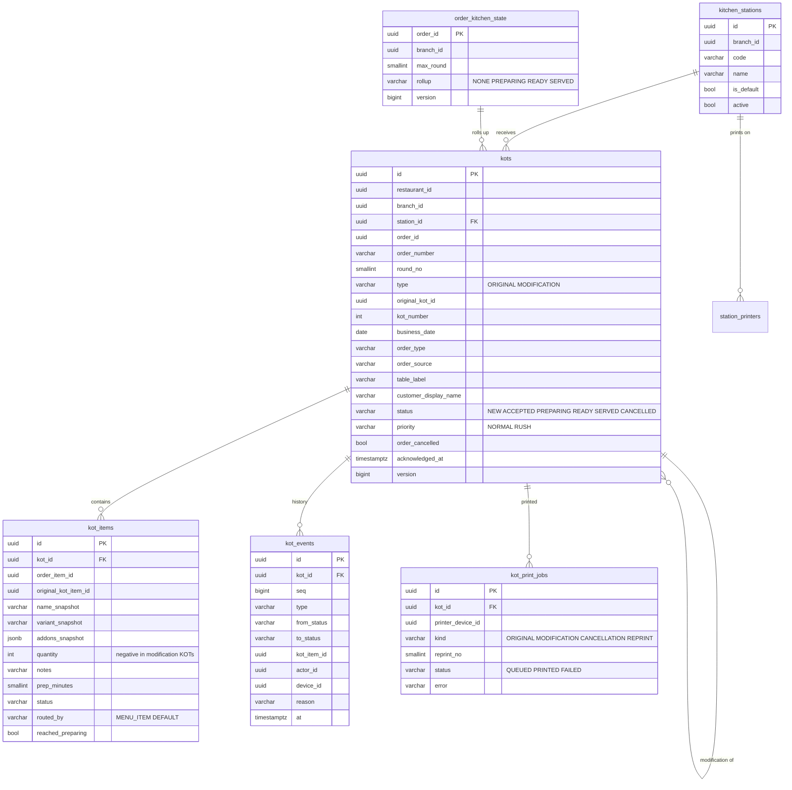
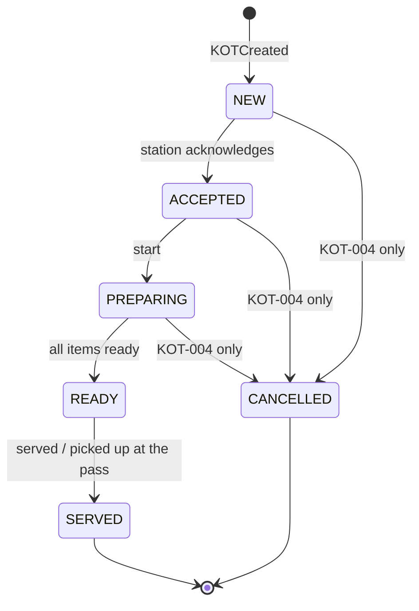
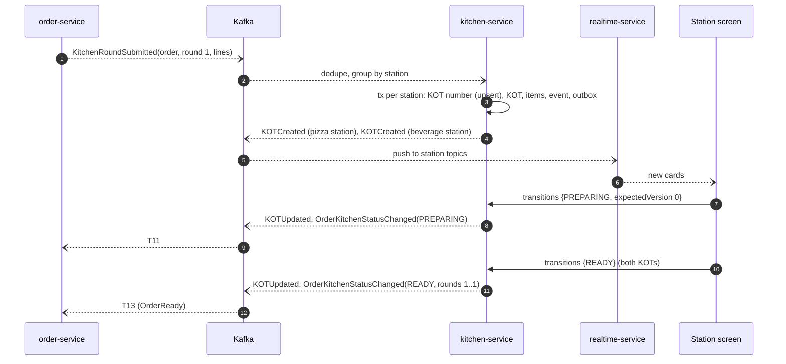
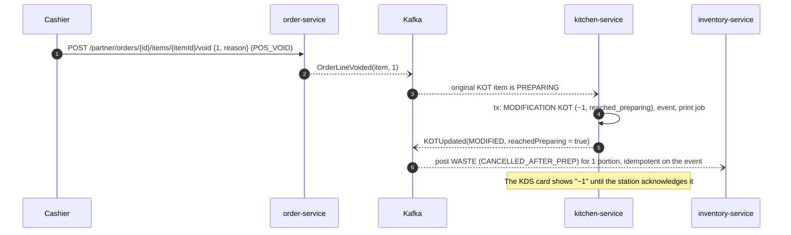

# Kitchen architecture (kitchen-service)

| Field | Value |
|---|---|
| Version | 0.1.0 |
| Status | **Approved** 2026-10-01 by the project owner (design decisions D-01..D-23 as proposed) |
| Owner | kitchen-service (new, port 8103, database `kitchen_db`); realtime-service pushes updates |
| Requirements | REQ-KOT-001..008, REQ-KDS-001..006, REQ-ORDER-003 v2, REQ-RT-002 v2, NFR-PERF-006 |
| Phase | 13B (backend); KDS app `web/apps/kds` in Phase 14 (REQ-WEB-002 v2 AC4) |

## 1. Responsibilities
- Kitchen stations per outlet, the default station, printers per station, and the stations each kitchen display shows.
- KOT generation from `KitchenRoundSubmitted`, sequential KOT numbers per outlet per business day.
- Modification and cancellation records; an append-only history of every KOT change.
- KDS state per KOT and per item; validated transitions; the per-order roll-up published as `OrderKitchenStatusChanged`.
- Print jobs for browser printing (ROS-OQ-05).

kitchen-service never changes an order. It publishes facts; order-service decides the order status (D-05).

## 2. Stations and routing (REQ-KOT-001, D-13)
- `kitchen_stations (restaurant_id, branch_id, code, name, is_default, active, sort_order)`. Exactly one active default station per outlet (`uq_kitchen_stations_default (branch_id) WHERE is_default AND active`).
- The **menu item** holds the station ID (REQ-MENU-005 AC1). catalog-service validates it against `GET /internal/v1/stations?branchId=` when the menu item is saved. This field is the StationProductMapping of REQ-KOT-001 AC2: there is no second mapping table to keep in sync.
- order-service copies the station ID, preparation time and priority onto each order line from the price-check response, and `KitchenRoundSubmitted` carries them.
- Routing at generation: the line's station if it exists and is active at that outlet; otherwise the default station (AC2). The KOT item records `routed_by = MENU_ITEM | DEFAULT`, so unmapped items show up in a report.
- Combos (AC4): the combo parent line is not routed; each child (slot) line is routed by its own station. Burger → main kitchen, Fries → fryer, Coffee → beverage.
- Priority (AC3): `NORMAL` or `RUSH`. A POS line can be sent as RUSH (`POS_ORDER`); a manager can raise a whole KOT to RUSH on the KDS (`KITCHEN_UPDATE`).

## 3. Data model (kitchen_db)

Also: `kot_sequences (branch_id, business_date, next_value, PK(branch_id, business_date))`, `station_printers (station_id, device_id, enabled)`, `display_stations` (projection of `DeviceRegistered`/`DeviceRevoked`: device → branch, stations), `branch_kitchen_settings` (projection of `PosSettingsChanged`: business-day close, late thresholds), plus `outbox_events`, `processed_events`, `shedlock`. All tables carry `restaurant_id` (ADR-019).

Key constraints:
- `uq_kots_round_station (order_id, round_no, station_id) WHERE type = 'ORIGINAL'`: generation is idempotent per (order, round) even if `processed_events` were purged (REQ-KOT-002 AC3).
- `uq_kots_number (branch_id, business_date, kot_number)`.
- `kot_events` is append-only: `UPDATE`/`DELETE` revoked from `kitchen_app`, plus a trigger that raises on either (REQ-KOT-007).
- `kot_items` content columns (name, variant, add-ons, quantity, notes) can't be updated after insert (trigger). Only `status` and `reached_preparing` change.
- `customer_display_name` is a first name or the table label only (minimal PII on kitchen screens).

## 4. KOT generation (REQ-KOT-002)

On `KitchenRoundSubmitted(orderId, round, lines)`:
1. Deduplicate by `eventId` (`processed_events`).
2. Group the round's lines by routed station; skip combo parents.
3. For each station, in one transaction:
   - allocate the number: `INSERT INTO kot_sequences … ON CONFLICT (branch_id, business_date) DO UPDATE SET next_value = kot_sequences.next_value + 1 RETURNING next_value`. The row lock serialises concurrent orders, so numbers never repeat (AC2). `business_date` uses the outlet's business-day close and time zone.
   - insert the KOT (`ORIGINAL`, status NEW) and its items; a unique-constraint hit on `uq_kots_round_station` means the KOT already exists, and the step is skipped.
   - append `kot_events(CREATED)`; queue a print job if the station has a printer; write `KOTCreated` to the outbox (AC5).
4. Update `order_kitchen_state.max_round`.

Online delivery and pickup orders flow through the same path at T8, so outlets that use KDS see online orders too. Outlets without screens keep the approved manual buttons (REQ-ORDER-003); both paths are idempotent against each other because order-service ignores a roll-up that doesn't match a valid transition.

## 5. Modifications and cancellations (REQ-KOT-003, REQ-KOT-004, D-10, D-23)

| Trigger | Result | Event |
|---|---|---|
| New round (items added after a KOT) | New `ORIGINAL` KOTs for the new lines only (AC1 of KOT-003) | `KOTCreated` |
| `OrderLineVoided` for a fired line | A `MODIFICATION` KOT at the same station, referencing the original KOT, with negative quantities ("−1 Paneer Pizza"). The original KOT is never edited (BR-R7). If every item of the original KOT is now fully voided and the KOT is NEW, ACCEPTED or PREPARING, the original KOT moves to CANCELLED | `KOTUpdated` (changeType `MODIFIED`, deltas, `reachedPreparing` per item); `KOTCancelled` when the whole KOT is cancelled |
| `OrderCancelled` | Every KOT of the order in NEW, ACCEPTED or PREPARING moves to CANCELLED with the order's reason and actor (KOT-004 AC1) | `KOTCancelled` |
| `OrderCancelled` with a KOT already READY | REQ-KDS-003 AC1 forbids READY → CANCELLED. The KOT keeps status READY, gets `order_cancelled = true` and a cancellation event, and shows a cancellation alert until acknowledged; it then leaves the board (D-23) | `KOTCancelled` (with `statusKept = READY`) |

- `reached_preparing` is true for an item whose status was PREPARING or later at the moment of the void or cancellation. inventory-service posts **waste** (reason `CANCELLED_AFTER_PREP`) only for those quantities (ROS-OQ-09, REQ-POS-005 AC3). Voided quantities are excluded from `OrderCompleted`, so nothing is both consumed and wasted.
- Effective quantity of an original KOT item = its quantity + Σ deltas of modification KOT items referencing it. The KDS card shows the effective quantity and highlights the change until acknowledged (REQ-KDS-006 AC1).
- Line notes can't change after a KOT (order lines are immutable); a changed note is a void plus a new line.
- Printing: modification and cancellation KOTs print with "MODIFIED" / "CANCELLED" headers when the station has a printer (KOT-004 AC2).

## 6. KDS states (REQ-KDS-001, REQ-KDS-003)

- The transition table is exactly REQ-KDS-003 AC1; everything else is rejected with `409 INVALID_KOT_TRANSITION`. So that a busy station needs one tap, a bump from NEW with target PREPARING is applied as the two allowed transitions NEW → ACCEPTED → PREPARING in one transaction, with two history rows and two `KOTUpdated` events (the same pattern as the approved T13 + T15).
- Items move through the same states. A KOT's status is the lowest status among its items with effective quantity > 0. Bumping a KOT moves all its items; bumping an item moves only that item (AC2).
- CANCELLED is set only by the system from §5, never by a KDS bump.
- MODIFICATION KOTs don't run this state machine. They are shown on the original card and only need `acknowledged_at`.

### 6.1 Order roll-up (REQ-KDS-003 AC3)
After every KOT change, `order_kitchen_state.rollup` is recomputed over the order's ORIGINAL, non-cancelled KOTs with effective items:

| Condition | Roll-up |
|---|---|
| Every KOT SERVED | `SERVED` |
| Every KOT READY or SERVED | `READY` |
| Any KOT PREPARING or later | `PREPARING` |
| Otherwise | `NONE` |

When the roll-up changes to PREPARING, READY or SERVED, `OrderKitchenStatusChanged(orderId, rollup, roundsCovered = 1..max_round)` is published. order-service applies T11, T13 or T28 only if `roundsCovered` includes its last fired round; otherwise it ignores the event, because the new round's KOTs will produce a fresh roll-up. For delivery orders, READY triggers the approved T13 with its assignment side effects.

### 6.2 Concurrent bumps (REQ-KDS-003 AC4)
`POST /api/v1/kitchen/kots/{id}/transitions {targetStatus, itemIds?, expectedVersion}`:
- target already reached → `200` with the current card (idempotent; two screens bumping READY both succeed).
- version mismatch and the target is no longer valid → `409 CONCURRENT_MODIFICATION` with the current card in the problem body (`current`). The KDS replaces the card silently, with no error page.
- otherwise apply under the optimistic lock, append `kot_events`, write `KOTUpdated` (AC5).

### 6.3 Timers (REQ-KDS-004)
The card shows elapsed time since `KOTCreated` against the largest `prep_minutes` of its items. Colours change at the outlet's thresholds (default: amber at 80 %, red at 100 %). Average preparation time per station and item comes from `KOTUpdated` events in analytics-service.

## 7. Real-time delivery and resynchronisation (REQ-KDS-002, NFR-PERF-006)
- realtime-service consumes `kitchen.events.v1` and pushes to `/topic/branches/{branchId}/kitchen/stations/{stationId}` and `/expedite`. Subscriptions are authorised against the device's stations or the user's branch scope (AC2).
- Every message carries the KOT `version`; the KDS drops older versions. After a reconnect it calls `GET /api/v1/kitchen/stations/{id}/board`, which returns all open cards with versions and a `boardSeq`, and then resumes from pushes (AC3). A banner shows when the socket is down (AC4).
- **Latency budget** for NFR-PERF-006 (KOT visible p95 < 2 s after acceptance), to be measured in Phase 13B, not claimed:

| Hop | Budget (p95) |
|---|---|
| order-service commit → outbox relay publish | 300 ms (relay poll ≤ 200 ms for order-service and kitchen-service, or LISTEN/NOTIFY wake-up) |
| Kafka → kitchen-service consumer, KOT transaction | 300 ms |
| kitchen outbox relay publish | 300 ms |
| Kafka → realtime-service → WebSocket frame | 300 ms |
| Browser render | 200 ms |
| **Total** | **1.4 s** (0.6 s headroom) |

## 8. Printing (REQ-KOT-005, REQ-KOT-008)
- A station printer is a kitchen device running the KDS app (or a POS device running the POS app) in kiosk printing mode. It subscribes to its station topic, renders the 80 mm KOT and calls `window.print()`.
- The device reports `POST /api/v1/kitchen/print-jobs/{id}/result {PRINTED | FAILED, error}`. Browsers can't detect paper-out or offline printers reliably, so a job without a PRINTED report within 30 s is marked FAILED, and the failure shows on the POS inbox and the KDS (AC2). Staff can reprint at any time.
- Reprint (KOT-005): `POST /api/v1/kitchen/kots/{id}/reprints` creates a REPRINT job with `reprint_no = n`, prints "REPRINT n", appends `kot_events(REPRINTED)` and publishes `KOTReprinted` (audited).
- A local ESC/POS bridge for direct printing is P2 (ROS-OQ-05).

## 9. History (REQ-KOT-007)
`kot_events` stores every creation, status change, modification, cancellation, acknowledgement, reprint and print failure, with actor, device, time and reason (AC1). `GET /api/v1/kitchen/orders/{orderId}/kots` returns the full history for managers (AC2). Retention follows orders (06 §2.8): at least 8 years, with partitioning by month after 2 years.

## 10. API contracts (kitchen-service)

| Method and path | Permission | Purpose |
|---|---|---|
| `GET /api/v1/kitchen/branches/{branchId}/stations` | KITCHEN_VIEW | List stations |
| `POST/PATCH /api/v1/kitchen/branches/{branchId}/stations` | KITCHEN_CONFIGURE | Create, rename, deactivate, set default, attach printer |
| `GET /api/v1/kitchen/stations/{stationId}/board` | KITCHEN_VIEW (device or staff) | Open cards in the six columns, oldest first, RUSH on top, with versions |
| `GET /api/v1/kitchen/branches/{branchId}/expedite` | KITCHEN_VIEW | All stations of the outlet (REQ-KDS-001 AC3) |
| `POST /api/v1/kitchen/kots/{kotId}/transitions` | KITCHEN_UPDATE | §6.2 |
| `POST /api/v1/kitchen/kots/{kotId}/acknowledge` | KITCHEN_UPDATE | Acknowledge a modification or cancellation alert |
| `POST /api/v1/kitchen/kots/{kotId}/priority` | KITCHEN_UPDATE (manager) | Raise to RUSH |
| `POST /api/v1/kitchen/kots/{kotId}/reprints` | KITCHEN_VIEW | Reprint |
| `POST /api/v1/kitchen/print-jobs/{jobId}/result` | Device token | Print result |
| `GET /api/v1/kitchen/orders/{orderId}/kots` | ORDER_VIEW (scoped, managers) | KOT history |
| `GET /internal/v1/stations?branchId=` | `svc:catalog-service` | Station validation |

**New error codes:** `INVALID_KOT_TRANSITION` (409), `KOT_CANCELLED` (409), `STATION_INACTIVE` (422).

## 11. Sequence diagrams

### 11.1 Generation, bump and roll-up

### 11.2 Void after preparation

## 12. Test obligations
- Unit: routing (mapped, unmapped, inactive station, combo slots); modification diff and effective quantity; KOT and item transition tables (generated); roll-up rules.
- Concurrency: KOT numbering under parallel orders (no duplicates); two screens bumping the same KOT (§6.2).
- Integration: replaying `KitchenRoundSubmitted` creates no duplicate KOTs; `kot_events` and KOT item content can't be updated or deleted (database test); print-job timeout marks FAILED.
- WebSocket: push within the budget; reconnect resynchronises with no stale or duplicate cards.
- E2E: KOT from the POS appears on the right station; add item after KOT → new KOT; void after KOT → modification KOT on the KDS; bump to READY updates the POS and the customer's order status.
- Security: a display can't read another outlet's stations (404); a revoked display is disconnected.
- Visual: KDS board in each column state, modification and cancellation alerts, 80 mm KOT print.
