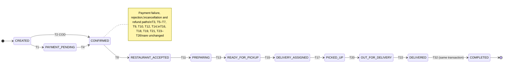
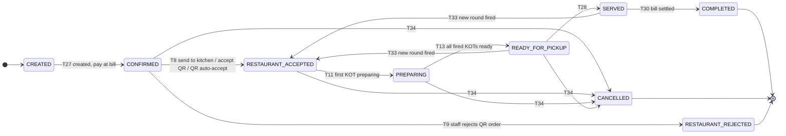
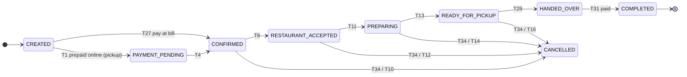
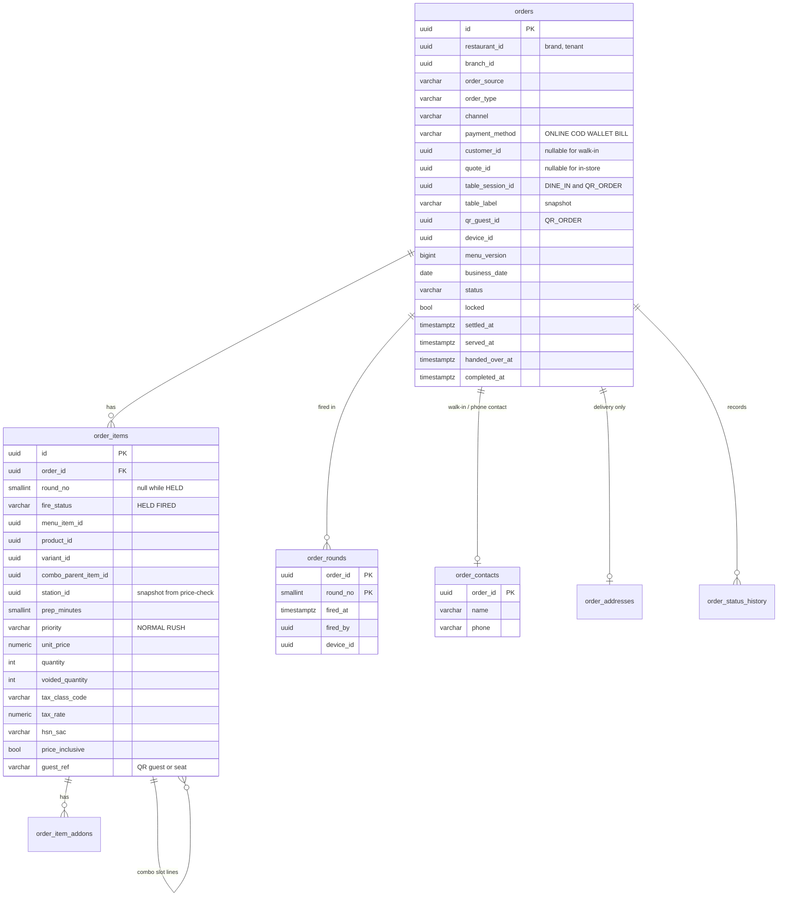
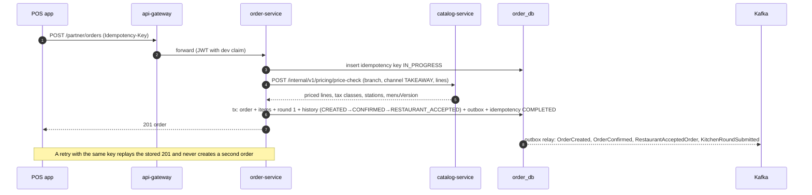

# Order architecture (Restaurant OS)

| Field | Value |
|---|---|
| Version | 0.1.0 |
| Status | **Proposed** 2026-10-01, awaiting approval |
| Owner | order-service (single owner of every order, whatever its source) |
| Requirements | REQ-ORDER-001 v2, REQ-ORDER-002 v3, REQ-ORDER-003 v2, REQ-ORDER-007, REQ-ORDER-008, REQ-ORDER-009, REQ-POS-001, REQ-POS-005, REQ-POS-009, REQ-POS-010, REQ-KOT-002 AC3, REQ-KOT-006, REQ-KDS-003 AC3, REQ-QR-005, REQ-BILL-003 AC4, NFR-PERF-005 |
| Extends | [order-state-machine.md](../order-state-machine.md) v1.0.0 (T1–T26 stay valid). On approval, that document becomes v2.0.0 with the content of §4. |

## 1. What changes

| Area | Before | After |
|---|---|---|
| Creation | Only from a cart quote (customer apps) | Also by POS, captain, phone, admin and QR (through pos-service), priced by catalog-service for the order's channel (REQ-ORDER-001 v2) |
| Classification | — | Mandatory `orderSource`, `orderType`, `channel` (REQ-ORDER-007) |
| Lines | Fixed at creation | Dine-in staff orders grow in **rounds**; lines can be held and fired later; lines can be voided (never edited) |
| Payment | Online, COD, wallet | Plus `BILL`: paid at the pos-service bill (dine-in, QR, takeaway, pay-at-counter pickup) |
| Lifecycle | One state machine (delivery) | One state machine with per-type transition rules; new states `SERVED`, `HANDED_OVER`, `COMPLETED` |
| Immutability | Service checks | Service checks **plus** a database guard once the order is locked (REQ-ORDER-009 AC3) |

## 2. Source, type and channel (REQ-ORDER-007)

The server sets `orderSource` from the authenticated client. It is never read from the request body (AC2):

| Authenticated caller | `orderSource` |
|---|---|
| Customer web token (OAuth client `customer-web`) | `CUSTOMER_WEB` |
| Customer mobile token (client `customer-mobile`) | `CUSTOMER_MOBILE` |
| Brand website ordering (client `brand-website`, future) | `WEBSITE` |
| Staff token on a `POS_TERMINAL` device (`dev` claim) | `POS` |
| Staff token on a `CAPTAIN_HANDHELD` device | `CAPTAIN` |
| Staff token with an explicit `phone=true` flag on the POS create request | `PHONE` (only `TAKEAWAY`, `PICKUP`, `DELIVERY`) |
| pos-service service token on `/internal/v1/orders/in-store` with a QR session | `QR` |
| Aggregator adapter (mock in v1, ROS-OQ-06) | `AGGREGATOR` |
| Admin token (`ORDER_MANAGE`) on the admin create endpoint | `ADMIN` |

Valid combinations (AC3), enforced by `OrderClassificationPolicy` in the domain layer and by `ck_orders_source_type`:

| orderType | Allowed sources | Required data | Default `paymentMethod` |
|---|---|---|---|
| `DELIVERY` | CUSTOMER_WEB, CUSTOMER_MOBILE, WEBSITE, PHONE, AGGREGATOR, ADMIN | Delivery address (serviceable, location-service) | ONLINE / COD / WALLET as today; PHONE: COD or ONLINE (payment link) |
| `PICKUP` | CUSTOMER_WEB, CUSTOMER_MOBILE, WEBSITE, PHONE, AGGREGATOR | — | ONLINE; `BILL` if the outlet enables pay-at-counter |
| `TAKEAWAY` | POS, PHONE, ADMIN | — | `BILL` |
| `DINE_IN` | POS, CAPTAIN | Open table session | `BILL` |
| `QR_ORDER` | QR | Open table session, verified QR guest | `BILL` (online session payment is a bill payment, REQ-QR-006) |

`channel` (REQ-MENU-006) is derived: DINE_IN → `DINE_IN`, TAKEAWAY → `TAKEAWAY`, QR_ORDER → `QR`, AGGREGATOR → `AGGREGATOR`, DELIVERY and PICKUP from customer web → `WEBSITE`, from customer mobile → `MOBILE`, from PHONE/ADMIN → `DELIVERY` (delivery) or `TAKEAWAY` (pickup). See [CATALOG §5](CATALOG_ARCHITECTURE.md#5-channels-and-menus) for the default menu covering DELIVERY, WEBSITE and MOBILE.

## 3. Rounds, held lines and voids (D-03)

- **One staff order per (table session, source).** The first POS or captain order on a table session creates a `DINE_IN` order. Later additions from the same source become new **rounds** of that order. A unique partial index enforces at most one open staff order per (session, source).
- **Every QR submission is its own order** (`QR_ORDER`), because each submission needs its own acceptance (REQ-QR-005), rate limit and guest attribution (REQ-BILL-004 AC3).
- **Round** = a set of lines sent to the kitchen together. `order_rounds` records the round number, time, actor and device. Round 1 is fired when the order is accepted. Every fire publishes `KitchenRoundSubmitted(orderId, round, lines)`, which is the only trigger for KOT generation (D-05).
- **Held lines** (REQ-KOT-006): a line added with `fire = false` has `fire_status = HELD`. It is priced and shown on the POS and the running bill, but not sent to the kitchen. `POST …/fire` moves held lines into a new round.
- **Voids** (REQ-POS-005): lines are never edited or deleted. A void increases `voided_quantity` (≤ `quantity`) with reason, actor and device, and publishes `OrderLineVoided`. Before any KOT for the line, `POS_ORDER` is enough. After the KOT, `POS_VOID` is required. kitchen-service answers with a modification KOT (REQ-KOT-003).
- **Net quantity** = `quantity − voided_quantity`. Bills, consumption (`OrderCompleted`) and reports use net quantities.
- Online delivery and pickup orders have exactly one round, fired at acceptance (T8).

## 4. Lifecycles per order type (REQ-ORDER-002 v3, REQ-ORDER-008)

### 4.1 States

The 16 approved states are unchanged. Three are added:

| State | Meaning | Terminal? |
|---|---|---|
| `SERVED` | All fired lines of a dine-in or QR order are at the table | No |
| `HANDED_OVER` | A takeaway or pickup order was handed to the customer | No |
| `COMPLETED` | Fulfilled **and** paid: served and settled, handed over and paid, or delivered. Publishes `OrderCompleted`, which triggers inventory consumption (ROS-OQ-09) | Yes |

`DELIVERED` stops being terminal: T32 moves it to `COMPLETED` in the same transaction (ROS-OQ-17). In store, `READY_FOR_PICKUP` means "food ready at the pass" and is labelled **Ready** (D-04). `OrderReady` keeps its meaning.

### 4.2 Diagrams per order type

**DELIVERY** (approved T1–T26 plus T32):


**DINE_IN and QR_ORDER** (payment deferred to the table bill):


**TAKEAWAY and PICKUP**:


### 4.3 New and extended transitions

Actor types are as approved, plus `RESTAURANT` now includes CASHIER and CAPTAIN with the listed permission. "In-store types" = DINE_IN, QR_ORDER, TAKEAWAY, and PICKUP with `paymentMethod = BILL`.

| # | From | To | Types | Trigger | Actor | Guards | Side effects | Event |
|---|---|---|---|---|---|---|---|---|
| T8 (ext.) | CONFIRMED | RESTAURANT_ACCEPTED | All | Online: accept as today. POS/captain: submit (same transaction as T27). QR: staff accept, or auto-accept when the outlet enables it | RESTAURANT, SYSTEM | Branch scope; QR order not older than the acceptance window (default 10 min, then T9 with reason `NOT_ACCEPTED`) | Fire round 1 (held lines stay held). Delivery only: schedule assignment as today | `RestaurantAcceptedOrder`, `KitchenRoundSubmitted` |
| T9 (ext.) | CONFIRMED | RESTAURANT_REJECTED | All | Reject; for QR also the acceptance window | RESTAURANT, SYSTEM | Reason present | QR: guest sees the rejection reason | `RestaurantRejectedOrder` |
| T11 (ext.) | RESTAURANT_ACCEPTED | PREPARING | All | Staff action, **or** `OrderKitchenStatusChanged(PREPARING)` | RESTAURANT, SYSTEM | — | — | `OrderPreparing` |
| T13 (ext.) | PREPARING | READY_FOR_PICKUP | All | Staff action, **or** `OrderKitchenStatusChanged(READY)` covering every fired round | RESTAURANT, SYSTEM | All fired, non-voided lines ready (SYSTEM path) | Delivery: as approved. Others: none | `OrderReady` |
| T27 | CREATED | CONFIRMED | In-store types | Order created with `paymentMethod = BILL` | SYSTEM | Source/type valid; DINE_IN/QR_ORDER: table session OPEN (checked with pos-service projection, §6) | — | `OrderConfirmed` |
| T28 | READY_FOR_PICKUP | SERVED | DINE_IN, QR_ORDER | Captain marks served, `OrderKitchenStatusChanged(SERVED)`, or bill settlement of a ready order | RESTAURANT, SYSTEM | No fired line still in the kitchen | `served_at` = now | `OrderServed` |
| T29 | READY_FOR_PICKUP | HANDED_OVER | TAKEAWAY, PICKUP | Staff hands over | RESTAURANT | PICKUP online: pickup code matches (optional per outlet) | `handed_over_at` = now; if already paid, T31 runs in the same transaction | `OrderHandedOver` |
| T30 | SERVED | COMPLETED | DINE_IN, QR_ORDER | `BillSettled` listing this order | SYSTEM | `settled_at` set | Lock the order (§5) | `OrderCompleted` |
| T31 | HANDED_OVER | COMPLETED | TAKEAWAY, PICKUP | Payment complete: `BillSettled` (BILL) or `paid_amount = grand_total` (ONLINE) | SYSTEM | Paid in full | Lock the order | `OrderCompleted` |
| T32 | DELIVERED | COMPLETED | DELIVERY | Automatic after T22 | SYSTEM | — | Same transaction as T22; lock the order | `OrderCompleted` |
| T33 | READY_FOR_PICKUP, SERVED | RESTAURANT_ACCEPTED | DINE_IN (staff orders) | New round fired | RESTAURANT (`POS_ORDER`) | Table session OPEN; bill not finalised | Fire round n | `KitchenRoundSubmitted` |
| T34 | CONFIRMED, RESTAURANT_ACCEPTED, PREPARING, READY_FOR_PICKUP | CANCELLED | In-store types | Staff cancels | RESTAURANT | Reason required. `POS_ORDER` before any KOT, `POS_VOID` after. Not on a finalised bill (`409 ORDER_BILLED`: use a credit note) | Lock the order. kitchen-service cancels open KOTs; waste follows from `KOTCancelled` (D-10). pos-service drops the lines from the open bill | `OrderCancelled` |

**Non-status changes** (additions to the approved table):

| Change | Allowed in | Effect | Event |
|---|---|---|---|
| Round fired | RESTAURANT_ACCEPTED, PREPARING (DINE_IN staff orders) | New round, no status change | `KitchenRoundSubmitted` |
| Lines added (held) | CONFIRMED … SERVED (DINE_IN staff orders), bill not finalised | `fire_status = HELD` | — (bill projection reads `OrderLinesAdded` on pos-service's internal read) |
| Line voided | CONFIRMED … READY_FOR_PICKUP (in-store types) | `voided_quantity` += n | `OrderLineVoided` |
| Settlement recorded | Any non-terminal in-store state | `settled_at` = now; T28/T30 or T31 run if their other condition already holds | — |
| Partial refund after completion | COMPLETED | As the approved "partial refund after delivery": status stays, refund tracked by payment-service (online) or credit note (bill) | `OrderRefundPending` / `OrderRefunded` (online) |

T23 (automatic refund of a captured payment on cancellation) applies only to `ONLINE`/`WALLET` orders. Orders paid at a bill are refunded through a credit note in pos-service (REQ-BILL-007).

### 4.4 Status labels (additions to the approved mapping)
| State | Customer / QR guest | Restaurant / POS |
|---|---|---|
| CONFIRMED (QR, not accepted) | Waiting for confirmation | **New QR order** (accept / reject) |
| READY_FOR_PICKUP (in store) | Ready | Ready |
| SERVED | Served | Served |
| HANDED_OVER | Collected | Handed over |
| COMPLETED | Delivered (delivery) / Completed | Completed |

## 5. Completed orders are immutable (REQ-ORDER-009, BR-R2)

- On entering `COMPLETED` or `CANCELLED`, the service sets `orders.locked = true` in the same transaction.
- **Service check:** every command handler loads the aggregate and rejects writes to a locked order with `409 ORDER_LOCKED`.
- **Database guard (AC3):** trigger function `fn_guard_locked_order()`:
  - `BEFORE INSERT OR UPDATE OR DELETE` on `order_items`, `order_item_addons`, `order_rounds`, `order_contacts`: raises `ORDER_LOCKED` when the parent order is locked.
  - `BEFORE UPDATE` on `orders` when `OLD.locked`: raises unless only the allowed post-completion columns change: `payment_status`, `refunded_amount`, `closed`, `updated_at`, `updated_by`, `version`.
  - `DELETE` on `orders` is revoked from `order_app` entirely (orders are never deleted, 06 §1.1).
- **Corrections** are linked records: refunds (payment-service), credit notes and complimentary adjustments (pos-service), each audited (AC2).
- An integration test runs raw SQL as `order_app` against a locked order and expects the trigger error.

## 6. Data model changes (order_db)



Column notes (base columns [B] as in 06 §1.2 are omitted):
- `customer_id` and `quote_id` become nullable (expand migration in Phase 8, before any data exists).
- `ck_orders_source_type`: the combination table in §2.
- `ck_orders_table_session`: `order_type IN ('DINE_IN','QR_ORDER')` ⇔ `table_session_id IS NOT NULL`.
- `uq_orders_open_staff_dine_in (table_session_id, order_source) WHERE order_type = 'DINE_IN' AND locked = false` (D-03).
- `ck_order_items_void`: `0 <= voided_quantity AND voided_quantity <= quantity`.
- `ix_orders_branch_business_date (branch_id, business_date)` for outlet reports and the POS order list.
- `ix_orders_table_session (table_session_id) WHERE table_session_id IS NOT NULL`.
- `order_contacts.phone` is PII: masked in logs and in list APIs (last 4 digits).
- order-service keeps a small projection `table_sessions_view (table_session_id PK, branch_id, status, version)` from `pos.events.v1` to check T27/T33 guards without a synchronous call. A missing or stale row makes the create fall back to `GET /internal/v1/table-sessions/{id}` on pos-service.
- Combos (REQ-PRODUCT-004 AC4): a combo line is the parent; its resolved slot items are child lines (`combo_parent_item_id`) with `unit_price` apportioned by the rule in [CATALOG §4](CATALOG_ARCHITECTURE.md#4-combos). Kitchen routing and consumption use the child lines.

## 7. API contracts (order-service)

All write endpoints need `Idempotency-Key` (REQ-PLAT-006). The POS sends a new key per user action and reuses it on retry (ROS-OQ-04 online-only safe retry).

| Method and path | Permission | Purpose | Notes |
|---|---|---|---|
| `POST /api/v1/partner/orders` | POS_ORDER | Create an in-store or phone order | Body below. 201 with the priced order. Source from the token (§2) |
| `POST /api/v1/partner/orders/{id}/lines` | POS_ORDER | Add lines (new round, or held with `fire=false`) | DINE_IN staff orders only. `409 ROUND_NOT_ALLOWED` otherwise |
| `POST /api/v1/partner/orders/{id}/fire` | POS_ORDER | Fire held lines `{orderItemIds[]}` | New round |
| `POST /api/v1/partner/orders/{id}/items/{itemId}/void` | POS_ORDER / POS_VOID | `{quantity, reasonCode, reasonText}` | Permission depends on KOT status |
| `POST /api/v1/partner/orders/{id}/cancel` | POS_ORDER / POS_VOID | `{reasonCode, reasonText}` | T34 |
| `POST /api/v1/partner/orders/{id}/accept`, `/reject` | ORDER_MANAGE | Existing; also accepts or rejects QR orders | T8, T9 |
| `POST /api/v1/partner/orders/{id}/served` | TABLE_MANAGE | T28 | |
| `POST /api/v1/partner/orders/{id}/handed-over` | POS_ORDER | T29 `{pickupCode?}` | |
| `GET /api/v1/partner/orders` | ORDER_VIEW (scoped) | Filters: `branchId`, `status`, `orderType`, `orderSource`, `tableSessionId`, `businessDate` | Cursor pagination |
| `POST /internal/v1/orders/in-store` | `svc:pos-service` | Create a QR order for a verified guest | Body carries `qrSessionId`, `qrGuestId`, `tableSessionId` |
| `GET /internal/v1/orders?tableSessionId=&includeLines=true` | `svc:pos-service` | Authoritative lines for bill finalisation | Returns `aggregateVersion` per order |

Create request (POS takeaway example):
```json
{
  "branchId": "0192…b1",
  "orderType": "TAKEAWAY",
  "phone": false,
  "contact": { "name": "Asha", "phone": "+919800000000" },
  "lines": [
    { "menuItemId": "0192…m1", "variantId": "0192…v2", "addonIds": ["0192…a1"], "quantity": 2, "notes": "less spicy", "fire": true },
    { "menuItemId": "0192…m9", "comboSelections": [ { "slotId": "0192…s1", "productId": "0192…p4", "variantId": null } ], "quantity": 1 }
  ]
}
```
Prices, taxes and totals are never accepted from the client (REQ-POS-001 AC2). The response contains the priced lines, `menuVersion`, `status` and `orderNumber`.

**New error codes:** `ORDER_SOURCE_TYPE_INVALID` (422), `TABLE_SESSION_NOT_OPEN` (409), `ROUND_NOT_ALLOWED` (409), `ORDER_LOCKED` (409), `ORDER_BILLED` (409), `VOID_EXCEEDS_QUANTITY` (422), `ITEM_NOT_ON_CHANNEL` (422).

## 8. Sequence diagrams

### 8.1 POS order submit (takeaway), NFR-PERF-005

The p95 < 500 ms target (NFR-PERF-005) covers steps 1–7. The price-check is a cached read in catalog-service (menu version cache key), so it stays within one Redis round trip in the common case.

### 8.2 Dine-in second round after serving (T33)
```mermaid
sequenceDiagram
    autonumber
    participant CAP as Captain handheld
    participant ORD as order-service
    participant K as Kafka
    participant KIT as kitchen-service
    participant POS as pos-service
    CAP->>ORD: POST /partner/orders/{id}/lines (fire=true)
    ORD->>ORD: guard: session OPEN, bill not finalised
    ORD->>ORD: tx: items round 2, SERVED→RESTAURANT_ACCEPTED (T33), outbox
    ORD-->>CAP: 200
    ORD--)K: KitchenRoundSubmitted(round 2)
    K--)KIT: create KOTs for round 2 only
    K--)POS: bill projection adds round 2 lines (running total)
    KIT--)K: OrderKitchenStatusChanged(PREPARING … READY)
    K--)ORD: T11, T13; then captain marks served (T28)
```

### 8.3 Completion triggers consumption
```mermaid
sequenceDiagram
    autonumber
    participant POS as pos-service
    participant K as Kafka
    participant ORD as order-service
    participant INV as inventory-service
    POS--)K: BillSettled(billId, orderIds)
    K--)ORD: for each order: settled_at; T28 if READY; T30
    ORD--)K: OrderCompleted(lines with net quantities, placedAt)
    K--)INV: consume idempotently (orderId, orderItemId, recipeVersionId)
    INV--)K: InventoryConsumed
```

## 9. Concurrency
- Optimistic `version` on `orders` as approved. Concurrent "add round" and "settle" on the same session: settlement first finalises the bill in pos-service, which publishes `BillFinalised`; order-service then rejects new rounds with `409 ORDER_BILLED`. A round that commits first makes pos-service's finalisation fail its version check (it re-reads authoritative lines with `aggregateVersion`, §7), and the cashier sees the new lines before retrying.
- Duplicate `OrderKitchenStatusChanged` or `BillSettled`: `processed_events` deduplication; a transition to the current state is a no-op.
- Round numbers: `order_rounds` primary key `(order_id, round_no)`; the next number is taken under the order's optimistic lock.

## 10. Test obligations
1. Generated tests for every allowed and disallowed (state, action, order type) triple, from the transition table (REQ-ORDER-008 AC4).
2. Source/type combination matrix; source can't be set by the client (AC2).
3. Idempotent submit: two parallel requests with the same key create one order (REQ-POS-001 AC3).
4. Database guard: raw SQL updates and deletes on a locked order fail (REQ-ORDER-009 AC3).
5. Round and settle race (§9).
6. Contract tests for `OrderCreated` (new fields), `KitchenRoundSubmitted`, `OrderLineVoided`, `OrderServed`, `OrderHandedOver`, `OrderCompleted`.
7. Regression: the approved delivery flow T1–T26 still passes, with T32 added after T22.
