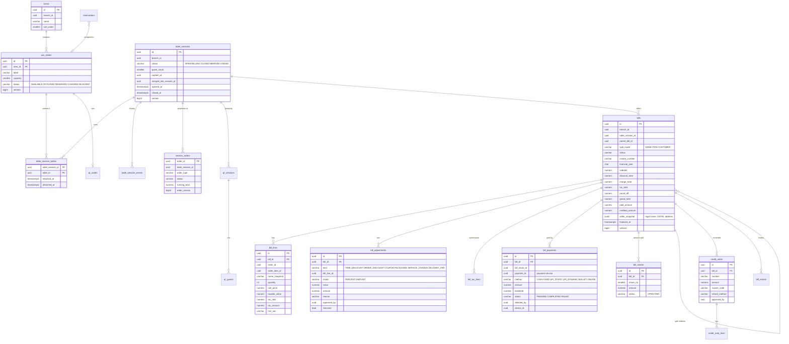
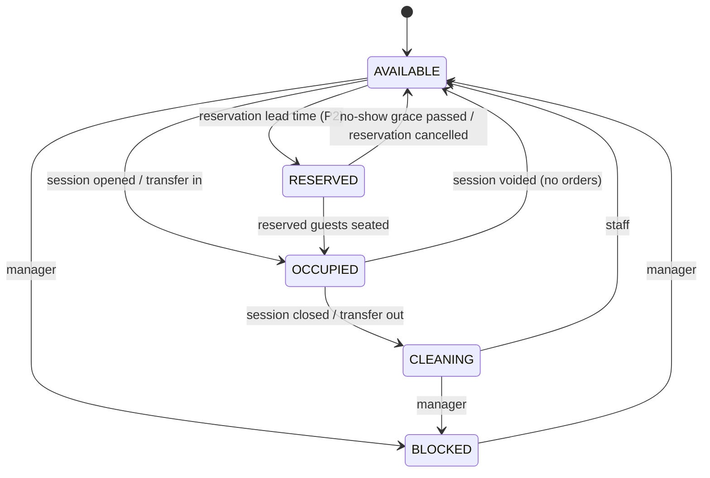
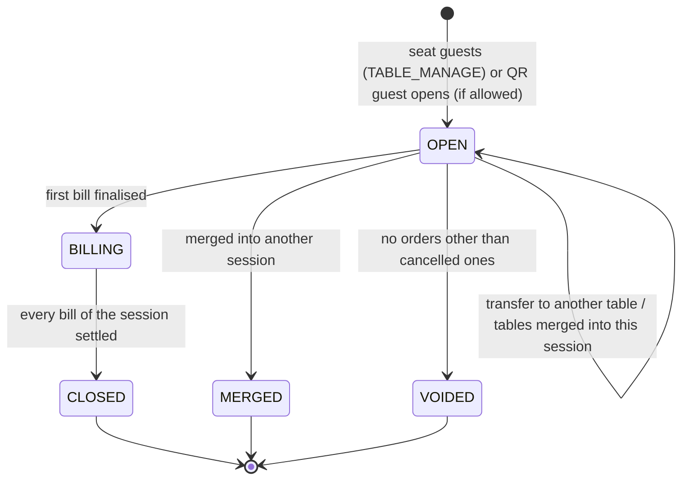
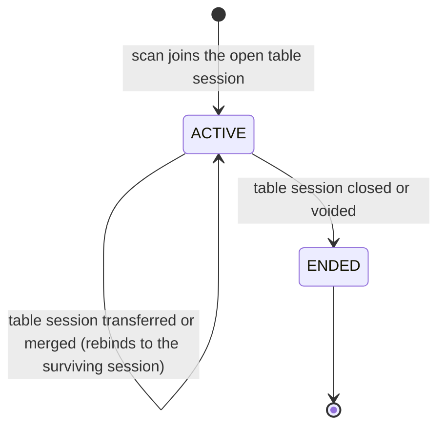
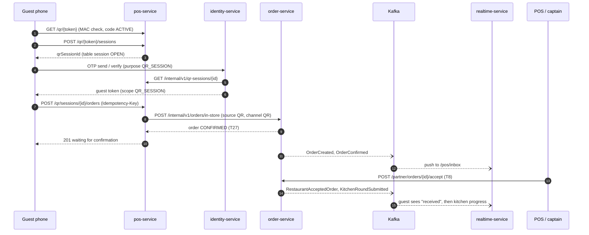
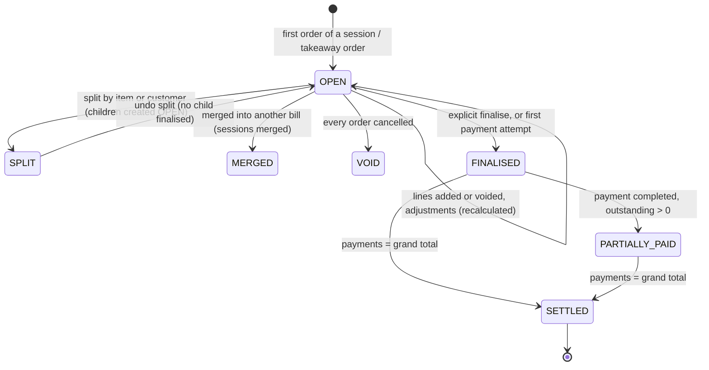
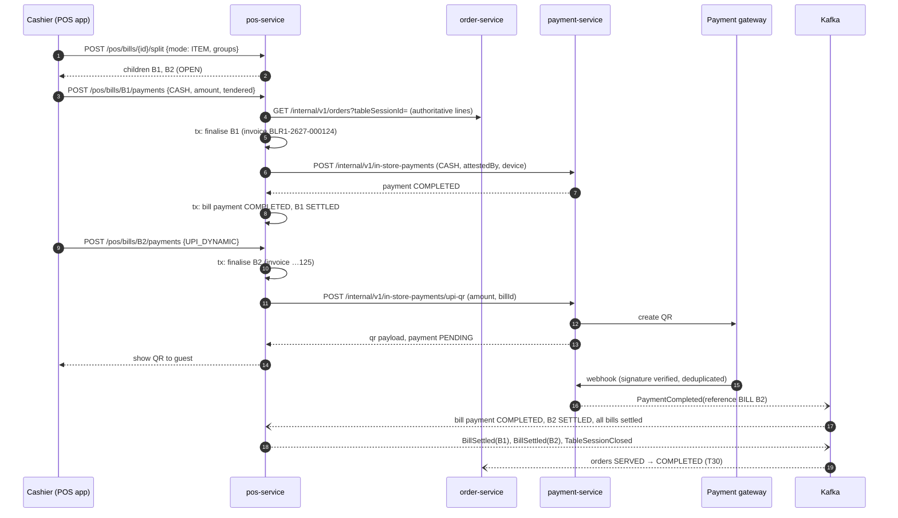
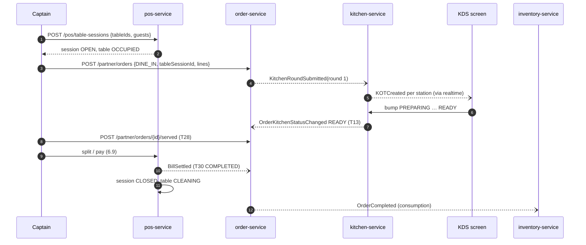

# POS architecture (pos-service)

| Field | Value |
|---|---|
| Version | 0.1.0 |
| Status | **Approved** 2026-10-01 by the project owner (design decisions D-01..D-23 as proposed) |
| Owner | pos-service (new, port 8102, database `pos_db`) |
| Requirements | REQ-POS-001..012, REQ-BILL-001..009, REQ-QR-001..006, REQ-PAYMENT-006, REQ-OUTLET-004 AC2, REQ-OUTLET-007, NFR-PERF-005 |
| Phase | 13A (floor, held orders, billing), 13E (QR) |

## 1. Responsibilities

| Module (package) | Owns | Requirements |
|---|---|---|
| `floor` | Areas, tables, table status, table sessions, transfers, merges, reservations (P2) | REQ-POS-006..008 |
| `drafts` | Held orders (unsent POS carts) | REQ-POS-003 |
| `qr` | Table QR codes, QR sessions, QR guests, QR order submission | REQ-QR-001..006 |
| `billing` | Bills, bill lines, adjustments (discounts, charges), tax lines, splits, merges, invoice numbering, settlement, credit notes, receipts | REQ-BILL-001..009, REQ-POS-004, REQ-POS-011, REQ-POS-012 |
| `settings` | POS settings per outlet (service charge, round-off, discount thresholds, invoice code, business-day close, QR options) | REQ-BILL-009, REQ-QR-005 |

pos-service never creates orders itself for staff: the POS app calls order-service directly (one order owner). It creates QR orders through order-service's internal API on behalf of a verified guest. It never decides payment status: payments are recorded by payment-service (D-16).

## 2. Data model (pos_db)

Every table below has `restaurant_id NOT NULL` (tenant, ADR-019) and the base columns from 06 §1.2 unless noted.



Additional tables (not drawn): `bill_tax_lines` (bill_id, rate, taxable, cgst, sgst, igst), `bill_events` (append-only history: created, recalculated, split, merged, finalised, reprinted, viewed), `credit_note_lines`, `invoice_series` (§6.3), `held_orders` (§7), `qr_codes`, `qr_sessions`, `qr_guests` (§5), `reservations` (P2), `table_session_events` (append-only: opened, transferred, merged, closed, with from/to tables), `branch_pos_settings` (§8), `branch_legal_view` (projection of the outlet's legal name, GSTIN, address and state code from `restaurant.events.v1`), plus `outbox_events`, `processed_events`, `idempotency_keys`, `shedlock`.

Key constraints:
- `uq_pos_tables_branch_label (branch_id, label)`.
- `uq_table_session_tables_active (table_id) WHERE detached_at IS NULL`: a table belongs to at most one open session.
- `uq_bills_invoice (branch_id, financial_year, invoice_number) WHERE invoice_number IS NOT NULL`.
- `uq_bill_lines_open_item (order_item_id) WHERE` the bill is not SPLIT/MERGED/VOID (maintained by the service; a line is billed once).
- `ck_bills_paid`: `paid_amount <= grand_total`; `ck_bills_credited`: `credited_amount <= paid_amount`.
- Money columns `numeric(12,2)`; rates `numeric(5,2)`.

## 3. Floor: tables and sessions (REQ-POS-006, REQ-POS-007)

### 3.1 Table status

Any other change returns `409 INVALID_TABLE_TRANSITION` (REQ-POS-006 AC2). Status changes publish `TableStatusChanged`.

### 3.2 Table session

- **Open** (AC1): attaches one or more tables (`table_session_tables`), records guest count and captain; tables become OCCUPIED.
- **Transfer** (AC2): detach from the source table and attach to an AVAILABLE target in one transaction. Source → CLEANING, target → OCCUPIED. `table_session_events` records both tables. QR sessions stay bound to the table session, so they follow the guests (REQ-QR-002 AC3).
- **Merge** (AC3): sessions B, C → A. B and C become MERGED with `merged_into_session_id = A`; their tables attach to A; their open bills merge into A's bill (REQ-BILL-005). The original sessions stay readable.
- **BILLING:** order-service rejects new rounds and new orders for the session (`409 ORDER_BILLED`). pos-service publishes the status in `pos.events.v1`, and order-service keeps it in its session projection.
- **Close** (AC5): the last settlement closes the session, moves its tables to CLEANING and ends its QR sessions.
- **Concurrency** (AC4): every command locks the session row (`SELECT … FOR UPDATE`) and the affected table rows in ascending ID order (prevents deadlocks), then checks `version`. The second device gets `409 CONCURRENT_MODIFICATION` with the current floor state in the problem body. A concurrency test runs parallel transfers and merges on the same tables.

### 3.3 Running bill on the floor plan (REQ-POS-006 AC3)
`session_orders` is a projection of `OrderCreated`, `OrderLinesAdded`, `OrderLineVoided`, `OrderCancelled` and status events. It keeps the running total (net quantity × unit price incl. tax, before bill-level adjustments) and the elapsed time. Changes push to `/topic/branches/{branchId}/floor`. The projection is for display only. Bill finalisation always re-reads authoritative lines from order-service (§6.1).

## 4. Devices and staff (REQ-OUTLET-004 AC2, REQ-OUTLET-007)
The POS app runs on a paired `POS_TERMINAL` or `CAPTAIN_HANDHELD` device and calls APIs with a PIN-login staff token (`sub` = person, `dev` = device), as designed in the [README §5.3](README.md#53-devices-and-staff-pins). pos-service stores `attested_by` (person) and `device_id` on every bill event, payment record, discount and void it receives. Manager approval on the same device ("manager PIN") is a second PIN login that returns a single-use approval token (`aud = pos-approval`, 2-minute TTL, bound to the bill and the action), attached to the request that needs approval.

## 5. QR ordering (REQ-QR-001..006, Phase 13E)

### 5.1 Codes (QR-001)
- `qr_codes (id, restaurant_id, branch_id, table_id, public_id char(16), key_version, status ACTIVE/REVOKED)`. `public_id` is 96 random bits in base62, not the UUIDv7 primary key, so it isn't guessable or sequential.
- Printed URL: `https://<customer-web>/t/{public_id}.{mac}` where `mac = base64url(HMAC-SHA256(qrKey[key_version], public_id))` truncated to 128 bits. The HMAC key lives in the secret manager (rotatable through `key_version`).
- Verification: constant-time MAC check, then load by `public_id`, require ACTIVE, and resolve (brand, outlet, table) from the row. Regenerating a code sets the old row REVOKED and creates a new `public_id` (AC2).

### 5.2 Sessions, verification and ordering

- `GET /api/v1/qr/{token}`: outlet name, table label, session state (`OPEN`, or `WAITING_FOR_STAFF` when no session is open and guests may not open one), and the QR channel menu link.
- `POST /api/v1/qr/{token}/sessions`: joins the open table session (or opens one if `qr_guest_can_open_session`). Returns `qrSessionId` and an anonymous session handle (HttpOnly cookie, 2-hour TTL) for browsing and the cart.
- **OTP** (QR-004): the guest verifies the phone through identity-service OTP (`purpose = QR_SESSION`, existing rate limits). identity-service asks pos-service `GET /internal/v1/qr-sessions/{id}` whether the session is ACTIVE, then issues a guest access token: role `QR_GUEST`, scope `{type: "QR_SESSION", id}`, 30-minute TTL, refreshable only while the QR session is ACTIVE (AC2). The guest is recorded in `qr_guests (qr_session_id, customer_id, guest_ref, verified_at)`.
- **Order** (QR-005): `POST /api/v1/qr/sessions/{id}/orders` with the guest token. pos-service checks the session is ACTIVE and the table session OPEN, applies the rate limit (default 1 order per 30 s per guest device, 20 per session, configurable; QR-004 AC3), then calls `POST /internal/v1/orders/in-store` on order-service with `orderSource = QR`. order-service prices the lines on the `QR` channel. With `qr_auto_accept` on, T8 runs at once; otherwise the order waits in CONFIRMED and appears on `/topic/branches/{branchId}/pos/inbox`.
- **Status** (QR-005 AC3): the guest subscribes to `/topic/qr-sessions/{qrSessionId}`; realtime-service maps KOT and order events of the session's QR orders to received / preparing / ready / served.
- **Payment** (QR-006): default at the table bill. With `qr_online_payment_enabled`, the guest can pay the session bill through payment-service hosted checkout (reference type `BILL`). The bill updates only on the `PaymentCompleted` webhook event, never from the browser.

### 5.3 QR order with staff acceptance


## 6. Billing (REQ-BILL-001..009)

### 6.1 Bill lifecycle (D-06)

- **OPEN** bills are recalculated on every change (AC5 of REQ-BILL-001). A **pro-forma estimate** can be printed from OPEN; it says "Estimate — not a tax invoice" and has no invoice number.
- **Finalise** (explicit, or implicitly at the first payment attempt): in one transaction pos-service re-reads the authoritative order lines from order-service (`GET /internal/v1/orders?tableSessionId=&includeLines=true`), checks every order's `aggregateVersion` against `session_orders` (a mismatch recalculates and returns `409 BILL_CHANGED` so the cashier sees the change), requires every dine-in order to be READY_FOR_PICKUP or later and no held lines, recalculates, allocates the invoice number (§6.3), snapshots the seller's legal details, and sets FINALISED. Publishes `BillFinalised`. The session moves to BILLING.
- **SETTLED** publishes `BillSettled` (with all order IDs), which completes the orders (ORDER T28/T30/T31).
- Credit notes don't change the status. They increase `credited_amount`.

### 6.2 Computation (REQ-BILL-001, D-15)
The pricing library ([ADR-021](../../17-adr/ADR-021-shared-pricing-library.md)) computes, for each line with net quantity > 0:

1. `gross = (unit_price + Σ addon prices) × net quantity`.
2. If the line's tax class is **inclusive**: `taxable = gross ÷ (1 + rate)`. If exclusive: `taxable = gross`.
3. Item discount (percentage or amount) reduces the line's taxable value.
4. Order discount, then coupon: allocated across lines pro-rata to their taxable values. The rounding residue goes to the line with the largest taxable value.
5. Charges: packaging (per item or per order) and service charge (percentage of the discounted taxable subtotal, only if enabled and not removed). Each charge is its own taxable line at the outlet's food tax rate.
6. Tax per line = `taxable_after_discounts × rate`, rounded HALF_UP to 2 decimals. The tax summary splits each rate into CGST and SGST halves (intra-state supply; IGST is kept in the model for inter-state cases).
7. `grand_total = Σ taxable_after_discounts + Σ charges + Σ tax`, then `round_off = round(grand_total, 0, HALF_UP) − grand_total` when the outlet enables round-off; shown as its own line (AC3).

All arithmetic is `BigDecimal`; intermediate values keep 4 decimals and stored amounts 2 decimals, HALF_UP. Discounts before tax and taxable charges reflect the usual GST treatment of discounts shown on the invoice and of service and packaging charges. **This order must be confirmed by a tax adviser before Phase 13A UAT** (D-15); it is configuration-free code, so a change is one library change plus its tests.

Service charge (REQ-BILL-009, ROS-OQ-13): disabled by default; percentage per outlet; separate labelled line; removable per bill with `removed = true`, actor and reason recorded; never part of item prices.

Discounts (REQ-POS-004): `POS_DISCOUNT` up to `discount_threshold_percent` / `discount_threshold_amount`; above it the request must carry a manager approval token (§4). Every adjustment records actor, device and reason, and is audited.

Coupons: validated and reserved by promotion-service with reference type `BILL` (D-17). Committed at settlement; released if the bill is voided.

### 6.3 Invoice numbering (REQ-BILL-002, ROS-OQ-14, D-07)
```text
invoice_series
  restaurant_id, branch_id, series_type CHECK IN ('INVOICE','CREDIT_NOTE'),
  financial_year char(4),          -- '2627' = 1 Apr 2026 – 31 Mar 2027, outlet time zone
  next_value bigint NOT NULL,
  PK (branch_id, series_type, financial_year)
```
Allocation, inside the finalisation transaction:
```sql
INSERT INTO invoice_series (restaurant_id, branch_id, series_type, financial_year, next_value)
VALUES (:r, :b, 'INVOICE', :fy, 1)
ON CONFLICT (branch_id, series_type, financial_year)
DO UPDATE SET next_value = invoice_series.next_value + 1
RETURNING next_value;
```
The row stays locked until commit. A rollback undoes the increment, so numbers are **gap-free**; parallel finalisations serialise on the row, so they are never duplicated. Format: `{invoice_code}-{fy}-{seq:06}`, e.g. `BLR1-2627-000123`. `invoice_code` is at most 4 characters, so the number is at most 16 characters (the GST limit). Credit notes use the `CREDIT_NOTE` series with the code suffixed `C` within the same limit (code ≤ 3 characters + `C`). A concurrency test finalises 200 bills in parallel and checks 1..200 with no gaps or duplicates.

### 6.4 Settlement and the payment trust model (REQ-BILL-003, REQ-PAYMENT-006, ROS-OQ-08, D-16)

| Method | Recorded by | Confirmation |
|---|---|---|
| `CASH` | Cashier (`POS_SETTLE`) | Staff-attested: pos-service calls payment-service `POST /internal/v1/in-store-payments` with amount, tendered, cashier and device; payment-service stores the record and returns COMPLETED. Change = tendered − amount |
| `CARD` (terminal) | Cashier | Staff-attested with last 4 digits or terminal reference (never the card number) |
| `UPI_STATIC` | Cashier | Staff-attested with the UPI reference |
| `UPI_DYNAMIC` | System | pos-service asks payment-service for a dynamic QR (`POST /internal/v1/in-store-payments/upi-qr`, 10-minute expiry). The bill payment stays PENDING until the gateway webhook produces `PaymentCompleted` (reference `BILL`) |
| `WALLET`, `ONLINE` | System | payment-service hosted checkout (QR guest online payment); webhook only |

Rules:
- The client never sends a status. Staff-attested records always carry the cashier and device and are audited.
- PENDING payments count against the outstanding amount, so a bill can't be over-collected: `Σ COMPLETED + Σ PENDING ≤ grand_total`. FAILED or expired payments free the amount.
- `PaymentCompleted` events for bills are keyed by `billId` and deduplicated by `payment_id`; replaying a webhook never settles twice (REQ-BILL-007 AC3).
- Settlement locks the bill row (`FOR UPDATE`) and checks `version`. Two cashiers settling the same bill: one wins, the other gets `409` with the current outstanding amount.
- Day-close reconciliation uses the payment summary by method and attester in the outlet reports (REQ-ANALYTICS-002). Cashier shifts are not in scope (ROS-OQ-20).

### 6.5 Split and merge (REQ-BILL-004, REQ-BILL-005, D-22)
- **By item / by customer**: the OPEN parent becomes SPLIT; child bills (OPEN) receive whole lines or line quantities (customer split groups lines by `guest_ref`). Each child is computed independently and gets its own invoice number when finalised. Line quantities split into fractions of one unit are not allowed; amounts are recomputed per child. The library checks that the children's totals add up to the parent's computed total; the rounding residue goes to the last child (AC5).
- **By amount / equal shares**: there is **one** bill and one invoice; `bill_shares` divide the grand total into amounts (residue on the last share). Each share is paid with its own method or methods. A share receipt can be printed per guest. This avoids issuing tax invoices that don't correspond to supplied items.
- **Undo**: allowed while no child is FINALISED. Because finalisation happens at the first payment (D-06), this matches "until any sub-bill has a payment".
- **Merge**: OPEN bills of merged sessions combine into the surviving session's bill before any payment; the merged bill becomes MERGED and its lines move. `BillsMerged` is published.

### 6.6 Immutability (REQ-BILL-006, BR-R3)
- Service: commands on a bill in FINALISED, PARTIALLY_PAID or SETTLED reject line, price, tax and total changes with `409 BILL_FINALISED`.
- Database guard: `fn_guard_finalised_bill()` on `bill_lines`, `bill_adjustments`, `bill_tax_lines` (any write) and on `bills` (financial columns, invoice number, seller snapshot) once `finalised_at IS NOT NULL`. Only `paid_amount`, `credited_amount`, `status` (forward only), `updated_*` and `version` may change.
- Every view of a finalised bill in the back office, every reprint and every correction writes a `bill_events` row and an audit event (AC3).

### 6.7 Refunds and credit notes (REQ-BILL-007, REQ-POS-012)
1. `POST /api/v1/pos/bills/{id}/credit-notes` with lines (or an amount), reason and refund method. `ORDER_REFUND` is required; amounts above the role's limit need a manager approval token, and above the brand limit the owner (REQ-POS-012 AC1).
2. In one transaction: allocate a credit-note number (§6.3), create the credit note and its lines, and increase `credited_amount`. The original bill is untouched (AC3 of REQ-POS-012).
3. Refund to the original method: cash and attested methods are recorded by payment-service as attested refunds; gateway methods go through the existing refund command (`RefundRequested`, key `billId`), and the result comes back by webhook (REQ-PAYMENT-005).
4. Publishes `CreditNoteIssued`; payment-service publishes `RefundCreated` (existing).

### 6.8 Receipts (REQ-POS-011, REQ-BILL-008)
- Print: the POS app renders an 80 mm HTML layout and calls `window.print()` (ROS-OQ-05). Reprints call `POST /api/v1/pos/bills/{id}/reprints`, which counts the reprint, returns the "DUPLICATE n" marker and audits it.
- Digital: `POST /api/v1/pos/bills/{id}/receipt-links` creates a signed URL (HMAC, 7-day expiry) to a receipt page; notification-service sends it by SMS or email. The page shows the invoice without the guest's phone number.

### 6.9 Split payment with cash and dynamic UPI


### 6.10 Dine-in round trip


## 7. Held orders (REQ-POS-003)
- `held_orders (id, restaurant_id, branch_id, label, order_type, table_session_id NULL, draft jsonb, created_by, device_id, status HELD/RESUMED/EXPIRED, expires_at)`. `draft` is a client cart snapshot (menu item, variant, add-ons, quantity, notes); it holds no prices.
- Visible to every POS device of the outlet (AC1). Resume returns the draft, and the POS app calls order-service `POST /api/v1/partner/orders/price-preview` to re-price it and show changes before sending (AC2).
- A ShedLock job marks held orders EXPIRED at the outlet's business-day close and logs each one (AC3). Expired rows are purged after 30 days.

## 8. Settings (`branch_pos_settings`)
`invoice_code` (≤ 4), `business_day_close` (time, default 04:00), `round_off_enabled`, `service_charge_enabled` (default false), `service_charge_percent`, `packaging_mode` (`NONE`/`PER_ITEM`/`PER_ORDER`), `packaging_amount`, `discount_threshold_percent`, `discount_threshold_amount`, `takeaway_payment` (`PREPAID`/`PAY_ON_HANDOVER`), `qr_auto_accept` (default false), `qr_guest_can_open_session` (default false), `qr_online_payment_enabled` (default false), `qr_acceptance_window_minutes` (default 10), `late_threshold_percent` (KDS colours, read by kitchen-service through `pos.events.v1` `PosSettingsChanged`). Every change is audited.

## 9. API contracts (pos-service)

| Method and path | Permission | Purpose |
|---|---|---|
| `GET /api/v1/pos/branches/{branchId}/floor` | TABLE_MANAGE | Areas, tables, status, session, elapsed time, running total, `version` |
| `POST/PATCH /api/v1/pos/branches/{branchId}/areas`, `/tables` | TABLE_CONFIGURE | Configure areas and tables |
| `POST /api/v1/pos/tables/{id}/status` | TABLE_MANAGE | `{to, reason}` (CLEANING → AVAILABLE, BLOCKED) |
| `POST /api/v1/pos/table-sessions` | TABLE_MANAGE | Open `{tableIds[], guestCount, captainId}` |
| `POST /api/v1/pos/table-sessions/{id}/transfer` | TABLE_MANAGE | `{targetTableId}` |
| `POST /api/v1/pos/table-sessions/{id}/merge` | TABLE_MANAGE | `{sourceSessionIds[]}` |
| `POST /api/v1/pos/table-sessions/{id}/void` | TABLE_MANAGE | Opened by mistake, no orders |
| `GET/POST/DELETE /api/v1/pos/branches/{branchId}/held-orders` | POS_ORDER | Hold, list, resume, discard |
| `GET /api/v1/pos/bills/{id}`, `GET /api/v1/pos/table-sessions/{id}/bill` | BILL_VIEW | Current bill with lines, adjustments, tax summary, payments |
| `POST /api/v1/pos/bills` | POS_ORDER | Takeaway bill for `{orderIds[]}` (dine-in bills are created automatically) |
| `POST /api/v1/pos/bills/{id}/adjustments` | POS_DISCOUNT (+ approval token above threshold) | Discounts, coupon, charge removal |
| `POST /api/v1/pos/bills/{id}/split`, `/undo-split`, `/shares` | POS_SETTLE | Split by item/customer; amount shares |
| `POST /api/v1/pos/bills/{id}/estimate` | POS_ORDER | Pro-forma print data |
| `POST /api/v1/pos/bills/{id}/finalise` | POS_SETTLE | Explicit finalisation |
| `POST /api/v1/pos/bills/{id}/payments` | POS_SETTLE | `{method, amount, tendered?, reference?, shareId?}`; Idempotency-Key required |
| `POST /api/v1/pos/bills/{id}/credit-notes` | ORDER_REFUND (+ approval token above limit) | Credit note and refund; Idempotency-Key required |
| `POST /api/v1/pos/bills/{id}/reprints`, `/receipt-links` | BILL_VIEW | Receipts |
| `GET/PUT /api/v1/pos/branches/{branchId}/settings` | BRANCH_MANAGE | POS settings |
| `POST /api/v1/pos/tables/{id}/qr-code` | QR_MANAGE | Generate or regenerate; returns the printable URL once |
| `GET /api/v1/qr/{token}`, `POST /api/v1/qr/{token}/sessions` | Public (QR token) | §5.2 |
| `GET /api/v1/qr/sessions/{id}/menu` | Session handle | QR channel menu (proxied read from catalog-service, cached) |
| `POST /api/v1/qr/sessions/{id}/orders` | QR_GUEST token | Submit a QR order; Idempotency-Key required |
| `GET /api/v1/qr/sessions/{id}/bill`, `POST …/bill/checkout` | QR_GUEST token | View and (if enabled) pay the session bill online |
| `GET /internal/v1/table-sessions/{id}`, `GET /internal/v1/qr-sessions/{id}` | Service tokens | Guards for order-service and identity-service |

**New error codes:** `INVALID_TABLE_TRANSITION`, `TABLE_NOT_AVAILABLE`, `TABLE_SESSION_NOT_OPEN`, `BILL_CHANGED`, `BILL_FINALISED`, `BILL_OVERPAYMENT`, `SPLIT_NOT_UNDOABLE`, `APPROVAL_REQUIRED`, `QR_TOKEN_INVALID`, `QR_SESSION_ENDED`, `QR_RATE_LIMITED`.

## 10. NFR notes
- NFR-PERF-005 (POS submit p95 < 500 ms) is an order-service path ([ORDER §8.1](ORDER_ARCHITECTURE.md#81-pos-order-submit-takeaway-nfr-perf-005)). pos-service's floor read is served from `pos_db` with one query per branch (≤ 200 tables) and is cached for 2 s per branch in Redis, invalidated by session events.
- pos-service scales horizontally; all coordination is row locks and optimistic versions in `pos_db`.

## 11. Test obligations
- Unit (pricing library): every component; inclusive and exclusive tax; allocation residue; round-off; split totals = parent total; share residue.
- Concurrency: invoice numbering (200 parallel finalisations, no gaps or duplicates); two cashiers settling one bill; parallel transfer/merge on the same tables; duplicate payment requests with one Idempotency-Key.
- Integration: webhook replay never double-settles; database guards reject writes to finalised bills; QR token forgery, revocation and cross-outlet use are rejected; OTP rate limits.
- Security: cashier of outlet A can't read or settle a bill of outlet B (404); captain without discount permission is rejected; approval tokens are single-use and bound to the bill.
- E2E: the dine-in round trip (§6.10); takeaway prepaid; split by item with cash + UPI (§6.9); refund with a credit note; QR order with auto-accept and with staff acceptance.
- Visual: floor plan, bill screen, 80 mm receipt and estimate layouts.
