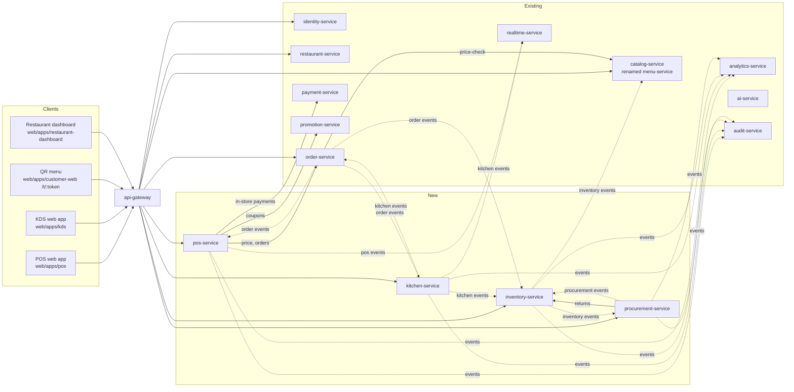

# Restaurant OS — architecture overview

| Field | Value |
|---|---|
| Version | 0.1.0 |
| Status | **Approved** 2026-10-01 by the project owner (design decisions D-01..D-23 as proposed) |
| Requirements | [restaurant-os requirements](../../requirements/restaurant-os/README.md) (97 requirements), [IMPACT-0002](../../requirements/impact/IMPACT-0002.md), NFR-PERF-005..007 |
| Depends on | [04](../../04-system-architecture.md), [05](../../05-microservices.md), [06](../../06-database-design.md), [07](../../07-api-design.md), [08](../../08-event-driven-architecture.md), [09](../../09-security.md), [order-state-machine](../order-state-machine.md) |
| Constraint | Independent design. No commercial POS code, UI, branding, API or schema is copied (ROS preamble). |

This folder holds the design for the Restaurant OS addendum. It extends the approved Phase 2 design and doesn't replace it. Anything not mentioned here follows the approved documents: outbox, idempotent consumers, error format, pagination, idempotency keys, observability and deployment.

## Documents

| Document | Content |
|---|---|
| This README | Service boundaries, ports, gateway routes, Kafka topics and the event catalogue, tenancy, roles and permissions, real-time channels, design decisions to approve |
| [CATALOG_ARCHITECTURE.md](CATALOG_ARCHITECTURE.md) | catalog-service (today's menu-service): master products, variants, add-ons, combos, tax classes, layered prices, channel menus, schedules, published menu versions, inventory-linked availability |
| [ORDER_ARCHITECTURE.md](ORDER_ARCHITECTURE.md) | order-service changes: order source and type, in-store creation, rounds, lifecycles per order type (REQ-ORDER-002 v3), immutability guard |
| [POS_ARCHITECTURE.md](POS_ARCHITECTURE.md) | pos-service: areas, tables, sessions, held orders, devices and PINs, QR ordering, billing (computation, invoice numbering, split, merge, settlement, credit notes) |
| [KITCHEN_ARCHITECTURE.md](KITCHEN_ARCHITECTURE.md) | kitchen-service: stations, routing, KOT generation and numbering, modifications, KDS states, order roll-up, printing |
| [INVENTORY_ARCHITECTURE.md](INVENTORY_ARCHITECTURE.md) | inventory-service (stock items, ledger, consumption, costing, alerts, transfers, central kitchen, recipes) and procurement-service (suppliers, purchase orders, receipts, invoices, returns) |
| ADRs | [ADR-018](../../17-adr/ADR-018-restaurant-os-services.md) service boundaries, [ADR-019](../../17-adr/ADR-019-tenant-isolation.md) tenant isolation, [ADR-020](../../17-adr/ADR-020-inventory-ledger-costing.md) inventory ledger and costing, [ADR-021](../../17-adr/ADR-021-shared-pricing-library.md) shared pricing library |

Each architecture document contains: responsibilities, a data model (mermaid ERD plus table notes), state machines, API contracts, events, sequence diagrams, concurrency rules, NFR notes and test obligations.

---

## 1. Service boundaries (ROS-OQ-01, ADR-018)

Solid arrows are synchronous REST calls (internal, service token). Dotted arrows are Kafka events.

| Service | Status | Owns | Does not own |
|---|---|---|---|
| **catalog-service** (port 8084) | Renamed from menu-service before any code exists (Phase 6) | Master products, categories, variants, add-on groups, combos, tax classes, price layers, menus, channels, schedules, menu items (including the station reference), published menu versions, availability flags | Stations (kitchen-service), recipes (inventory-service), stock |
| **order-service** (8088) | Extended | Every order whatever its source: lines, rounds, status, lifecycle per order type, saga for online orders | Tables, bills, KOTs |
| **pos-service** (8102) | New | Areas, tables, table sessions, transfers and merges, reservations (P2), held orders, QR codes and QR sessions, bills, splits, invoices, credit notes, in-store settlement orchestration | Orders, payments, menu |
| **kitchen-service** (8103) | New | Kitchen stations, displays and printers per station, KOTs, KOT items, KOT event history, KOT numbering, KDS state, order kitchen roll-up | Order status (it publishes a roll-up and order-service decides) |
| **inventory-service** (8104) | New | Stock items, units, stock locations, balances, batches, the movement ledger, consumption records, counts, waste, transfers, central-kitchen requests, production batches, stock levels and alerts, costing, recipes and recipe costs | Suppliers, purchase documents |
| **procurement-service** (8105) | New | Suppliers, supplier items, purchase suggestions, purchase orders, goods receipts, purchase invoices, returns and debit notes, supplier payment records | Stock balances (it asks inventory-service to post) |
| **restaurant-service** (8083) | Extended | Brand (restaurant), outlets (branches), warehouses and central kitchens as locations, staff assignments, device registry | Credentials (identity-service) |
| **identity-service** (8081) | Extended | Device credentials, device pairing, staff PINs, new roles and permissions | Device registry |
| **payment-service** (8089) | Extended | In-store payment records (cash, card terminal, UPI static attested, UPI dynamic QR by webhook) next to online payments: one payment ledger | Bills |
| **promotion-service** (8087) | Extended | Coupon redemption by order **or** bill reference | — |
| **realtime-service** (8097) | Extended | Kitchen, floor and QR-session channels (REQ-RT-002 v2) | — |
| **analytics-service** (8095) | Extended (Phase 13E/17) | Restaurant operations reports (REQ-ANALYTICS-002), async report files in object storage | — |
| **ai-service** (8099) | Extended (Phase 17) | Restaurant operations tools (REQ-AI-004), action proposals and approvals (REQ-AI-005) | Executes nothing itself: approved actions call the owning API with the approver's JWT |

Deployables: 21 + 4 = **25** backend services. Web apps: `web/apps/pos` (POS PWA, ROS-OQ-15) and `web/apps/kds` (kitchen display) are separate apps sharing the design system (REQ-WEB-002 v2 AC4); the QR menu is part of `web/apps/customer-web`.

### 1.1 Synchronous calls (new)

| Caller | Callee | Endpoint | Purpose | Failure behaviour |
|---|---|---|---|---|
| order-service | catalog-service | `POST /internal/v1/pricing/price-check` (now with `channel`) | Price in-store lines, return tax class, station and menu version | Circuit open: `503 DEPENDENCY_UNAVAILABLE`; the POS keeps the cart and retries with the same Idempotency-Key |
| pos-service | order-service | `POST /internal/v1/orders/in-store`, `GET /internal/v1/orders?tableSessionId=` | Create QR orders on behalf of a verified guest; read authoritative lines before finalising a bill | Bill finalisation fails safely (nothing issued) |
| pos-service | payment-service | `POST /internal/v1/in-store-payments`, `POST /internal/v1/in-store-payments/upi-qr` | Record staff-attested payments; create a dynamic UPI QR | Settlement stays PARTIALLY_PAID; no client-side status is ever trusted |
| pos-service | promotion-service | `POST /internal/v1/redemptions/reserve` (reference type `BILL`) | Coupon at the POS | Coupon rejected with the circuit open; the bill continues without it |
| procurement-service | inventory-service | `POST /internal/v1/stock/returns` | Post a purchase return; can be rejected by the negative-stock rule | Return stays DRAFT |
| catalog-service | kitchen-service | `GET /internal/v1/stations?branchId=` (cached) | Validate a menu item's station | Cached list; unknown station falls back to the default station at routing time |

No ROS service calls another synchronously on the order-completion path. Completion, consumption, waste and alerts are event-driven.

---

## 2. Ports and gateway routes

Additions to [05 §1.1–1.2](../../05-microservices.md):

| Port | Service |
|---|---|
| 8084 | catalog-service (was menu-service) |
| 8102 | pos-service |
| 8103 | kitchen-service |
| 8104 | inventory-service |
| 8105 | procurement-service |

| Path | Service | Access |
|---|---|---|
| `/api/v1/branches/*/menu/**` (GET), `/api/v1/products/**` (GET) | catalog-service | Public (unchanged; `channel` query parameter added, default `DELIVERY`) |
| `/api/v1/partner/catalog/**`, `/api/v1/partner/menus/**` | catalog-service | Authenticated, brand or outlet scope |
| `/api/v1/partner/orders/**` | order-service | Authenticated staff (existing accept/reject plus in-store create, rounds, voids) |
| `/api/v1/pos/**` | pos-service | Authenticated staff or paired device + PIN |
| `/api/v1/qr/**` | pos-service | Public with a signed QR token; rate-limited per token and IP |
| `/api/v1/kitchen/**` | kitchen-service | Authenticated staff or paired kitchen device |
| `/api/v1/inventory/**`, `/api/v1/recipes/**` | inventory-service | Authenticated, brand or outlet scope |
| `/api/v1/procurement/**` | procurement-service | Authenticated, brand or outlet scope |
| `/api/v1/partner/devices/**`, `/api/v1/partner/locations/**` | restaurant-service | `DEVICE_MANAGE`, `BRANCH_MANAGE` |
| `/api/v1/auth/device/**` | identity-service | Pairing code exchange (public, rate-limited); PIN login (device token required) |

---

## 3. Kafka topics and event catalogue (ROS §27)

Envelope, outbox, retry and DLT rules are unchanged ([08](../../08-event-driven-architecture.md)). Every ROS event payload carries `restaurantId` (the brand, REQ-OUTLET-003 AC3) and `branchId` where it applies. Consumers reject an event whose `restaurantId` doesn't match the referenced entity they hold, and send it to the DLT with an alert.

### 3.1 Topics

| Topic | Key | Producer | Partitions (prod / local) | Retention | Ordering need |
|---|---|---|---|---|---|
| `catalog.events.v1` (replaces the never-built `menu.events.v1`) | branchId for menu and menu-item events; restaurantId for brand-level product, category, combo and tax events | catalog | 12 / 1 | 7 d | Per menu and per product |
| `order.events.v1` | orderId (unchanged) | order | 24 / 3 | 7 d | Per order |
| `pos.events.v1` | branchId | pos | 12 / 1 | 7 d | Table, session and bill events of one outlet in order |
| `kitchen.events.v1` | orderId | kitchen | 12 / 1 | 7 d | KOT events of one order in order (roll-up correctness) |
| `inventory.events.v1` | locationId | inventory | 12 / 1 | 7 d | Stock events of one location in order (alert crossing) |
| `procurement.events.v1` | restaurantId | procurement | 6 / 1 | 7 d | Low volume |
| `payment.events.v1` | orderId for order payments, **billId** for bill payments | payment | 12 / 3 | 7 d | Per order or per bill |

### 3.2 Event catalogue (new and changed)

Consumer legend: ORD order, POS pos, KIT kitchen, INV inventory, PROC procurement, CAT catalog, RT realtime, AN analytics, AU audit, NOT notification, PRO promotion, AI ai-service (Phase 17 read models).

| Topic | Event | Key payload fields | Consumers | Requirement |
|---|---|---|---|---|
| catalog | `ProductCreated`, `ProductUpdated`, `ProductArchived` | productId, sku, categoryId, kind (`SIMPLE`/`COMBO`), variants[], addonGroupIds[], taxClassId | INV (product reference cache), SRCH, AN | REQ-PRODUCT-009 |
| catalog | `ProductPriceChanged` | productId, variantId?, addonId?, branchId?, channel?, amount, effectiveFrom | AN, INV (recipe margin) | REQ-PRODUCT-007 |
| catalog | `ComboUpdated` | productId, slots[] | INV | REQ-PRODUCT-004 |
| catalog | `MenuPublished` | branchId, menuId, channels[], menuVersion, diffSummary | SRCH, CART, RT | REQ-MENU-010 |
| catalog | `MenuUpdated` (existing name; now with branchId, channels[], menuVersion) | as before | SRCH, CART, REC | REQ-MENU-001 |
| catalog | `MenuItemAvailabilityChanged` (existing) | branchId, menuItemId, productId, available, cause (`MANUAL`/`INVENTORY`/`SCHEDULE`) | SRCH, CART, RT (POS greys items out) | REQ-MENU-009 |
| order | `OrderCreated` (changed: adds `orderSource`, `orderType`, `tableSessionId`, `paymentMode`, `menuVersion`, `channel`) | as before + new fields | AN, NOT, POS | REQ-ORDER-007 |
| order | `KitchenRoundSubmitted` (new) | orderId, round, orderType, orderSource, tableLabel?, lines[] (orderLineId, menuItemId, productId, variant, addons, comboParentLineId, quantity, stationId, prepMinutes, priority, notes) | KIT | REQ-KOT-002, REQ-KOT-006 |
| order | `OrderLinesAdded` (new) | orderId, lines[] (as above, with fireStatus) | POS (bill projection) | REQ-POS-001 AC4, REQ-KOT-006 |
| order | `OrderLineVoided` (new) | orderId, orderLineId, voidedQuantity, reasonCode, actorId | KIT (modification KOT), POS (bill projection) | REQ-POS-005 |
| order | `OrderServed`, `OrderHandedOver` (new) | orderId, at | POS, RT, AN | REQ-ORDER-008 |
| order | `OrderCompleted` (new) | orderId, orderType, branchId, placedAt, completedAt, lines[] (orderLineId, productId, variantId, addonIds[], comboSlotLines[], netQuantity) | INV (consumption), AN, REV, AI | REQ-ORDER-008, REQ-INV-004 |
| pos | `TableSessionOpened`, `TableSessionClosed` | tableSessionId, tableIds[], guestCount, captainId | RT, AN | REQ-POS-007 |
| pos | `TableTransferred`, `TablesMerged` | sourceTableIds[], targetTableId, sessionIds[] | RT, ORD (session reference only), AN | REQ-POS-007 |
| pos | `TableStatusChanged` | tableId, from, to | RT | REQ-POS-006 |
| pos | `BillCreated`, `BillSplit`, `BillsMerged` | billId, tableSessionId?, orderIds[], childBillIds[] | RT, AN | REQ-BILL-004/005 |
| pos | `BillFinalised` | billId, invoiceNumber, financialYear, totals (subtotal, discounts, charges, tax summary, roundOff, grandTotal), orderIds[] | AN, AU | REQ-BILL-002 |
| pos | `BillSettled` | billId, orderIds[], payments[] (paymentId, method, amount) | ORD (completion), RT, AN | REQ-BILL-003 |
| pos | `CreditNoteIssued` | creditNoteId, billId, number, amount, reasonCode | AN, AU | REQ-BILL-007 |
| pos | `QrSessionStarted`, `QrOrderSubmitted` | qrSessionId, tableSessionId, guestRef, orderId? | RT, AN | REQ-QR-002/005 |
| pos | `TableSessionStatusChanged` (new) | tableSessionId, status (`OPEN`/`BILLING`/`CLOSED`/`MERGED`/`VOIDED`), version | ORD (session projection for T27/T33 guards) | REQ-POS-007 |
| pos | `PosSettingsChanged` (new) | branchId, changed settings (no secrets) | KIT (late thresholds), ORD (QR auto-accept, acceptance window) | REQ-BILL-009, REQ-QR-005 |
| kitchen | `KOTCreated` | kotId, kotNumber, orderId, round, stationId, type (`ORIGINAL`/`MODIFICATION`), items[], priority, version | RT, AN | REQ-KOT-002/003 |
| kitchen | `KOTUpdated` | kotId, status, itemStatuses[], version, actor | RT, AN (prep times), INV (waste for `MODIFIED` with reachedPreparing) | REQ-KDS-003 |
| kitchen | `KOTCancelled` | kotId, orderId, reasonCode, **reachedPreparing**, items[] | RT, INV (waste when reachedPreparing) | REQ-KOT-004, ROS-OQ-09 |
| kitchen | `KOTReprinted` | kotId, reprintNo, actor | AU | REQ-KOT-005 |
| kitchen | `OrderKitchenStatusChanged` (new) | orderId, rollup (`PREPARING`/`READY`/`SERVED`), roundsCovered[] | ORD (T11, T13, T28) | REQ-KDS-003 AC3 |
| inventory | `StockMovementPosted` | movementId, type, stockItemId, locationId, quantity, unitCost, referenceType, referenceId | AN | REQ-INV-003 |
| inventory | `InventoryConsumed` | orderId, movements[] | AN, AI | REQ-INV-004 |
| inventory | `LowStockDetected`, `OutOfStockDetected`, `ExpiringSoonDetected`, `StockLevelRestored` (new) | stockItemId, locationId, balance, threshold | PROC (suggestions), NOT, CAT (via the event below), AN | REQ-INV-011 |
| inventory | `ProductStockAvailabilityChanged` (new) | branchId, productId, variantId?, available, limitingStockItemId | CAT (inventory-linked availability) | REQ-MENU-009 |
| inventory | `StockTransferred` | transferId, fromLocationId, toLocationId, lines[] | AN | REQ-INV-009, REQ-OUTLET-005 |
| inventory | `StockDiscrepancyDetected` | stockItemId, locationId, shortQuantity, referenceId | NOT, AN | REQ-INV-005 |
| inventory | `StockReceiptPosted` (new) | goodsReceiptId, movements[] | PROC (marks the receipt POSTED) | REQ-PURCHASE-003 |
| inventory | `RecipePublished`, `RecipeCostChanged` | recipeId, versionId, subject, costPerPortion | AN, AI | REQ-RECIPE-002/004 |
| procurement | `PurchaseCreated` (on approval), `PurchaseReceived`, `PurchaseReturned`, `PurchaseInvoiceRecorded`, `SupplierCreated`, `SupplierUpdated` | ids, lines, totals | INV (`PurchaseReceived`), AN, AU | REQ-PURCHASE-*, REQ-SUPPLIER-* |
| payment | `PaymentCompleted` (changed: `referenceType` `ORDER`/`BILL`, `method`, `attestedBy?`) | as before + new fields | ORD (ORDER), POS (BILL), AN | REQ-PAYMENT-006 |
| restaurant | `LocationCreated`, `LocationUpdated`, `DeviceRegistered`, `DeviceRevoked`, `StaffAssignmentChanged` | ids, type, branchId | INV (locations), ID (revocation), KIT (displays) | REQ-OUTLET-001/004/007 |

Events not listed in the requirement documents and added by this design: `KitchenRoundSubmitted` (named in REQ-KOT-002 AC3, producer fixed here), `OrderLinesAdded`, `OrderLineVoided`, `TableSessionStatusChanged`, `PosSettingsChanged`, `OrderKitchenStatusChanged`, `StockLevelRestored`, `ProductStockAvailabilityChanged`, `StockReceiptPosted`, `LocationCreated`/`LocationUpdated`, `DeviceRegistered`/`DeviceRevoked`, `StaffAssignmentChanged`. They are listed in decision D-11.

---

## 4. Tenancy and scope (REQ-OUTLET-002/003, ADR-019)

- **Tenant column.** The brand is the existing `restaurants` row. Every tenant-owned table in catalog, order, pos, kitchen, inventory and procurement has `restaurant_id uuid NOT NULL` (the brand ID). Code and APIs keep `restaurant` and `branch` (ROS-OQ-18); the UI says "Brand" and "Outlet".
- **Application guard.** `common-persistence` provides a `TenantContext` filled from the JWT (requests) or from the event's `restaurantId` (consumers). Tenant-owned entities use Hibernate's `@TenantId`, so every query is filtered and every insert stamped without per-query code.
- **Database guard.** PostgreSQL row-level security on the same tables: `USING (restaurant_id = current_setting('app.restaurant_id')::uuid)`, with `FORCE ROW LEVEL SECURITY`. The runtime role `<service>_app` isn't the table owner, so the policy applies to it. `common-persistence` runs `SET LOCAL app.restaurant_id` at the start of every transaction. A transaction without a tenant sees no rows.
- **Platform jobs** (nightly reconciliation, report generation) iterate per brand and set the context for each brand. No runtime role has `BYPASSRLS`; only the Flyway owner role does, for data migrations.
- **Outlet scope.** `AccessPolicy` components check `branchId ∈ scopes` (or a brand scope) for every outlet-level action. IDs in the request body are never trusted for scope.
- **Cross-tenant responses** return `404 NOT_FOUND` (REQ-OUTLET-003 AC2).

---

## 5. Roles, permissions and devices (REQ-AUTH-003 v2, REQ-OUTLET-004/007)

### 5.1 New permissions
| Permission | Meaning |
|---|---|
| `CATALOG_MANAGE` | Master products, variants, add-ons, combos, tax classes, base prices |
| `MENU_PUBLISH` | Brand menus and publishing to outlets |
| `MENU_UPDATE`, `MENU_AVAILABILITY_UPDATE` (existing) | Outlet menu overrides within allowed fields; availability toggle |
| `POS_ORDER` | Create and add rounds to in-store orders, hold and resume |
| `POS_DISCOUNT` | Discounts up to the outlet threshold |
| `POS_DISCOUNT_APPROVE` | Approve discounts above the threshold (PIN on the same device, or an approval request) |
| `POS_VOID` | Cancel orders or void items after a KOT |
| `POS_SETTLE` | Finalise and settle bills, record in-store payments |
| `ORDER_REFUND` (existing) | Refunds within the role's configured limit |
| `TABLE_MANAGE` | Seat, transfer, merge, close; table status |
| `TABLE_CONFIGURE`, `QR_MANAGE` | Areas, tables, QR codes |
| `KITCHEN_VIEW`, `KITCHEN_UPDATE`, `KITCHEN_CONFIGURE` | KDS board, bump and recall, stations and printers |
| `INVENTORY_VIEW`, `INVENTORY_OPERATE`, `INVENTORY_APPROVE` | Read stock; record counts, waste, transfers, production; approve adjustments above threshold and transfer requests |
| `RECIPE_MANAGE` | Recipes and versions |
| `PURCHASE_CREATE`, `PURCHASE_APPROVE`, `SUPPLIER_MANAGE` | Purchasing and suppliers |
| `DEVICE_MANAGE` | Register and revoke POS and kitchen devices |
| `BILL_VIEW` | Bills, invoices, credit notes, reprints |

### 5.2 Role → permission matrix (scope in brackets)
| Permission | OWNER (brand) | MANAGER (outlet) | CASHIER (outlet) | CAPTAIN (outlet) | KITCHEN_STAFF (outlet) | INVENTORY_MANAGER (brand or outlet) |
|---|---|---|---|---|---|---|
| CATALOG_MANAGE, MENU_PUBLISH | ✓ | | | | | |
| MENU_UPDATE, MENU_AVAILABILITY_UPDATE | ✓ | ✓ | availability only | | | |
| POS_ORDER | ✓ | ✓ | ✓ | ✓ | | |
| POS_DISCOUNT | ✓ | ✓ | ✓ | configurable, off by default (REQ-POS-009 AC2) | | |
| POS_DISCOUNT_APPROVE, POS_VOID | ✓ | ✓ | | | | |
| POS_SETTLE | ✓ | ✓ | ✓ | configurable, off by default | | |
| ORDER_REFUND | ✓ (brand limit) | ✓ (outlet limit) | | | | |
| TABLE_MANAGE | ✓ | ✓ | ✓ | ✓ | | |
| TABLE_CONFIGURE, QR_MANAGE, KITCHEN_CONFIGURE, DEVICE_MANAGE | ✓ | ✓ | | | | |
| KITCHEN_VIEW, KITCHEN_UPDATE | ✓ | ✓ | view | view | ✓ | |
| INVENTORY_VIEW | ✓ | ✓ | | | view (own outlet) | ✓ |
| INVENTORY_OPERATE | ✓ | ✓ | | | waste only | ✓ |
| INVENTORY_APPROVE, RECIPE_MANAGE | ✓ | | | | | ✓ (brand scope only) |
| PURCHASE_CREATE | ✓ | ✓ | | | | ✓ |
| PURCHASE_APPROVE, SUPPLIER_MANAGE | ✓ | | | | | ✓ (brand scope only) |
| BILL_VIEW | ✓ | ✓ | ✓ | | | |
| ANALYTICS_VIEW_RESTAURANT (existing) | ✓ | ✓ (own outlets) | | | | inventory and purchase reports |

Roles are assigned per outlet (REQ-OUTLET-004), so the JWT `scopes` stay `[{type:"RESTAURANT"}, {type:"BRANCH"}]` as approved. Configurable cells are brand settings, stored in restaurant-service and resolved into `perms` at token issue.

### 5.3 Devices and staff PINs
- **Registry** (restaurant-service): `devices` (restaurant_id, branch_id, type `POS_TERMINAL`/`CAPTAIN_HANDHELD`/`KITCHEN_DISPLAY`, label, station_ids[], status `ACTIVE`/`REVOKED`).
- **Pairing** (identity-service): a manager creates the device. identity-service issues a one-time pairing code (8 characters, 10-minute TTL, shown once). The device exchanges it at `POST /api/v1/auth/device/pair` for a device refresh token, stored hashed and rotated like user refresh tokens (ADR-008).
- **Device token**: `sub = device:<id>`, `typ = device`, scope = one branch, permissions limited by device type (a kitchen display gets `KITCHEN_VIEW`/`KITCHEN_UPDATE` only).
- **Staff PIN** (REQ-OUTLET-004 AC2): `POST /api/v1/auth/device/pin-login` with the device token plus a staff code and a 4–6 digit PIN. PINs are hashed with Argon2id. Five failures lock that staff PIN for 15 minutes (security test). The resulting access token has `sub = <user>`, `dev = <device>`, and scopes = the user's scopes ∩ the device's branch, with a 15-minute TTL. Every action is attributed to the person and the device.
- **Revocation** (REQ-OUTLET-007): `DeviceRevoked` makes identity-service revoke the device family. realtime-service disconnects the device's sockets. Access tokens expire within 15 minutes; device-sensitive endpoints (settle, void, refund) also check the device status against a Redis deny-list, so revocation applies at once.

---

## 6. Real-time channels (REQ-RT-002 v2)

| STOMP destination | Who may subscribe | Fed by |
|---|---|---|
| `/topic/branches/{branchId}/kitchen/stations/{stationId}` | Kitchen displays assigned to the station; staff with KITCHEN_VIEW on the branch | kitchen.events.v1 |
| `/topic/branches/{branchId}/kitchen/expedite` | KITCHEN_VIEW on the branch | kitchen.events.v1 |
| `/topic/branches/{branchId}/floor` | TABLE_MANAGE on the branch | pos.events.v1 (table status, session, running total), order.events.v1 (served/ready badges) |
| `/topic/branches/{branchId}/pos/inbox` | POS_ORDER on the branch | QR orders waiting for acceptance, print failures |
| `/topic/qr-sessions/{qrSessionId}` | The verified guest token of that QR session | Item status (received, preparing, served) from kitchen and order events |

Every pushed message carries the aggregate `version`. Clients drop messages older than the version they hold, and resynchronise through the REST board or floor endpoint after a reconnect (REQ-KDS-002 AC3).

---

## 7. Phase mapping

| Phase | Builds |
|---|---|
| 5 | REQ-AUTH-003 v2 roles and permissions, device credentials and PINs (identity-service) |
| 6 | catalog-service (master catalogue, menus, channels, versions); restaurant-service locations, staff assignments, device registry |
| 8 | Order source and type, in-store creation, rounds, lifecycles per type, immutability guard |
| 13A | pos-service: tables, sessions, held orders, billing, invoices, split and merge, credit notes; payment-service in-store payments (REQ-PAYMENT-006); devices (REQ-OUTLET-007) |
| 13B | kitchen-service: stations, KOT, KDS, printing |
| 13C | inventory-service: stock items, ledger, consumption, costing, alerts, recipes; inventory-linked availability (REQ-MENU-009) |
| 13D | procurement-service; transfers and central kitchen (REQ-OUTLET-005); sub-recipes and production (REQ-RECIPE-006) |
| 13E | QR ordering; restaurant operations reports (REQ-ANALYTICS-002); HQ reporting (REQ-OUTLET-006) |
| 14 | POS app `web/apps/pos`; KDS app `web/apps/kds`; HQ screens in `web/apps/restaurant-dashboard`; QR menu in `web/apps/customer-web` |
| 17 | REQ-AI-004/005 in ai-service |

---

## 8. Design decisions

These choices go beyond what the requirements fix. Each one is explained in the referenced document. All were approved as proposed on 2026-10-01, including D-23 (keep READY with an alert, no requirement change).

| ID | Decision | Where |
|---|---|---|
| D-01 | The tenant column is `restaurant_id` (= brand ID) in every tenant-owned table, matching the existing naming (ROS-OQ-18 spirit) | §4, ADR-019 |
| D-02 | Tenant isolation = Hibernate `@TenantId` guard **plus** PostgreSQL row-level security as defence in depth | §4, ADR-019 |
| D-03 | Dine-in: one staff order per (table session, source) that grows in **rounds**; every QR submission is its own order | ORDER §3 |
| D-04 | In-store lifecycles reuse the approved states (`READY_FOR_PICKUP` is labelled "Ready" in store) and add `SERVED`, `HANDED_OVER`, `COMPLETED`; new transitions T27–T34 and extended T8, T9, T11, T13; DELIVERED → COMPLETED in the same transaction as delivery | ORDER §4 |
| D-05 | kitchen-service generates KOTs only from `KitchenRoundSubmitted` and reports progress with `OrderKitchenStatusChanged`; order-service owns the order status | KITCHEN §4, ORDER §4 |
| D-06 | For in-store orders the **bill** is the financial record (discounts, charges, tax summary, invoice). Bills are finalised (invoice number issued) at the first payment or an explicit "Finalise"; before that, only a pro-forma estimate can be printed | POS §6 |
| D-07 | Invoice numbers: `{outletCode≤4}-{FY yy yy}-{seq 6}`, at most 16 characters; allocated by a counter row updated inside the finalisation transaction (gap-free) | POS §6.3 |
| D-08 | Negative-stock clamp is implemented as the consumption movement **plus** a system `ADJUSTMENT` movement that brings the balance to zero, so the balance still equals the ledger sum (REQ-INV-002 AC2 and REQ-INV-005 AC3 together) | INVENTORY §5 |
| D-09 | A ninth movement type `PRODUCTION_IN` for semi-finished output (REQ-RECIPE-006); production inputs post `CONSUMPTION` with reference type `PRODUCTION` | INVENTORY §3 |
| D-10 | Waste for cancel-after-preparation is driven by `KOTCancelled` / modification KOTs with `reachedPreparing = true`, not by `OrderCancelled` | KITCHEN §5, INVENTORY §5 |
| D-11 | The extra events listed at the end of §3.2 | §3.2 |
| D-12 | Goods receipts post stock asynchronously (event, idempotent on the receipt ID). Purchase returns post synchronously because inventory can reject them | INVENTORY §9 |
| D-13 | Station master data lives in kitchen-service. The menu item stores the station ID (REQ-MENU-005 AC1), so StationProductMapping (REQ-KOT-001 AC2) is the menu item's station field | KITCHEN §2 |
| D-14 | Device registry in restaurant-service; device credentials and PINs in identity-service | §5.3 |
| D-15 | Bill computation order: line discounts → order discount allocated pro-rata → coupon → charges → tax per line on the discounted taxable value → round-off. Packaging and service charge are taxable at the outlet's food rate. **To be confirmed by a tax adviser before Phase 13A UAT.** | POS §6.2 |
| D-16 | In-store payments are recorded in payment-service (one payment ledger), called by pos-service | POS §6.4 |
| D-17 | promotion-service redemptions get a reference type (`ORDER`/`BILL`) instead of only `order_id` (expand migration) | POS §6 |
| D-18 | A shared, framework-free pricing library `backend/platform/pricing` used by catalog, cart and pos | ADR-021 |
| D-19 | Ports 8102–8105 for the new services | §2 |
| D-20 | Topic keys as in §3.1 | §3.1 |
| D-21 | Channel derivation from order type and source; an outlet's default menu is enabled for DELIVERY, WEBSITE and MOBILE together, and the public menu API defaults to DELIVERY (keeps REQ-MENU-001..004 working) | ORDER §2, CATALOG §5 |
| D-22 | Split by item or customer creates child bills with their own invoices; split by amount keeps **one** invoice and divides payment into shares | POS §6.5 |
| D-23 | When an order is cancelled while one of its KOTs is already READY, the KOT keeps status READY (REQ-KDS-003 AC1 forbids READY → CANCELLED), gets a cancellation record and alert, and leaves the board after acknowledgement; waste is posted. The alternative, allowing READY → CANCELLED, would need a change to REQ-KDS-003 | KITCHEN §5 |
