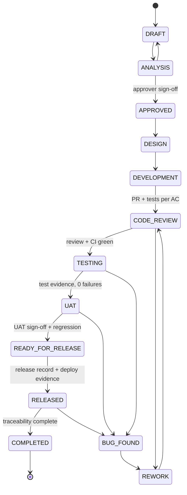
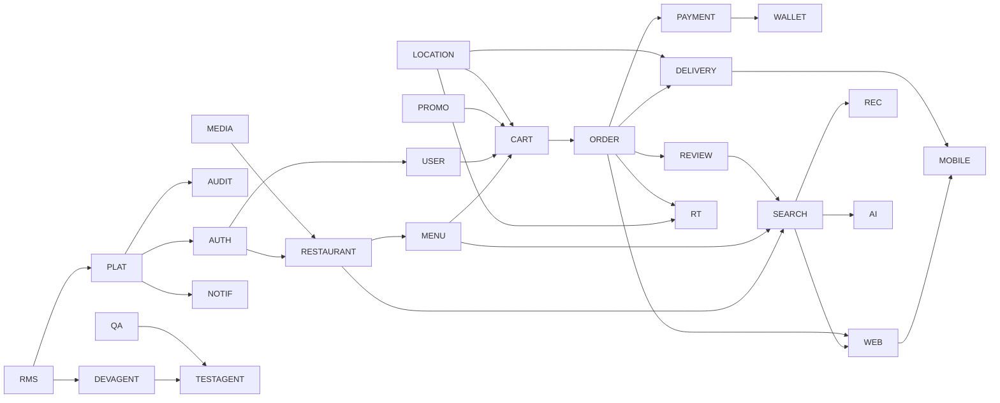

# Food Delivery Platform — Requirements

| Field | Value |
|---|---|
| Document version | 1.0.0 |
| Stage | Baseline approved; Phase 2 (System Design) in progress |
| Status | **APPROVED** baseline. 107 requirements APPROVED (REQ-ORDER-002 and REQ-RT-003 at v2 via [IMPACT-0001](impact/IMPACT-0001.md)). The 3 P2 backlog items stay in ANALYSIS. |
| Created | 2026-10-01 by RequirementAgent |
| Approved by | Project owner (instruction: "continue"), 2026-10-01 |
| Canonical data | [`requirements.json`](./requirements.json) (all fields, full acceptance criteria) |
| Architecture | [04 System Architecture](../04-system-architecture.md) and the [documentation index](../README.md) |

**Source legend.** Each requirement cites where it came from:

- `MP §n`: the master prompt (project brief), section *n*.
- `REF p.n`: the handwritten system design notes, page *n* of 15, stored in [`docs/reference/system-design-notes/`](../reference/system-design-notes/).
- `PROPOSED`: added during analysis and not present in either source. These items need explicit approval before the requirement can move to `APPROVED`.

> **How to read this document.** This file is the human-readable analysis. Every requirement's complete record (description, technical requirement, acceptance criteria, API/DB/UI/mobile/testing/security/performance requirements, version and change history) lives in `requirements.json`, which is the single source of truth. Section 8 is a catalogue index.

---

## 1. Project vision

**Vision.** Build a production-grade, AI-assisted food delivery platform (Zomato/Swiggy-like). Customers, restaurants and delivery partners connect through it to discover, order, pay, prepare, deliver and track food in real time. It is engineered as a professional organisation would build it: requirements are traceable, every change is impact-analysed, and every release is backed by evidence.

**Goals**

1. A complete ordering experience on web and mobile: discover, order, pay, track and review.
2. Restaurants and delivery partners can run their daily operations on the platform.
3. Correctness under failure: no duplicate orders, no double charges, no lost events.
4. A real-time experience: live order status and live partner location.
5. AI that helps users (food assistant, recommendations) without unsafe access to data.
6. An evidence-based engineering process run by DevAgent and TestAgent, with human approval gates.
7. Production readiness that is *demonstrated* (observability, performance and security reports), not just claimed.

**Success metrics** (product metrics; targets to be agreed with the product owner)

| Metric | Source |
|---|---|
| Order placement success rate (target > 98%) | REF p.3 |
| Order placement time (< 2 s) | REF p.3 |
| ETA accuracy (predicted vs actual) | REF p.10 |
| Order cancellation rate, payment failure rate | REF p.6, p.8 |
| Time to assign a delivery partner | REF p.9 |
| Customer ratings and review volume | REF p.3 |

---

## 2. Scope

### 2.1 In scope (v1.0.0)
Every capability in master prompt sections 2–59, decomposed into 110 functional requirements (section 8) and 22 non-functional requirements (section 9).

### 2.2 Out of scope / not yet requirements
These appear only as examples or in the reference notes. They are **not** treated as requirements unless you approve them:

| Candidate | Where it appeared | Handling |
|---|---|---|
| Scheduled delivery | MP §3, only as a version-history *example* | Not a requirement |
| AI order recommendation inside the order flow | MP §3, as an example | Covered generally by REQ-REC-001 |
| Loyalty points and referrals | REF p.13 | Backlog (P2) as REQ-PROMO-004; see OQ-07 |
| Split payment (wallet + card) | REF p.8 | Backlog (P2) as REQ-WALLET-002 |
| Partner payouts and cash settlement | Not in sources | Out of scope; see OQ-12 |
| Wallet top-up with real money | Not in sources | Out of scope; see OQ-13 |
| Grocery, pharmacy, drone delivery, multi-country | REF p.15 "future enhancements" | Out of scope |

### 2.3 Assumptions
- **A1.** India is the first market: INR currency, GST taxes, FSSAI licences, UPI payments, IST time zone (REF p.1, p.5, p.7). Pending OQ-09.
- **A2.** The REF p.1 scale figures are *design* targets. The load actually demonstrated before v1.0.0 is decided in OQ-01.
- **A3.** External providers (payment, maps, SMS, push, email, LLM) are accessed through adapters. Dev and test environments use mocks.
- **A4.** A *branch* (outlet) is the orderable unit. A restaurant brand can have many branches (MP §10 `restaurant_branches`).

### 2.4 Constraints (from the brief)
- Java / Spring Boot microservices, PostgreSQL, Redis, Kafka, Docker. React + TypeScript web. React + Capacitor mobile.
- One database per service. No distributed (XA) transactions.
- The strict phase order of MP §60. Two deviations are proposed in OQ-19.
- AI agents must follow MP §53: never invent requirements and never claim results without evidence.

---

## 3. Business requirements

| ID | Business requirement | Sources |
|---|---|---|
| BR-01 | Customers discover nearby restaurants and order food online | MP §21, REF p.1, p.3 |
| BR-02 | Restaurants onboard, manage menus and fulfil orders | MP §22, REF p.5 |
| BR-03 | Delivery partners receive, pick up and deliver orders, and track earnings | MP §23, REF p.9 |
| BR-04 | The platform accepts secure payments (UPI, card, wallet, COD) and handles refunds | MP §18, REF p.8 |
| BR-05 | Customers track orders and delivery partners in real time | MP §26, REF p.10, p.14 |
| BR-06 | Operators administer users, restaurants, partners, orders, finance and disputes | MP §24 |
| BR-07 | Promotions drive acquisition and retention | MP §21, REF p.12, p.13 |
| BR-08 | Personalisation and an AI assistant increase conversion | MP §28–29 |
| BR-09 | Engineering is requirement-driven, traceable and evidence-based | MP §2–4, §30–31, §50–56 |
| BR-10 | The platform is reliable, secure, observable and scalable in production | MP §39–49, REF p.2, p.15 |

---

## 4. Actors and roles

### 4.1 Human actors

| Actor | Role | Primary goals |
|---|---|---|
| Customer | `CUSTOMER` | Discover, order, pay, track, review |
| Restaurant owner | `RESTAURANT_OWNER` | Onboard, manage branches, staff, menu, offers, view analytics |
| Restaurant manager | `RESTAURANT_MANAGER` | Run live orders and menu availability for assigned branches |
| Delivery partner | `DELIVERY_PARTNER` | Go online, accept offers, pick up, deliver, see earnings |
| Admin | `ADMIN` | Approve restaurants and partners, manage users, coupons, refunds, reports |
| Super admin | `SUPER_ADMIN` | Manage admins, roles, permissions and platform configuration |
| Support agent | `SUPPORT_AGENT` | Resolve complaints, issue limited refunds, intervene in orders |
| Approver (engineering) | Product owner / tech lead | Approve requirements, breaking changes and releases |

### 4.2 External systems and agents
Payment gateway, maps/routing provider, push/SMS/email providers, LLM provider, object storage + CDN, **DevAgent**, **TestAgent**, and the specialised agents listed in MP §55.

### 4.3 Indicative permission matrix
This is a summary. The full matrix is in [09-security.md §3.3](../09-security.md).

| Permission | CUSTOMER | R_OWNER | R_MANAGER | PARTNER | SUPPORT | ADMIN | SUPER_ADMIN |
|---|:-:|:-:|:-:|:-:|:-:|:-:|:-:|
| ORDER_CREATE | ✓ | | | | | | |
| ORDER_VIEW | own | own branches | assigned branches | assigned | ✓ | ✓ | ✓ |
| ORDER_CANCEL | own, before PREPARING | reject only | reject only | | ✓ (reason) | ✓ | ✓ |
| ORDER_REFUND | | | | | ≤ limit | ✓ | ✓ |
| RESTAURANT_UPDATE | | ✓ | assigned branches | | | ✓ | ✓ |
| MENU_UPDATE | | ✓ | assigned branches | | | | ✓ |
| RESTAURANT_APPROVE | | | | | | ✓ | ✓ |
| USER_BLOCK | | | | | | ✓ | ✓ |
| ROLE_MANAGE | | | | | | | ✓ |
| COUPON_MANAGE | | restaurant offers | | | | ✓ | ✓ |

---

## 5. User journeys

**UJ-01: Customer's first order** (BR-01, BR-04, BR-05)
1. Register and verify phone by OTP.
2. Set location (GPS or address).
3. Browse nearby restaurants, search and filter.
4. Open a restaurant and customise items (variant, add-ons).
5. Add to cart and apply a coupon.
6. Checkout: revalidate and get a signed price quote.
7. Place the order (idempotent).
8. Pay by UPI or card through the gateway. The webhook confirms payment and the order becomes CONFIRMED.
9. Restaurant accepts and starts preparing.
10. A partner is assigned. The customer watches live tracking with ETA.
11. Order delivered; the customer rates and reviews.

**UJ-02: Customer cancels an order.** The order is in CONFIRMED or RESTAURANT_ACCEPTED, so it is cancellable. The customer cancels and the order moves through REFUND_PENDING to REFUNDED. The coupon reservation is released and the customer is notified. A cancellation attempt in PREPARING or later is rejected.

**UJ-03: Payment failure and retry.** The gateway reports failure, so the order moves to PAYMENT_FAILED. The customer retries within the payment window and a new payment transaction is created. If the payment stays stuck, reconciliation resolves it.

**UJ-04: AI-assisted discovery.** The customer types "spicy veg under ₹300". The assistant turns this into structured criteria and calls the search tool. It returns real results with reasons. The customer confirms an add-to-cart action.

**UJ-05: Restaurant onboarding.** The owner registers, enters details and location, and uploads GST and FSSAI documents. An admin reviews and approves. The owner creates the menu, sets hours and opens the branch, which goes live in search.

**UJ-06: Restaurant handles a live order.** A new order appears without refresh, with a sound alert. Staff accept it with a prep time, mark it PREPARING, then READY_FOR_PICKUP, and hand it to the partner. An out-of-stock item is toggled off in one tap.

**UJ-07: Delivery partner shift.** The partner goes ONLINE and background location starts. An offer arrives with a 30-second countdown and the partner accepts. They navigate to the restaurant, mark PICKED_UP, navigate to the customer, and mark DELIVERED (collecting cash if COD). Earnings update.

**UJ-08: Admin and support.** An admin approves a pending partner. Support handles a "missing item" complaint by issuing a partial refund, which is audited. An admin reviews reports and system health.

**UJ-09: Engineering change** (BR-09). A requirement change creates a new version. An impact report is produced and approved. DevAgent opens a PR. TestAgent generates and runs tests and records evidence. After review and merge, the change ships in a release with notes. The traceability matrix updates.

---

## 6. Core modules

| Code | Module | Proposed owner |
|---|---|---|
| RMS | Requirement & release management | `docs/requirements` → `requirement-service` (Phase 18) |
| PLAT / SEC / OBS | Platform foundation, cross-cutting security, observability | gateway, discovery, config, shared libraries |
| AUTH | Identity, authentication, authorisation | `identity-service` |
| USER | Profile, addresses, preferences, devices, favourites | `user-service` |
| RESTAURANT | Onboarding, branches, hours, staff, settings | `restaurant-service` |
| MENU | Categories, products, variants, add-ons, availability | `menu-service` |
| SEARCH | Discovery and search read model | `search-service` |
| CART | Cart and pricing | `cart-service` |
| PROMO | Coupons and offers | `promotion-service` |
| ORDER | Order lifecycle, state machine, saga | `order-service` |
| PAYMENT / WALLET | Payments, refunds, reconciliation, wallet ledger | `payment-service` |
| DELIVERY | Partners, assignment engine, delivery workflow | `delivery-service` |
| LOCATION | Location ingestion, distance, serviceability, ETA | `location-service` |
| RT | WebSocket push | `realtime-service` (proposed addition, OQ-16) |
| NOTIF | Push, SMS, email, in-app notifications | `notification-service` |
| REVIEW | Ratings and reviews | `review-service` |
| REC | Recommendations | `recommendation-service` |
| AI | AI food assistant | `ai-service` |
| MEDIA | Images and documents | `media-service` |
| ADMIN | Back-office, complaints, support | `admin-service` + admin dashboard |
| ANALYTICS | KPIs and reports | `analytics-service` |
| AUDIT | Audit trail | `audit-service` |
| UX / WEB / MOBILE | Design system, web apps, mobile apps | `web/*`, `mobile/*` |
| DEVAGENT / TESTAGENT | AI engineering agents | `ai-agents/*` |
| QA / DEVOPS | Test suites, CI/CD, containers, Kubernetes, IaC | `tests/*`, `infrastructure/*` |

The rationale for service boundaries, and for the services I propose to merge or not create, is in the architecture proposal.

---

## 7. Requirement lifecycle

**Statuses:** DRAFT, ANALYSIS, APPROVED, DESIGN, DEVELOPMENT, CODE_REVIEW, TESTING, BUG_FOUND, REWORK, UAT, READY_FOR_RELEASE, RELEASED, COMPLETED, BLOCKED, CANCELLED.

`BLOCKED` can be entered from ANALYSIS through READY_FOR_RELEASE and returns to the prior status. `CANCELLED` is terminal and its ID is never reused.

**Versioning rules**
1. Any content change creates version N+1. Version N is kept unchanged (append-only history).
2. A new version re-enters ANALYSIS and needs an impact report (REQ-RMS-004) before approval.
3. Breaking changes need explicit approval before implementation.
4. A requirement cannot reach COMPLETED without evidence (tests executed, release, traceability).

---

## 8. Functional requirements catalogue

Priority definitions:

- **P0 (Must):** required for v1.0.0. This covers the core ordering path, security, data integrity and mandated governance.
- **P1 (Should):** mandated by the brief but not on the core ordering path.
- **P2 (Could):** backlog, pending confirmation.

Current statuses (207 requirements): 195 **APPROVED**, 9 in **DEVELOPMENT** (since Phase 3: REQ-DEVOPS-002, REQ-RMS-001..003; since Phase 4A: REQ-PLAT-001..003, REQ-OBS-001, REQ-DEVOPS-001) and 3 P2 items in **ANALYSIS**. 97 of them come from the Restaurant OS addendum (§8.14). IMPACT-0002 moved 13 requirements to a new version (REQ-ORDER-002 is now v3). REQ-ORDER-002 and REQ-RT-003 are at version 2 (IMPACT-0001, approved 2026-10-01); REQ-PLAT-004 is at version 2 (IMPACT-0003, RFC 9457 error format, approved 2026-10-01); all others are at version 1. The three P2 items (REQ-PROMO-004, REQ-WALLET-002, REQ-REC-002) remain in **ANALYSIS** as backlog. `requirements.json` holds the authoritative status and history.

### 8.1 Requirement & release management (Phase 1)
| ID | Title | Pri | Phase | Depends on | Source |
|---|---|---|---|---|---|
| REQ-RMS-001 | Requirement registry with unique IDs and full schema | P0 | 1 | — | MP §2–3 |
| REQ-RMS-002 | Immutable versioning and change history | P0 | 1 | RMS-001 | MP §3 |
| REQ-RMS-003 | Status workflow with evidence gates | P0 | 1 | RMS-001 | MP §3, §53 |
| REQ-RMS-004 | Change impact analysis | P0 | 1 | RMS-002, RMS-005 | MP §4 |
| REQ-RMS-005 | Traceability matrix | P0 | 1 | RMS-001 | MP §50 |
| REQ-RMS-006 | Release management (SemVer) | P0 | 1 | RMS-003, RMS-005 | MP §51 |

### 8.2 Platform foundation (Phases 3–4)
| ID | Title | Pri | Phase | Depends on | Source |
|---|---|---|---|---|---|
| REQ-PLAT-001 | API Gateway: routing, versioning, correlation, CORS, security headers | P0 | 4 | PLAT-002, PLAT-003 | MP §6 |
| REQ-PLAT-002 | Service discovery, health checks, load balancing | P0 | 4 | — | MP §7 |
| REQ-PLAT-003 | Centralised configuration and secrets | P0 | 4 | — | MP §8 |
| REQ-PLAT-004 | Standard error format and OpenAPI | P0 | 4 | — | MP §37–38 |
| REQ-PLAT-005 | Event backbone: versioned events, idempotent consumers, retry, DLT | P0 | 4 | — | MP §12 |
| REQ-PLAT-006 | Transactional outbox and idempotency keys | P0 | 4 | PLAT-005, PLAT-008 | MP §13, REF p.6 |
| REQ-PLAT-007 | Resilience for synchronous calls | P0 | 4 | — | MP §40 |
| REQ-PLAT-008 | Persistence standards (DB per service, migrations, audit columns, optimistic locking) | P0 | 4 | — | MP §9–10 |
| REQ-OBS-001 | Structured logging with correlation and PII masking | P0 | 4* | PLAT-001 | MP §39 |
| REQ-DEVOPS-001 | Production Dockerfiles and Docker Compose environment | P0 | 4 | PLAT-003 | MP §44–45 |
| REQ-DEVOPS-002 | CI pipeline and Git strategy (baseline from Phase 3) | P0 | 3* | — | MP §43, §57 |

\* Proposed deviation from strict phase order (OQ-19).

### 8.3 Identity, user, security, audit (Phase 5)
| ID | Title | Pri | Phase | Depends on | Source |
|---|---|---|---|---|---|
| REQ-AUTH-001 | Registration/login with JWT + rotating refresh token | P0 | 5 | PLAT-001, PLAT-003 | MP §19 |
| REQ-AUTH-002 | OTP verification and OTP login | P0 | 5 | AUTH-001, NOTIF-001† | MP §14, §19 |
| REQ-AUTH-003 | RBAC, granular permissions, resource ownership | P0 | 5 | AUTH-001 | MP §19, §49 |
| REQ-AUTH-004 | Sessions, logout, password reset | P0 | 5 | AUTH-001 | MP §19 |
| REQ-AUTH-005 | Brute-force protection and lockout | P0 | 5 | AUTH-001, SEC-001, AUDIT-001 | MP §19, §49 |
| REQ-USER-001 | Profile and food preferences | P0 | 5 | AUTH-001 | MP §10, §21, §28 |
| REQ-USER-002 | Address book with geo-coordinates | P0 | 5 | USER-001 | MP §10, §16 |
| REQ-USER-003 | Device registration for push | P0 | 5 | AUTH-001 | MP §25, §27 |
| REQ-USER-004 | Favourites | P1 | 5 | USER-001 | MP §21 |
| REQ-AUDIT-001 | Audit trail for sensitive operations | P0 | 5 | PLAT-006 | MP §19, §42 |
| REQ-SEC-001 | Rate limiting | P0 | 5 | PLAT-001 | MP §6, §14, §19 |
| REQ-SEC-002 | Input validation and OWASP protections | P0 | 5 | PLAT-004 | MP §19 |
| REQ-SEC-003 | Data protection and privacy (deletion/export PROPOSED) | P0 | 5 | AUTH-003 | MP §19, §49, PROPOSED |
| REQ-QA-001 | Backend testing standards and coverage gates | P0 | 5 | DEVOPS-002 | MP §32 |

† Depends on a later phase; the resolution is in section 11.

### 8.4 Restaurant, menu, media (Phase 6)
| ID | Title | Pri | Phase | Depends on | Source |
|---|---|---|---|---|---|
| REQ-RESTAURANT-001 | Onboarding with document verification and admin approval | P0 | 6 | AUTH-003, MEDIA-001, AUDIT-001 | MP §22, REF p.5 |
| REQ-RESTAURANT-002 | Profile, branches, operational settings | P0 | 6 | RESTAURANT-001 | MP §10, §16, §22 |
| REQ-RESTAURANT-003 | Opening hours, holidays, live open/closed | P0 | 6 | RESTAURANT-002 | MP §14, REF p.5, p.7 |
| REQ-RESTAURANT-004 | Staff management | P1 | 6 | AUTH-003, RESTAURANT-002 | MP §22 |
| REQ-MENU-001 | Categories and products | P0 | 6 | RESTAURANT-002, MEDIA-001 | MP §10, §22 |
| REQ-MENU-002 | Variants and add-ons with selection rules | P0 | 6 | MENU-001 | MP §10, REF p.7 |
| REQ-MENU-003 | Availability and inventory | P0 | 6 | MENU-001 | MP §22, REF p.5 |
| REQ-MENU-004 | Menu caching and invalidation | P0 | 6 | MENU-001, MENU-003 | MP §14, REF p.5 |
| REQ-MEDIA-001 | Media upload/delivery via object storage | P0 | 6 | AUTH-003 | MP §41 |

### 8.5 Cart, promotions, geo library (Phase 7)
| ID | Title | Pri | Phase | Depends on | Source |
|---|---|---|---|---|---|
| REQ-CART-001 | Cart management (single branch, expiry) | P0 | 7 | AUTH-001, MENU-002 | MP §10, REF p.7 |
| REQ-CART-002 | Server-side pricing and signed price quote | P0 | 7 | CART-001, LOCATION-002, PROMO-002 | REF p.7 |
| REQ-CART-003 | Checkout validation | P0 | 7 | CART-002, RESTAURANT-003, MENU-003 | REF p.7 |
| REQ-PROMO-001 | Coupon and offer management | P1 | 7 | AUTH-003 | MP §21, REF p.12 |
| REQ-PROMO-002 | Coupon validation, discount, redemption | P1 | 7 | PROMO-001 | REF p.12 |
| REQ-PROMO-003 | Promotion abuse prevention | P1 | 7 | PROMO-002, SEC-001 | REF p.12 |
| REQ-PROMO-004 | Loyalty and referral | P2 | backlog | PROMO-002, WALLET-001 | REF p.13 only |
| REQ-LOCATION-002 | Distance and serviceability (geo library first) | P0 | 7 | RESTAURANT-002, USER-002 | MP §16 |

### 8.6 Order (Phase 8)
| ID | Title | Pri | Phase | Depends on | Source |
|---|---|---|---|---|---|
| REQ-ORDER-001 | Create order from validated quote (idempotent) | P0 | 8 | CART-002, CART-003, PLAT-006, USER-002 | MP §11, §13 |
| REQ-ORDER-002 | State machine with guarded transitions and history | P0 | 8 | ORDER-001, AUTH-003 | MP §11, REF p.6 |
| REQ-ORDER-003 | Restaurant accept/reject/prepare/ready | P0 | 8 | ORDER-002, RESTAURANT-002 | MP §22, REF p.6 |
| REQ-ORDER-004 | Customer cancellation | P0 | 8 | ORDER-002, PAYMENT-005† | MP §31, REF p.6 |
| REQ-ORDER-005 | Saga orchestration with timeouts and compensation | P0 | 8 | ORDER-002, PLAT-006, PAYMENT-002†, PROMO-002 | MP §13, REF p.6 |
| REQ-ORDER-006 | Order history and details | P0 | 8 | ORDER-002 | MP §21–24 |

### 8.7 Payment and wallet (Phase 9)
| ID | Title | Pri | Phase | Depends on | Source |
|---|---|---|---|---|---|
| REQ-PAYMENT-001 | Online payment initiation via gateway abstraction | P0 | 9 | ORDER-001, PLAT-006 | MP §18, REF p.8 |
| REQ-PAYMENT-002 | Webhook processing with signature verification | P0 | 9 | PAYMENT-001 | MP §18, REF p.8 |
| REQ-PAYMENT-003 | Reconciliation and retry | P0 | 9 | PAYMENT-002 | MP §18, REF p.8 |
| REQ-PAYMENT-004 | Cash on Delivery | P1 | 9 | ORDER-001, DELIVERY-004† | MP §18 |
| REQ-PAYMENT-005 | Full and partial refunds | P0 | 9 | PAYMENT-002, AUDIT-001 | MP §18, §42 |
| REQ-WALLET-001 | Wallet ledger and wallet payment | P1 | 9 | PAYMENT-001, PLAT-006 | MP §18, §21 |
| REQ-WALLET-002 | Split payment (wallet + gateway) | P2 | backlog | WALLET-001, ORDER-005 | REF p.8 only |

### 8.8 Delivery and location (Phase 10)
| ID | Title | Pri | Phase | Depends on | Source |
|---|---|---|---|---|---|
| REQ-DELIVERY-001 | Partner onboarding and profile | P0 | 10 | AUTH-003, MEDIA-001 | MP §23–24 |
| REQ-DELIVERY-002 | Partner availability states | P0 | 10 | DELIVERY-001, LOCATION-001 | MP §23, REF p.9 |
| REQ-DELIVERY-003 | Assignment engine with scoring | P0 | 10 | DELIVERY-002, LOCATION-002/003, ORDER-003 | MP §17, REF p.9 |
| REQ-DELIVERY-004 | Delivery workflow and navigation | P0 | 10 | DELIVERY-003, ORDER-002 | MP §23 |
| REQ-DELIVERY-005 | Earnings and history | P1 | 10 | DELIVERY-004 | MP §23 |
| REQ-LOCATION-001 | Partner location ingestion | P0 | 10 | PLAT-005, AUTH-003 | MP §16, §26, REF p.14 |
| REQ-LOCATION-003 | ETA estimation | P0 | 10 | LOCATION-002 | MP §16, REF p.10 |

### 8.9 Notifications, reviews, search, analytics (Phases 11–13)
| ID | Title | Pri | Phase | Depends on | Source |
|---|---|---|---|---|---|
| REQ-NOTIF-001 | Event-driven multi-channel notifications | P0 | 11 | PLAT-005, USER-003 | MP §27, REF p.11 |
| REQ-NOTIF-002 | In-app notification centre | P1 | 11 | NOTIF-001 | MP §21, REF p.11 |
| REQ-NOTIF-003 | Reliability, dedup, preferences | P0 | 11 | NOTIF-001 | REF p.11 |
| REQ-REVIEW-001 | Ratings and reviews for delivered orders | P1 | 12 | ORDER-002, MEDIA-001 | MP §21 |
| REQ-REVIEW-002 | Aggregation, replies, moderation | P1 | 12 | REVIEW-001, AUDIT-001 | MP §22, §24 |
| REQ-SEARCH-001 | Location-aware discovery | P0 | 13 | SEARCH-003, LOCATION-002, RESTAURANT-003 | MP §15–16, REF p.4 |
| REQ-SEARCH-002 | Text search, filters, sorting | P0 | 13 | SEARCH-001 | MP §15, REF p.4 |
| REQ-SEARCH-003 | Read-model sync and engine portability | P0 | 13 | PLAT-005, RESTAURANT-002, MENU-001 | MP §15, REF p.4 |
| REQ-ANALYTICS-001 | Business analytics and reports | P1 | 13 | PLAT-005 | MP §22, §24 |

### 8.10 Web applications and admin (Phase 14)
| ID | Title | Pri | Phase | Depends on | Source |
|---|---|---|---|---|---|
| REQ-UX-001 | Shared design system | P0 | 14 | — | MP §36 |
| REQ-WEB-001 | Customer web app | P0 | 14 | UX-001, AUTH-001, SEARCH-001, CART-001, ORDER-001, PAYMENT-001 | MP §20–21 |
| REQ-WEB-002 | Restaurant dashboard | P0 | 14 | UX-001, RESTAURANT-002, MENU-001, ORDER-003 | MP §22 |
| REQ-WEB-003 | Delivery partner web dashboard | P1 | 14 | UX-001, DELIVERY-002, DELIVERY-004 | MP §23 |
| REQ-WEB-004 | Admin dashboard | P0 | 14 | UX-001, ADMIN-001, ADMIN-002 | MP §24 |
| REQ-ADMIN-001 | Administer users, restaurants, partners | P0 | 14 | AUTH-003, RESTAURANT-001, DELIVERY-001, AUDIT-001 | MP §24 |
| REQ-ADMIN-002 | Order/payment/refund/coupon oversight | P0 | 14 | ORDER-006, PAYMENT-005, PROMO-001 | MP §24 |
| REQ-ADMIN-003 | Complaints and support | P1 | 14 | ORDER-006, MEDIA-001 | MP §24 |
| REQ-QA-002 | Web (Phase 14) and mobile (Phase 15) E2E suites | P0 | 14 | WEB-001, MOBILE-001†, MOBILE-002† | MP §33–34 |

### 8.11 Mobile, real-time, AI (Phases 15–17)
| ID | Title | Pri | Phase | Depends on | Source |
|---|---|---|---|---|---|
| REQ-MOBILE-001 | Customer mobile app (React + Capacitor) | P1 | 15 | UX-001, WEB-001, USER-003 | MP §25 |
| REQ-MOBILE-002 | Partner mobile app with background location | P0 | 15 | UX-001, DELIVERY-003/004, LOCATION-001 | MP §23, §25 |
| REQ-RT-001 | WebSocket infrastructure with authenticated subscriptions | P0 | 16 | AUTH-003, PLAT-005 | MP §26 |
| REQ-RT-002 | Real-time order, payment, notification updates | P0 | 16 | RT-001, ORDER-002, PAYMENT-002 | MP §22, §26 |
| REQ-RT-003 | Live delivery tracking | P0 | 16 | RT-001, LOCATION-001, LOCATION-003 | MP §26, REF p.10 |
| REQ-REC-001 | Rule-based recommendations | P1 | 17 | SEARCH-001, USER-001, ORDER-006 | MP §28 |
| REQ-REC-002 | ML/LLM-ready strategy interface | P2 | backlog | REC-001, ANALYTICS-001 | MP §28 |
| REQ-AI-001 | NL to structured search criteria | P1 | 17 | SEARCH-002, AI-002 | MP §29 |
| REQ-AI-002 | Controlled tool execution (no DB access) | P1 | 17 | AUTH-003, PLAT-004 | MP §29 |
| REQ-AI-003 | Guardrails, cost control, monitoring | P1 | 17 | AI-001, AI-002, OBS-002† | MP §29, §53 |

### 8.12 Agents, hardening, delivery pipeline (Phases 18–24)
| ID | Title | Pri | Phase | Depends on | Source |
|---|---|---|---|---|---|
| REQ-DEVAGENT-001 | DevAgent tool suite | P1 | 18 | RMS-001, RMS-004, RMS-005 | MP §30 |
| REQ-DEVAGENT-002 | Governed change workflow | P1 | 18 | DEVAGENT-001, DEVOPS-002 | MP §30, §53 |
| REQ-DEVAGENT-003 | Agent handoff, shared state, standard output | P1 | 18 | DEVAGENT-001 | MP §54–56 |
| REQ-ADMIN-004 | Engineering, health, audit visibility in admin | P1 | 18 | RMS-005/006, OBS-002†, AUDIT-001, AI-003 | MP §24 |
| REQ-TESTAGENT-001 | Test generation from acceptance criteria | P1 | 19 | RMS-001, QA-001, QA-002 | MP §31 |
| REQ-TESTAGENT-002 | Execution, evidence, bug creation | P1 | 19 | TESTAGENT-001, RMS-005 | MP §31, §53 |
| REQ-TESTAGENT-003 | Screenshot-based visual testing | P1 | 19 | UX-001, QA-002 | MP §35 |
| REQ-OBS-002 | Metrics, dashboards, alerting | P0 | 20 | PLAT-002 | MP §39 |
| REQ-OBS-003 | Distributed tracing | P1 | 20 | OBS-001, PLAT-005 | MP §39 |
| REQ-QA-003 | Performance testing and reports | P0 | 21 | OBS-002 | MP §48 |
| REQ-QA-004 | Security testing | P0 | 22 | DEVOPS-002, AUTH-003 | MP §49 |
| REQ-DEVOPS-003 | CD to development/staging/production | P0 | 23 | DEVOPS-002, DEVOPS-004 | MP §43 |
| REQ-DEVOPS-004 | Kubernetes deployment (staging in 23, prod in 24) | P0 | 23 | DEVOPS-001 | MP §45 |
| REQ-DEVOPS-005 | IaC, backups, disaster recovery | P1 | 24 | DEVOPS-004 | MP §46, §59 |

**Totals:** 110 functional requirements (79 P0, 28 P1, 3 P2) with 429 acceptance criteria.

### 8.13 Example: full acceptance criteria (REQ-ORDER-004, customer cancellation)
This shows the format used for every requirement in `requirements.json`:

- **AC1:** A customer can cancel in CREATED, PAYMENT_PENDING, CONFIRMED or RESTAURANT_ACCEPTED.
- **AC2:** Customer cancellation in PREPARING or later returns `409 ORDER_NOT_CANCELLABLE`.
- **AC3:** SUPPORT_AGENT/ADMIN may cancel in later states with a mandatory reason; the action is audited.
- **AC4:** Cancelling a paid order moves it through REFUND_PENDING to REFUNDED via payment-service.
- **AC5:** Cancellation releases the coupon reservation and any delivery assignment.
- *Testing:* backend unit, integration and API tests; web and mobile E2E; a negative test per non-cancellable state; an IDOR test.

### 8.14 Restaurant OS addendum (Phases 6, 8, 13A–13E, 17)
97 requirements in modules PRODUCT, MENU (005–010), ORDER (007–009), POS, BILL, KOT, KDS, RECIPE, INV, PURCHASE, SUPPLIER, OUTLET and QR, plus REQ-ANALYTICS-002, REQ-AI-004, REQ-AI-005 and REQ-PAYMENT-006. Full text, acceptance criteria and the decided open questions ROS-OQ-01..22 are in [restaurant-os/](restaurant-os/README.md). New NFRs: NFR-PERF-005..007. New business requirement BR-11. Impact on earlier requirements: [IMPACT-0002](impact/IMPACT-0002.md).

---

## 9. Non-functional requirements

None of these targets is verified yet. Each is marked verified only when a stored test report shows it.

| ID | Category | Target | Verified in phase |
|---|---|---|---|
| NFR-AVAIL-001 | Availability | Ordering path 99.9% monthly (design target) | 24 |
| NFR-PERF-001 | Performance | Common reads p95 < 300 ms | 21 |
| NFR-PERF-002 | Performance | Search p95 < 300 ms (stretch 200 ms, REF p.4) | 21 |
| NFR-PERF-003 | Performance | Order placement p95 < 2 s, excluding gateway UI (REF p.3) | 21 |
| NFR-PERF-004 | Performance | Partner location to customer screen p95 < 2 s (REF p.10) | 21 |
| NFR-SCALE-001 | Scalability | Design for 10M+ users, 500K+ restaurants, 1M+ orders/day, 100K+ concurrent users, 5–10K peak TPS, read:write 10:1 (REF p.1) | 21 |
| NFR-SCALE-002 | Scalability | 500K partners, updates every 5–10 s, peak 100K+ updates/s (REF p.14) | 21 |
| NFR-SCALE-003 | Scalability | Stateless services, horizontal autoscaling, no sticky sessions | 24 |
| NFR-CONS-001 | Consistency | Zero duplicate orders; order and event committed atomically | 8 |
| NFR-CONS-002 | Consistency | Zero double charges or refunds; wallet balance never negative | 9 |
| NFR-CONS-003 | Consistency | Event propagation p95 < 5 s (PROPOSED) | 21 |
| NFR-REL-001 | Reliability | No event loss during broker outage (outbox, idempotent consumers) | 8 |
| NFR-REL-002 | Reliability | RPO ≤ 5 min, RTO ≤ 1 h (PROPOSED) | 24 |
| NFR-DEPLOY-001 | Deployability | Zero-downtime rolling deployments | 23 |
| NFR-SEC-001 | Security | OWASP Top 10 covered; 0 open critical/high findings at release; ASVS L2 reference (PROPOSED) | 22 |
| NFR-SEC-002 | Security | No secrets in repo or images; secret scan on every PR | 3 |
| NFR-SEC-003 | Security | No raw card data on the platform (PCI scope minimisation) | 9 |
| NFR-OBS-001 | Observability | 100% of requests carry a traceId across logs, metrics and traces | 20 |
| NFR-MAINT-001 | Maintainability | ≥ 80% coverage on domain/application layers (PROPOSED); ≥ 1 automated test per requirement | 5 |
| NFR-COMPAT-001 | Compatibility | Latest 2 versions of major browsers; Android 10+; iOS 15+ (PROPOSED) | 15 |
| NFR-A11Y-001 | Accessibility | WCAG 2.1 AA (PROPOSED) | 14 |
| NFR-I18N-001 | Localisation | India-first (INR, IST, GST), i18n-ready (PROPOSED) | 14 |

**Capacity sanity check (from REF p.1, p.14):**

- 1M orders/day averages about 12 orders/s. With a 5–10× peak factor, that is about 60–120 order writes/s.
- The 5–10K peak TPS figure is therefore dominated by reads (browse, menu, search, tracking). That matches the 10:1 read:write ratio and is why caching and read models matter.
- Location ingestion (100K updates/s) is the highest *write* load in the system, by roughly three orders of magnitude over orders. That justifies a separate location service, Redis GEO for the latest position, and batched history writes.

---

## 10. Requirement dependencies (module level)

**Critical path to a first end-to-end order:** PLAT → AUTH → RESTAURANT/MENU → CART (+ geo library) → ORDER → PAYMENT → DELIVERY/LOCATION → NOTIF → WEB.

---

## 11. Phase-order conflicts and resolutions

The strict order in MP §60 creates eight cases where a requirement depends on something in a later phase. Two were resolved by moving work earlier: REQ-LOCATION-002 moved to Phase 7, and REQ-DEVOPS-004 (staging) moved to Phase 23. The remaining cases are handled as follows:

| Requirement | Depends on (later phase) | Resolution |
|---|---|---|
| REQ-AUTH-002 (5) | REQ-NOTIF-001 (11) | Phase 5 uses an SMS port with a fake/log adapter; the real provider is wired in Phase 11 |
| REQ-ORDER-004/005 (8) | REQ-PAYMENT-002/005 (9) | Saga built against the payment event contract with a stub; refund ACs verified at end of Phase 9 |
| REQ-PAYMENT-004 (9) | REQ-DELIVERY-004 (10) | COD AC3 (cash collected) verified in Phase 10 |
| REQ-AI-003 (17), REQ-ADMIN-004 (18) | REQ-OBS-002 (20) | Metrics exported from day one; dashboard ACs verified after Phase 20 |
| REQ-QA-002 (14) | REQ-MOBILE-001/002 (15) | Web E2E in Phase 14; mobile E2E in Phase 15 |

---

## 12. Initial product roadmap

Versions below 1.0.0 are development milestones. **v1.0.0 is the first production release** (SemVer: the public API is stable from 1.0.0).

| Release | Name | Phases | Scope | Exit criteria |
|---|---|---|---|---|
| v0.1.0 | Foundation | 1–4 | RMS, PLAT, OBS-001, DEVOPS-001, baseline CI | Requirements and architecture approved; Compose stack runs; CI green |
| v0.2.0 | Identity & Catalogue | 5–6 | AUTH, USER, AUDIT, SEC, RESTAURANT, MENU, MEDIA | Register/login; restaurants onboard and publish menus |
| v0.3.0 | Commerce Core | 7–9 | CART, PROMO, geo library, ORDER, PAYMENT, WALLET | Order placed and paid (mock gateway) end to end via API; saga failure tests green |
| v0.4.0 | Fulfilment & Engagement | 10–13 | DELIVERY, LOCATION, NOTIF, REVIEW, SEARCH, ANALYTICS | Order delivered end to end with assignment engine |
| v0.5.0 | Web Applications | 14 | UX, WEB, ADMIN, web E2E | Four web apps; Playwright journeys green |
| v0.6.0 | Mobile Applications | 15 | MOBILE, mobile E2E | Android/iOS test builds; Appium journeys green |
| v0.7.0 | Real-time | 16 | RT | Live status and tracking with measured latency |
| v0.8.0 | AI | 17 | AI, REC-001 | Evaluation and red-team suites pass |
| v0.9.0 | Engineering Agents | 18–19 | DEVAGENT, TESTAGENT, ADMIN-004 | Agents operate via governed PRs with evidence |
| v0.10.0 | Hardening | 20–22 | OBS-002/003, QA-003, QA-004 | Performance and security reports stored; NFR gaps documented |
| v1.0.0 | Production | 23–24 | DEVOPS-003/004/005 | Pipeline deployment with approval, smoke tests, rollback plan, DR drill |
| backlog | Post-1.0 | — | PROMO-004, WALLET-002, REC-002 | Pending product confirmation |

---

## 13. Open questions

The full list with recommendations is in `requirements.json` → `openQuestions`.

**Decided on 2026-10-01:**

- OQ-01: portfolio/learning context. Design for REF scale and demonstrate a modest load on a small budget.
- OQ-03: Razorpay test mode plus a mock adapter.
- OQ-07: loyalty and referral stay in the backlog (P2).
- OQ-16: dedicated `realtime-service`, with the other service changes approved.
- OQ-19: phase-order deviation approved.

**Decided by default on 2026-10-01.** The project owner instructed "continue", which accepted the recommendation for OQ-02, 04, 05, 06, 08, 09, 10, 11, 12, 13, 14, 15, 17, 18 and 20. Each recommendation is recorded in `requirements.json` and the ADRs in `docs/17-adr/`.

**Raised during Phase 2 design and decided on 2026-10-01:**

| ID | Question | Decision |
|---|---|---|
| OQ-21 | Refund after DELIVERY_FAILED: automatic for some reasons, or support decision only? | Support decision only in v1 |
| OQ-22 | Verified load profile (docs/11-scalability.md §3) | 300 RPS mixed, 10 orders/s, 2,000 location updates/s, 5,000 WebSocket connections |
| OQ-23 | Refund approval thresholds per role | Support up to ₹500, admin up to ₹5,000, above that SUPER_ADMIN (configurable) |

No open questions remain.

---

## 14. Reference notes index

The 16 images in `docs/reference/system-design-notes/` are the handwritten notes "System Design: Food Delivery App" (cover + pages 1–15). Page numbers in `REF p.n` follow the "Page n of 15" label printed on each note:

| Page | Topic |
|---|---|
| 1 | What we're building, stakeholders, FR/NFR, scale assumptions |
| 2 | High-level architecture and tech stack |
| 3 | User journey and order flow sequence |
| 4 | Restaurant discovery and search |
| 5 | Restaurant and menu service |
| 6 | Order service and state machine |
| 7 | Cart and checkout |
| 8 | Payment system |
| 9 | Delivery partner assignment |
| 10 | Real-time tracking |
| 11 | Notification system |
| 12 | Coupons, offers and promotions |
| 13 | Loyalty and referral |
| 14 | Scaling the tracking system |
| 15 | Best practices, trade-offs, conclusion |
