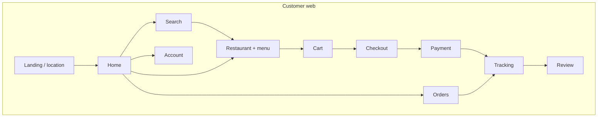
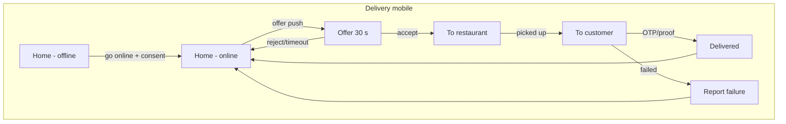

# Screen Inventory and Navigation

| Field | Value |
|---|---|
| Version | 1.0.0 |
| Status | **Approved** 2026-10-01 |
| Requirements | REQ-WEB-001..004, REQ-MOBILE-001/002, REQ-ADMIN-001..004, MP §21–24 |
| Design system | [design-system.md](design-system.md) |

Screen IDs (`CW-`, `RD-`, `DD-`, `AD-`, `CM-`, `DM-`) are used in tests, visual specs and traceability. Each screen lists the requirements whose APIs back it. Wireframes and UI specs are produced per screen in the phase that implements it (`docs/ui/specs/<screen-id>.md`).

---

## 1. Customer web (`web/apps/customer-web`) — REQ-WEB-001

| ID | Screen | Route | Backed by |
|---|---|---|---|
| CW-01 | Landing / location picker | `/` | REQ-LOCATION-002, REQ-USER-002 |
| CW-02 | Login / register / OTP | `/login`, `/register`, `/verify` | REQ-AUTH-001/002 |
| CW-03 | Home / discovery (nearby, offers, recommendations, cuisines) | `/home` | REQ-SEARCH-001, REQ-REC-001, REQ-PROMO-001 |
| CW-04 | Search results + filters + sort | `/search?q=` | REQ-SEARCH-002 |
| CW-05 | Restaurant detail + menu (category scroll-spy, veg-only toggle) | `/r/:restaurantSlug/:branchId` | REQ-RESTAURANT-002/003, REQ-MENU-001..003, REQ-REVIEW-002 |
| CW-06 | Product detail / customisation (sheet or modal) | modal on CW-05 | REQ-MENU-002 |
| CW-07 | Cart (with coupon, instructions) | `/cart` | REQ-CART-001, REQ-PROMO-002 |
| CW-08 | Checkout (address, payment method, quote breakdown) | `/checkout` | REQ-CART-002/003, REQ-USER-002 |
| CW-09 | Payment (hosted checkout handoff, "confirming payment" state) | `/checkout/pay/:orderId` | REQ-PAYMENT-001/002, REQ-PAYMENT-004 |
| CW-10 | Order tracking (timeline, map, partner card, ETA) | `/orders/:id` | REQ-ORDER-006, REQ-RT-002/003, REQ-LOCATION-003 |
| CW-11 | Order history (+ reorder) | `/orders` | REQ-ORDER-006 |
| CW-12 | Write review | `/orders/:id/review` | REQ-REVIEW-001 |
| CW-13 | Profile + preferences | `/account/profile` | REQ-USER-001 |
| CW-14 | Addresses | `/account/addresses` | REQ-USER-002 |
| CW-15 | Wallet | `/account/wallet` | REQ-WALLET-001 |
| CW-16 | Notifications | `/account/notifications` | REQ-NOTIF-002 |
| CW-17 | Favourites | `/account/favorites` | REQ-USER-004 |
| CW-18 | Help / complaints | `/help`, `/help/tickets/:id` | REQ-ADMIN-003 |
| CW-19 | AI assistant (panel/drawer) | overlay | REQ-AI-001..003 |
| CW-20 | Sessions & security, data export / delete account | `/account/security` | REQ-AUTH-004, REQ-SEC-003 |

**Key UX rules:**
- Cart is single-branch. Adding from another branch shows a "Replace cart?" dialog (`CART_BRANCH_CONFLICT`).
- The payment success screen appears only after the server confirms (polling the order status after the gateway callback), per REQ-WEB-001 AC3.
- Tracking polls every 10 s until realtime is available (Phase 16), then uses WebSocket with polling fallback.
- Closed restaurants are shown greyed, with their next opening time.

## 2. Restaurant dashboard (`web/apps/restaurant-dashboard`) — REQ-WEB-002

| ID | Screen | Backed by |
|---|---|---|
| RD-01 | Login (+ OTP second factor) | REQ-AUTH-001 |
| RD-02 | Onboarding wizard (details → branches → documents → bank → submit) + status | REQ-RESTAURANT-001, REQ-MEDIA-001 |
| RD-03 | Dashboard (today's orders, revenue, ratings, alerts) | REQ-ANALYTICS-001 |
| RD-04 | **Live orders** board (New / Accepted / Preparing / Ready columns; sound + visual alert for new orders; accept with prep time; reject with reason; 5-min countdown) | REQ-ORDER-003, REQ-RT-002 |
| RD-05 | Order history + detail | REQ-ORDER-006 |
| RD-06 | Menu: categories | REQ-MENU-001 |
| RD-07 | Menu: products (list, editor with variants, add-on groups, images) | REQ-MENU-001/002, REQ-MEDIA-001 |
| RD-08 | Add-on groups | REQ-MENU-002 |
| RD-09 | Inventory / availability (quick toggles, "out of stock until") | REQ-MENU-003 |
| RD-10 | Offers | REQ-PROMO-001 |
| RD-11 | Restaurant profile & branches | REQ-RESTAURANT-002 |
| RD-12 | Opening hours & holidays, open/close/busy toggle | REQ-RESTAURANT-003 |
| RD-13 | Analytics & reports (export) | REQ-ANALYTICS-001 |
| RD-14 | Reviews (+ reply) | REQ-REVIEW-002 |
| RD-15 | Staff (owner only) | REQ-RESTAURANT-004 |
| RD-16 | Settings (auto-accept, notifications, COD) | REQ-RESTAURANT-002, REQ-PAYMENT-004 |

The navigation shows only the permitted items (REQ-WEB-002 AC3). A branch selector appears in the top bar for multi-branch users.

## 3. Delivery partner web dashboard (`web/apps/delivery-dashboard`) — REQ-WEB-003

| ID | Screen | Backed by |
|---|---|---|
| DD-01 | Login (OTP) / onboarding + documents | REQ-AUTH-002, REQ-DELIVERY-001 |
| DD-02 | Home: online/offline toggle, current status | REQ-DELIVERY-002 |
| DD-03 | Incoming offer (30 s countdown) | REQ-DELIVERY-003 |
| DD-04 | Active delivery (pickup → drop steps, navigation deep links, OTP entry, proof photo) | REQ-DELIVERY-004 |
| DD-05 | Earnings | REQ-DELIVERY-005 |
| DD-06 | History | REQ-DELIVERY-005 |
| DD-07 | Profile & documents | REQ-DELIVERY-001 |
| DD-08 | Notifications | REQ-NOTIF-002 |

Browser geolocation is used only while the tab is active. A banner recommends the mobile app for continuous tracking (REQ-WEB-003 AC2).

## 4. Admin dashboard (`web/apps/admin-dashboard`) — REQ-WEB-004, REQ-ADMIN-001..004

| ID | Screen | Backed by |
|---|---|---|
| AD-01 | Login (+ MFA) | REQ-AUTH-001 |
| AD-02 | Overview (KPIs, alerts, pending approvals) | REQ-ANALYTICS-001 |
| AD-03 | Users (search, detail, block/unblock, roles) | REQ-ADMIN-001, REQ-AUTH-003 |
| AD-04 | Restaurants (approval queue, document review, suspend) | REQ-ADMIN-001, REQ-RESTAURANT-001 |
| AD-05 | Delivery partners (verification queue, suspend) | REQ-ADMIN-001, REQ-DELIVERY-001 |
| AD-06 | Orders (search, unified timeline order/payment/delivery, cancel, reassign) | REQ-ADMIN-002 |
| AD-07 | Payments & refunds (refund with reason; high-value approval queue) | REQ-ADMIN-002, REQ-PAYMENT-005 |
| AD-08 | Coupons | REQ-PROMO-001 |
| AD-09 | Reports & analytics | REQ-ANALYTICS-001 |
| AD-10 | Complaints / tickets | REQ-ADMIN-003 |
| AD-11 | Reviews moderation | REQ-REVIEW-002 |
| AD-12 | Audit logs (filters: actor, action, entity, date) | REQ-AUDIT-001, REQ-ADMIN-004 |
| AD-13 | Roles & permissions (SUPER_ADMIN) | REQ-AUTH-003 |
| AD-14 | Notification templates | REQ-NOTIF-001 |
| AD-15 | **Requirements** (status, dev/test/deploy/production status, history) | REQ-ADMIN-004, REQ-RMS-* |
| AD-16 | **Releases** (notes, status, evidence links) | REQ-ADMIN-004, REQ-RMS-006 |
| AD-17 | **System health** (service status, key metrics, DLT viewer) | REQ-ADMIN-004, REQ-OBS-002 |
| AD-18 | **AI monitoring** (latency, tokens, cost, errors, tool distribution) | REQ-AI-003 |

Screens AD-15 to AD-18 depend on Phases 18 and 20 (phase-order notes in `requirements.json`).

## 5. Customer mobile (`mobile/customer-mobile`) — REQ-MOBILE-001

**Tabs:** Home · Search · Orders · Account. A floating cart bar appears when the cart is not empty. The assistant is reachable from Home and Search.

| ID | Screen | Mobile specifics |
|---|---|---|
| CM-01 | Splash / onboarding / permissions explainer (location, notifications) | Pre-permission screens |
| CM-02 | Login / OTP | SMS autofill (Android SMS Retriever / iOS one-time-code) |
| CM-03 | Location select (GPS + map pin + saved addresses) | Capacitor Geolocation |
| CM-04 | Home | Pull to refresh; offline cache |
| CM-05 | Search + filters (bottom sheet) | |
| CM-06 | Restaurant + menu | Sticky category bar; customisation sheet |
| CM-07 | Cart + checkout | Native keyboard handling |
| CM-08 | Payment | Razorpay checkout (web or native SDK via plugin, decided in Phase 15); deep-link return |
| CM-09 | Order tracking | Map, live location; push notifications per status |
| CM-10 | Orders history / reorder | |
| CM-11 | Review (with camera photo) | Capacitor Camera |
| CM-12 | Account (profile, addresses, wallet, favourites, notifications, help, security) | Optional biometric unlock |
| CM-13 | Assistant | |

Deep links: `fooddelivery://restaurant/{branchId}` and `fooddelivery://order/{orderId}` (plus universal/app links).

## 6. Delivery partner mobile (`mobile/delivery-mobile`) — REQ-MOBILE-002

**Tabs:** Home · Earnings · History · Profile.

| ID | Screen | Mobile specifics |
|---|---|---|
| DM-01 | Login / onboarding (documents via camera) | Camera, file upload |
| DM-02 | Background location disclosure + consent | Required before going online (store policy) |
| DM-03 | Home (online/offline toggle, map, status) | Background geolocation only while ONLINE; stops when OFFLINE |
| DM-04 | Offer (full-screen, 30 s ring countdown, accept/reject) | High-priority push + sound + haptics; works from lock screen notification |
| DM-05 | Active delivery: to restaurant → picked up → to customer → delivered | Navigation deep links (Google Maps / Apple Maps); OTP entry; proof photo; COD cash confirmation |
| DM-06 | Delivery failed report (reason category) | |
| DM-07 | Earnings (today, week; COD collected) | |
| DM-08 | History | |
| DM-09 | Profile, documents, vehicle, notification settings | |

**Location behaviour (REQ-MOBILE-002 AC3):**
- Update interval adapts to movement: every 5 s when moving faster than 3 m/s, every 10 s when slow, every 30 s when stationary.
- Battery-aware: the interval increases below 20% battery.
- Points are batched (up to 10) and queued offline, then flushed on reconnect with the original timestamps.

## 7. Navigation maps

